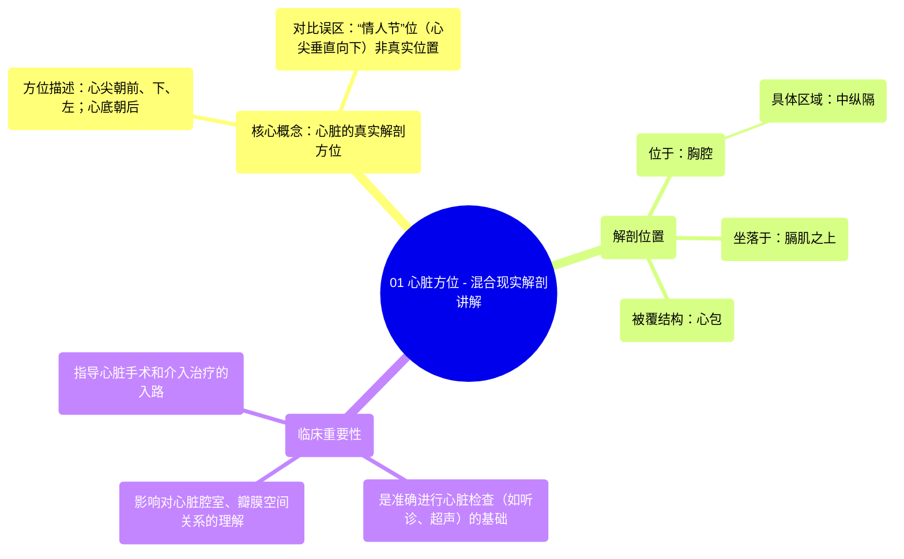

# 01 Heart Orientation - Anatomy Explained in Mixed Reality

  <video controls preload="metadata" playsinline>
    <source src="https://helly.bitiful.net/心血管学科/%E4%B8%93%E8%BE%91%2001%EF%BC%9A%E5%BF%83%E8%84%8F%E8%A7%A3%E5%89%96%E5%AD%A6%E5%AE%9E%E6%99%AF%E8%AF%BE%20%28Heart%20Anatomy%20-%20Course%29/01%20Heart%20Orientation%20-%20Anatomy%20Explained%20in%20Mixed%20Reality.mp4" type="video/mp4">
    
您的浏览器不支持播放，请升级。

  </video>

::: tip ⚡️ 核心考点 (30s速读)
*   **核心考点**：心脏在胸腔内的真实解剖方位是心尖朝前、向下、向左，心底朝后。这与传统“情人节”位（心尖垂直向下）的图示不同。
*   **临床意义**：准确理解心脏方位是进行心脏听诊、影像学检查（如超声心动图、CT）和手术入路设计的基础。错误的方位认知会导致对心脏结构、瓣膜位置及血流方向的误判。
:::

## 🧠 深度精讲
*   **心脏的真实解剖方位**：视频强调，心脏并非如许多教科书“情人节”位插图所示垂直悬挂。实际上，在标准解剖体位下，心脏位于中纵隔，坐于膈肌之上，其长轴是倾斜的。具体而言，**心尖** 朝向前下方，并偏向左前侧（约在左侧第五肋间隙、锁骨中线内侧1-2厘米处可触及心尖搏动）。而 **心底** （主要由左心房和部分右心房及大血管根部构成）则朝向脊柱，即朝向后上方。这种倾斜的方位是理解心脏各腔室、瓣膜和大血管空间关系的关键。
*   **“情人节”位的误解与澄清**：“情人节”位是为了便于在脱离躯体的标本上展示心脏所有四个腔室而采用的一种传统摆放方式，它使心脏看起来更对称、心尖垂直向下。但这并非其在活体内的自然位置。将心脏“摆正”回其在胸腔内的真实倾斜方位，是学习临床解剖的第一步。
*   **心脏的“住所”：纵隔与心包**：心脏位于 **胸腔** 的 **中纵隔** 内。纵隔是两肺之间的中央间隔，中纵隔是其核心部分，容纳心脏、心包、大血管根部等。心脏被 **心包** （一个纤维浆膜性囊）包裹和固定，心包提供保护、减少摩擦，并帮助维持其解剖位置。

## 📚 双语术语表 (Terminology)
| 英文术语 | 中文翻译 | 定义/解释 |
| :--- | :--- | :--- |
| Heart Orientation | 心脏方位 | 指心脏在人体胸腔内的空间位置和方向。 |
| Apex | 心尖 | 心脏的左下尖端，由左心室构成，朝向前下左方。 |
| Base | 心底 | 心脏的上后部，主要由左心房和部分右心房构成，朝向脊柱。 |
| Thoracic Cavity | 胸腔 | 由胸廓围成的体腔，内有心、肺、大血管等器官。 |
| Mediastinum | 纵隔 | 位于两肺之间、胸骨之后、脊柱之前的胸腔中部区域。 |
| Middle Mediastinum | 中纵隔 | 纵隔的中部，是心脏、心包和大血管根部所在的位置。 |
| Pericardium | 心包 | 包裹心脏和出入心脏大血管根部的纤维浆膜囊，分纤维层和浆膜层。 |
| In situ | 原位 | 指器官或结构处于其在身体内的自然位置和关系。 |
| Valentine‘s position | “情人节”位 | 一种传统的心脏图示方位，心尖垂直向下，便于展示结构，但非解剖真实位置。 |
| Diaphragm | 膈肌 | 分隔胸腔和腹腔的穹窿状肌性结构，心脏坐于其上。 |

## 🗺️ 知识图谱

