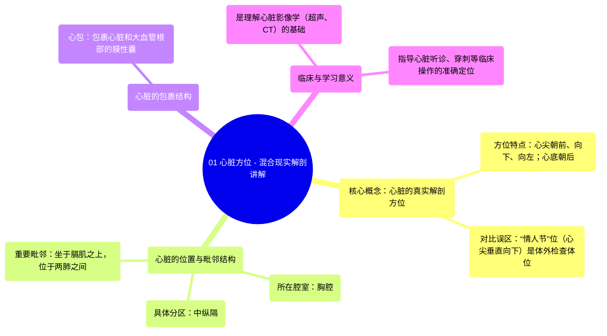

# 01 Heart Orientation - Anatomy Explained in Mixed Reality

  <video controls preload="metadata" playsinline>
    <source src="https://helly.bitiful.net/心血管学科/%E4%B8%93%E8%BE%91%2001%EF%BC%9A%E5%BF%83%E8%84%8F%E8%A7%A3%E5%89%96%E5%AD%A6%E5%AE%9E%E6%99%AF%E8%AF%BE%20%28Heart%20Anatomy%20-%20Course%29/01%20Heart%20Orientation%20-%20Anatomy%20Explained%20in%20Mixed%20Reality.mp4" type="video/mp4">
    
您的浏览器不支持播放，请升级。

  </video>

::: tip ⚡️ 核心考点 (30s速读)
*   **核心考点**：心脏在胸腔内的真实解剖方位是心尖朝前、向下、向左，心底朝后。传统图示中的“情人节”位（心尖垂直向下）是解剖室检查体位，并非其在体内的自然位置。
*   **临床意义**：准确理解心脏的解剖方位是进行心脏听诊、影像学检查（如超声心动图、CT）以及心导管介入等所有临床操作的基础。错误的方位认知会导致对心脏结构、瓣膜位置及大血管关系的误判。
:::

## 🧠 深度精讲

*   **心脏的真实解剖方位**：视频纠正了一个关键误解。在活体胸腔内，心脏并非像许多教科书插图（“情人节”位）那样心尖垂直向下。实际上，心脏位于中纵隔，坐于膈肌之上，其**心尖**朝**前**、**向下**、并向**左侧**倾斜，而**心底**则朝向**后方**。这种三维空间定位对于理解心脏与周围结构（如肺、胸骨、脊柱）的关系至关重要。
*   **心脏的位置与毗邻**：心脏被包裹在心包内，位于胸腔的**中纵隔**。中纵隔是两肺之间的中央区域，内含心脏、心包、大血管（如主动脉、肺动脉）的根部以及重要神经（如膈神经、迷走神经）。心脏前方有胸骨和部分肺组织，后方是食管和胸主动脉，两侧是肺。
*   **“情人节”位的由来与局限**：视频指出，传统的心尖垂直向下的图示方式，源于解剖室中将心脏取出后平放观察的体位。这种呈现方式虽然便于展示心脏的某些表面结构，但扭曲了其在体内真实的空间关系，不利于建立准确的解剖学思维，尤其是在学习影像解剖和临床定位时。

## 📚 双语术语表 (Terminology)
| 英文术语 | 中文翻译 | 定义/解释 |
| :--- | :--- | :--- |
| Heart Orientation | 心脏方位 | 指心脏在胸腔内的空间指向和位置关系。 |
| Apex of the heart | 心尖 | 心脏的左下尖端，朝前、下、左。 |
| Base of the heart | 心底 | 心脏的上部，主要由左心房和部分右心房构成，朝向后上方。 |
| Thoracic cavity | 胸腔 | 由胸廓围成的体腔，内含肺、心脏、大血管等。 |
| Mediastinum | 纵隔 | 位于两肺之间、胸骨之后、脊柱之前的胸腔中央区域。 |
| Middle mediastinum | 中纵隔 | 纵隔的一部分，是心脏、心包和大血管根部所在的位置。 |
| Pericardium | 心包 | 包裹心脏和出入心脏大血管根部的纤维浆膜囊，起保护和固定作用。 |
| In situ | 原位 | 指器官或结构在其体内的自然位置和状态。 |
| Valentine‘s position | “情人节”位 | 一种传统的心脏图示方式，心尖垂直向下，模拟解剖室检查体位，非体内真实方位。 |
| Diaphragm | 膈肌 | 分隔胸腔和腹腔的穹窿状肌性结构，心脏坐于其上。 |

## 🗺️ 知识图谱

