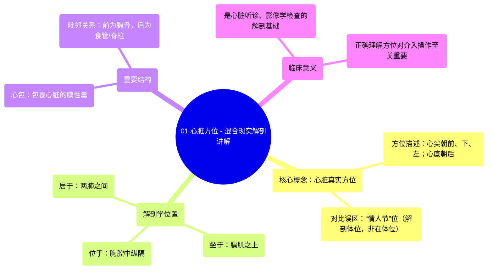

# 01 Heart Orientation - Anatomy Explained in Mixed Reality

  <video controls preload="metadata" playsinline>
    <source src="https://helly.s3.bitiful.net/心血管学科/%E4%B8%93%E8%BE%91%2001%EF%BC%9A%E5%BF%83%E8%84%8F%E8%A7%A3%E5%89%96%E5%AD%A6%E5%AE%9E%E6%99%AF%E8%AF%BE%20%28Heart%20Anatomy%20-%20Course%29/01%20Heart%20Orientation%20-%20Anatomy%20Explained%20in%20Mixed%20Reality.mp4" type="video/mp4">
    
您的浏览器不支持播放，请升级。

  </video>

::: tip ⚡️ 核心考点 (30s速读)
*   **核心考点**：心脏在胸腔内的真实解剖方位是心尖朝前、向下、向左，心底朝后。传统图示中的“情人节”位（心尖垂直向下）是解剖室检查体位，并非其在体内的自然位置。
*   **临床意义**：准确理解心脏的解剖方位是进行心脏听诊、影像学检查（如超声心动图、CT）以及心导管介入等临床操作的基础，对精确定位心脏结构至关重要。
:::

## 🧠 深度精讲

*   **心脏的真实解剖方位**：视频强调了一个关键但常被误解的解剖学事实。在活体胸腔内，心脏并非像许多教科书插图或“情人节”卡片上那样，心尖垂直指向下方。其真实位置是：**心尖朝向前方、下方和左侧**，而**心底（大血管出入处）朝向后方**。这种朝向是由于心脏坐落在倾斜的膈肌之上，并受到周围结构（如脊柱、胸骨）的影响。
*   **“情人节”位的由来与误导**：视频指出，传统的心脏图示（“情人节”位）实际上描绘的是心脏在解剖台上被取出并平放时的姿态，即**解剖学位置**。这种呈现方式便于观察心脏的各个表面和腔室，但扭曲了其在体内的三维空间关系。将这种“离体”方位误认为是“在体”方位，是初学者常见的错误。
*   **心脏的解剖学邻居**：心脏位于**胸腔**的**中纵隔**内。具体来说，它居于**两肺之间**，下方坐于**膈肌**之上，前方是**胸骨和肋软骨**，后方紧邻**食管、胸主动脉和脊柱**。理解这些毗邻关系对于理解心脏搏动的影响、影像学解读以及手术入路都十分重要。
*   **心包的作用**：心脏被一个纤维浆膜囊——**心包**——所包裹。心包固定心脏于中纵隔，防止其过度移位，并提供润滑以减少搏动时的摩擦。视频中展示的标本清晰地显示了心包覆盖心脏的结构。

## 📚 双语术语表 (Terminology)
| 英文术语 | 中文翻译 | 定义/解释 |
| :--- | :--- | :--- |
| Heart Orientation | 心脏方位 | 心脏在胸腔内的空间指向和位置。 |
| Apex | 心尖 | 心脏的左下尖端，朝前、下、左。 |
| Base | 心底 | 心脏的上部，大血管（主动脉、肺动脉等）出入的部位，朝后。 |
| Thoracic Cavity | 胸腔 | 由胸廓围成的体腔，内含心、肺等重要器官。 |
| Mediastinum | 纵隔 | 位于两肺之间、胸骨之后、脊柱之前的胸腔中部区域。 |
| Middle Mediastinum | 中纵隔 | 纵隔的一部分，是心脏和心包所在的中心区域。 |
| Pericardium | 心包 | 包裹心脏和各大血管根部的纤维浆膜囊，起固定和保护作用。 |
| Diaphragm | 膈肌 | 位于胸腔和腹腔之间的穹窿状肌性结构，是心脏的基座。 |
| In situ | 原位 | 指器官在生物体内自然位置上的状态。 |
| Valentine‘s position | “情人节”位 | 一种传统的心脏描绘方式，心尖垂直向下，源于解剖室检查体位，非真实在体方位。 |

## 🗺️ 知识图谱

