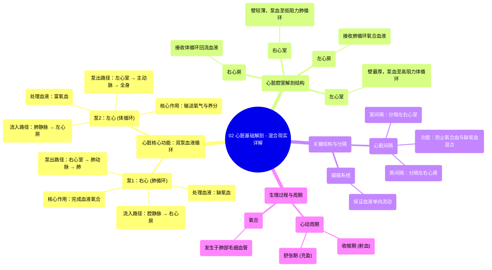

# 02 Heart Basic Anatomy - Explained in Mixed Reality

  <video controls preload="metadata" playsinline>
    <source src="https://helly.s3.bitiful.net/心血管学科/%E4%B8%93%E8%BE%91%2001%EF%BC%9A%E5%BF%83%E8%84%8F%E8%A7%A3%E5%89%96%E5%AD%A6%E5%AE%9E%E6%99%AF%E8%AF%BE%20%28Heart%20Anatomy%20-%20Course%29/02%20Heart%20Basic%20Anatomy%20-%20Explained%20in%20Mixed%20Reality.mp4" type="video/mp4">
    
您的浏览器不支持播放，请升级。

  </video>

::: tip ⚡️ 核心考点 (30s速读)
*   **核心考点**：心脏是一个由左右两侧组成的双泵系统，负责体循环和肺循环。右侧（右心房、右心室）收集并泵出缺氧血至肺部进行氧合；左侧（左心房、左心室）接收并泵出富氧血至全身。两侧由间隔分隔，血液不混合。
*   **临床意义**：理解心脏的双泵结构和血流方向是诊断心血管疾病（如心力衰竭、瓣膜病、先天性心脏病如房间隔缺损）的基础。左心室壁更厚，因其需克服体循环的高阻力泵血，其功能异常直接影响全身器官灌注。
:::

## 🧠 深度精讲
*   **概念1：心脏的双泵功能与血液循环路径**
    心脏并非一个单一的泵，而是由两个独立但协同工作的泵组成，分别管理肺循环和体循环。
    1.  **右心泵（肺循环泵）**：负责收集全身回流的**缺氧血**。血液经上、下腔静脉进入**右心房**，然后流入**右心室**。右心室收缩，将血液通过**肺动脉**泵入肺部。在肺部毛细血管网，血液释放二氧化碳，摄取氧气，完成**氧合**，转变为**富氧血**。
    2.  **左心泵（体循环泵）**：负责将氧合后的血液泵送至全身。富氧血经**肺静脉**回流至**左心房**，然后进入**左心室**。左心室拥有最厚的心肌壁，收缩时产生强大压力，将血液泵入**主动脉**，进而通过动脉系统分布到全身各组织器官，供应氧气和营养物质。

*   **概念2：心脏腔室结构与功能差异**
    心脏的四个腔室在结构和功能上存在显著差异，以适应不同的血流动力学需求。
    1.  **心房 vs. 心室**：心房是血液回流的“接收腔”，壁较薄，主要功能是在心室舒张末期主动收缩（心房收缩），将血液进一步挤入心室，完成心室充盈（约占充盈量的20-30%）。心室是主要的“泵血腔”，壁厚，收缩产生压力将血液射入动脉。
    2.  **左心室 vs. 右心室**：**左心室**壁最厚（通常是右心室壁厚的3倍），因为它需要克服体循环（全身）高达80-120 mmHg的高阻力，将血液泵至全身。**右心室**壁较薄，形状呈新月形，因为它只需将血液泵入低阻力（约8-20 mmHg）的肺循环。这种结构差异是理解左心衰竭（如肺水肿）和右心衰竭（如颈静脉怒张、肝淤血）病理生理的关键。

*   **概念3：心脏间隔与心动周期**
    1.  **心脏间隔**：**房间隔**分隔左、右心房，**室间隔**分隔左、右心室。它们保证了缺氧血和富氧血在心脏内完全分离，不发生混合，确保氧合效率。先天性心脏病如室间隔缺损（VSD）或房间隔缺损（ASD）会导致血液异常分流，影响循环效率。
    2.  **心动周期**：指心脏一次收缩和舒张的机械活动周期，包括**心室收缩期（射血）**和**心室舒张期（充盈）**。心肌规律性的收缩与舒张，以及房室瓣（二尖瓣、三尖瓣）和动脉瓣（主动脉瓣、肺动脉瓣）的有序开闭，共同保证了血液的单向流动和高效泵送。

## 📚 双语术语表 (Terminology)
| 英文术语 | 中文翻译 | 定义/解释 |
| :--- | :--- | :--- |
| Heart | 心脏 | 位于胸腔中的肌性器官，作为循环系统的动力泵。 |
| Deoxygenated blood | 缺氧血 | 氧气含量低、二氧化碳含量较高的血液，通常呈暗红色。 |
| Oxygenated blood | 富氧血 | 氧气含量高、二氧化碳含量较低的血液，通常呈鲜红色。 |
| Oxygenation | 氧合 | 在肺部，血液从肺泡中摄取氧气并释放二氧化碳的过程。 |
| Right atrium | 右心房 | 心脏右上方的腔室，接收来自体循环的缺氧血。 |
| Right ventricle | 右心室 | 心脏右下方的腔室，将缺氧血泵入肺动脉至肺部。 |
| Left atrium | 左心房 | 心脏左上方的腔室，接收来自肺循环的富氧血。 |
| Left ventricle | 左心室 | 心脏左下方的腔室，心肌壁最厚，将富氧血泵入主动脉至全身。 |
| Vena cava | 腔静脉 | 将体循环缺氧血输送回右心房的大静脉，包括上腔静脉和下腔静脉。 |
| Pulmonary artery | 肺动脉 | 将右心室的缺氧血输送至肺部的动脉。 |
| Pulmonary veins | 肺静脉 | 将肺部氧合后的富氧血输送回左心房的静脉。 |
| Aorta | 主动脉 | 人体最大的动脉，起始于左心室，将富氧血输送至全身（除肺外）。 |
| Cardiac cycle | 心动周期 | 心脏一次完整的收缩（ systole）和舒张（ diastole）活动过程。 |
| Interventricular septum | 室间隔 | 分隔左心室和右心室的肌性/膜性结构。 |
| Interatrial septum | 房间隔 | 分隔左心房和右心房的隔膜。 |

## 🗺️ 知识图谱

