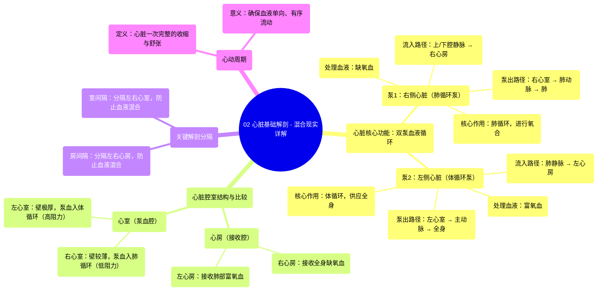

# 02 Heart Basic Anatomy - Explained in Mixed Reality

  <video controls preload="metadata" playsinline>
    <source src="https://helly.s3.bitiful.net/心血管学科/%E4%B8%93%E8%BE%91%2001%EF%BC%9A%E5%BF%83%E8%84%8F%E8%A7%A3%E5%89%96%E5%AD%A6%E5%AE%9E%E6%99%AF%E8%AF%BE%20%28Heart%20Anatomy%20-%20Course%29/02%20Heart%20Basic%20Anatomy%20-%20Explained%20in%20Mixed%20Reality.mp4" type="video/mp4">
    
您的浏览器不支持播放，请升级。

  </video>

::: tip ⚡️ 核心考点 (30s速读)
*   **核心考点**：心脏是一个由左右两侧组成的双泵系统，负责推动血液进行体循环和肺循环。右侧处理缺氧血，泵入肺进行氧合；左侧处理富氧血，泵出至全身。两侧血液由间隔分隔，互不混合。
*   **临床意义**：理解心脏的双泵结构和血流方向是诊断心血管疾病（如心内分流、心力衰竭）的基础。左心室壁更厚，因其需克服体循环阻力泵血，其功能异常直接影响全身器官灌注。
:::

## 🧠 深度精讲
*   **概念1：心脏的双泵功能与血液循环路径**
    心脏并非一个单一的泵，而是由两个独立的泵（右侧心脏和左侧心脏）协同工作。右侧心脏（右心房、右心室）作为“肺循环泵”，接收来自全身组织的**缺氧血**，通过肺动脉将其泵入肺部进行气体交换（**氧合**）。氧合后的**富氧血**经肺静脉回流至左侧心脏（左心房、左心室）。左侧心脏作为“体循环泵”，将富氧血通过主动脉泵出，输送至全身各器官组织，供应氧气和营养物质。

*   **概念2：心脏腔室结构与功能差异**
    心脏共有四个腔室：两个心房（右心房、左心房）和两个心室（右心室、左心室）。心房主要负责接收回心血液，心室则是主要的泵血结构。**左心室**的肌肉壁显著厚于**右心室**，这是因为左心室需要产生更大的压力以克服体循环（全身）的高阻力，将血液泵至全身；而右心室只需将血液泵入阻力较低的肺循环。这种结构差异是功能需求的具体体现。

*   **概念3：心脏的分隔与心动周期**
    尽管左右两侧心脏同步工作，但**缺氧血**与**富氧血**在心脏内是严格分隔的。**房间隔**分隔左右心房，**室间隔**分隔左右心室，防止血液混合。心脏的泵血活动表现为周期性的**心动周期**，包括心肌的收缩（**收缩期**）与舒张（**舒张期**）。心房和心室的有序、交替收缩与舒张，确保了血液沿单一方向流动（通过瓣膜控制），高效完成泵血功能。

## 📚 双语术语表 (Terminology)
| 英文术语 | 中文翻译 | 定义/解释 |
| :--- | :--- | :--- |
| Deoxygenated blood | 缺氧血 | 氧气含量较低的血液，通常呈暗红色，从身体组织返回心脏。 |
| Oxygenated blood | 富氧血 | 氧气含量丰富的血液，通常呈鲜红色，从肺部返回心脏准备泵向全身。 |
| Right atrium | 右心房 | 心脏右上方的腔室，接收来自上、下腔静脉的全身缺氧血。 |
| Right ventricle | 右心室 | 心脏右下方的腔室，接收右心房的血液，并将其泵入肺动脉至肺部。 |
| Left atrium | 左心房 | 心脏左上方的腔室，接收来自肺静脉的肺循环富氧血。 |
| Left ventricle | 左心室 | 心脏左下方的腔室，心肌最厚，接收左心房的血液，并将其高压泵入主动脉至全身。 |
| Pulmonary artery | 肺动脉 | 将右心室的缺氧血输送至肺部进行氧合的血管。 |
| Pulmonary veins | 肺静脉 | 将肺部氧合后的富氧血输送回左心房的血管。 |
| Aorta | 主动脉 | 人体最粗大的动脉，起始于左心室，将富氧血输送至全身（除肺以外）。 |
| Cardiac cycle | 心动周期 | 心脏一次完整的收缩和舒张过程，包括心房和心室的电活动与机械活动。 |
| Interventricular septum | 室间隔 | 分隔左心室与右心室的肌肉性/膜性结构。 |
| Interatrial septum | 房间隔 | 分隔左心房与右心房的隔膜。 |
| Oxygenation | 氧合 | 在肺部，血液中的血红蛋白与氧气结合的过程。 |

## 🗺️ 知识图谱

