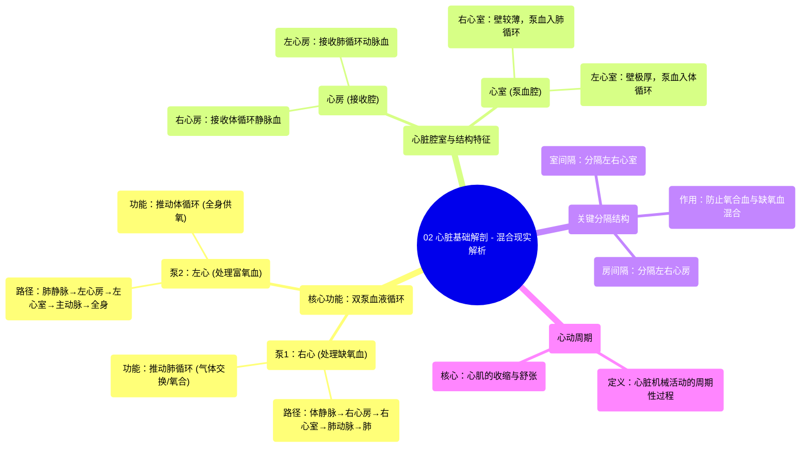

# 02 Heart Basic Anatomy - Explained in Mixed Reality

  <video controls preload="metadata" playsinline>
    <source src="https://helly.bitiful.net/心血管学科/%E4%B8%93%E8%BE%91%2001%EF%BC%9A%E5%BF%83%E8%84%8F%E8%A7%A3%E5%89%96%E5%AD%A6%E5%AE%9E%E6%99%AF%E8%AF%BE%20%28Heart%20Anatomy%20-%20Course%29/02%20Heart%20Basic%20Anatomy%20-%20Explained%20in%20Mixed%20Reality.mp4" type="video/mp4">
    
您的浏览器不支持播放，请升级。

  </video>

::: tip ⚡️ 核心考点 (30s速读)
*   **核心考点**：心脏是一个由左右两侧构成的“双泵”系统，负责推动血液进行体循环和肺循环。右侧处理“缺氧血”，泵入肺进行氧合；左侧处理“富氧血”，泵出至全身。两侧血液由间隔分隔，互不混合。
*   **临床意义**：理解心脏的“双泵”结构和血流方向是诊断心血管疾病（如房间隔缺损、室间隔缺损导致血液混合）的基础。左心室壁更厚，其功能异常（如心力衰竭）直接影响全身供氧。
:::

## 🧠 深度精讲
*   **概念1：心脏的“双泵”功能与血液循环路径**
    心脏并非一个单一的泵，而是由两个协同工作的泵组成，分别管理肺循环和体循环。
    1.  **右心泵（肺循环泵）**：负责收集并泵出全身回流、氧气含量低的“缺氧血”。
        *   **路径**：上、下腔静脉 → 右心房 → 右心室 → 肺动脉 → 肺部毛细血管网（进行气体交换，即“氧合”）。
    2.  **左心泵（体循环泵）**：负责接收并泵出经过肺氧合后的“富氧血”。
        *   **路径**：肺静脉 → 左心房 → 左心室 → 主动脉 → 全身各级动脉及毛细血管网（为组织供氧）。
    这一过程是连续的，两个泵通过心房和心室的顺序收缩与舒张（即“心动周期”）来协调完成。

*   **概念2：心脏腔室结构与功能适配**
    心脏的四个腔室在结构上存在显著差异，这与其承担的功能压力直接相关。
    1.  **心房 vs. 心室**：心房壁较薄，主要功能是接收回心血液并将其“排空”入心室，是低压腔室；心室壁厚，特别是左心室，其功能是以高压将血液泵出心脏，是高压泵血腔室。
    2.  **左心室 vs. 右心室**：左心室壁最厚，肌肉最发达。因为它需要产生足够的压力将血液泵入体循环，克服全身血管的阻力。右心室只需将血液泵入阻力较低的肺循环，故其室壁较薄。这种结构差异是功能需求不同的直接体现。

*   **概念3：心脏内的分隔——保证血流单向性的关键**
    尽管心脏左右两侧同时工作，但“缺氧血”和“富氧血”在正常情况下绝不混合，这得益于心脏内部精密的分隔结构。
    1.  **房间隔**：位于左、右心房之间，防止心房水平的血液混合。
    2.  **室间隔**：位于左、右心室之间，主要由厚实的肌肉构成，防止心室水平的血液混合。
    这些分隔结构保证了血液在肺循环和体循环两条路径中单向、顺序流动，是维持高效气体交换和全身供氧的解剖学基础。

## 📚 双语术语表 (Terminology)
| 英文术语 | 中文翻译 | 定义/解释 |
| :--- | :--- | :--- |
| Heart | 心脏 | 位于胸腔内的肌性器官，作为循环系统的动力泵。 |
| Deoxygenated blood | 缺氧血 | 氧气含量较低、二氧化碳含量较高的静脉血。 |
| Oxygenated blood | 富氧血 | 氧气含量高、二氧化碳含量较低的动脉血。 |
| Right atrium | 右心房 | 心脏右上方的腔室，接收来自体循环的缺氧血。 |
| Right ventricle | 右心室 | 心脏右下方的腔室，将缺氧血泵入肺动脉至肺部。 |
| Left atrium | 左心房 | 心脏左上方的腔室，接收来自肺循环的富氧血。 |
| Left ventricle | 左心室 | 心脏左下方的腔室，肌肉最厚，将富氧血泵入主动脉至全身。 |
| Pulmonary artery | 肺动脉 | 将右心室的缺氧血输送至肺部的血管。 |
| Pulmonary vein | 肺静脉 | 将肺部氧合后的富氧血输送回左心房的血管。 |
| Aorta | 主动脉 | 人体最粗大的动脉，起始于左心室，将富氧血输送至全身。 |
| Cardiac cycle | 心动周期 | 心脏一次收缩和舒张所经历的机械活动周期，包括心室的收缩期和舒张期。 |
| Interventricular septum | 室间隔 | 分隔左、右心室的肌性（大部分）和膜性结构。 |
| Interatrial septum | 房间隔 | 分隔左、右心房的隔膜。 |

## 🗺️ 知识图谱

