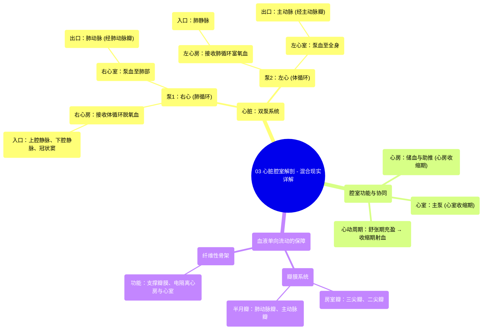

# 03 Heart Chambers Anatomy - Explained in Mixed Reality

  <video controls preload="metadata" playsinline>
    <source src="https://helly.s3.bitiful.net/心血管学科/%E4%B8%93%E8%BE%91%2001%EF%BC%9A%E5%BF%83%E8%84%8F%E8%A7%A3%E5%89%96%E5%AD%A6%E5%AE%9E%E6%99%AF%E8%AF%BE%20%28Heart%20Anatomy%20-%20Course%29/03%20Heart%20Chambers%20Anatomy%20-%20Explained%20in%20Mixed%20Reality.mp4" type="video/mp4">
    
您的浏览器不支持播放，请升级。

  </video>

::: tip ⚡️ 核心考点 (30s速读)
*   **核心考点**：心脏是一个“双泵”，由四个腔室组成：两个心房（接收血液）和两个心室（泵出血液）。血液流动遵循“心房→心室→大动脉”的单向路径，由瓣膜系统精确控制。
*   **临床意义**：理解心脏腔室的结构与功能是诊断和治疗各类心脏疾病（如心力衰竭、瓣膜病、先天性心脏病）的基础。例如，心室收缩功能下降会导致泵血不足（心衰），而瓣膜功能异常会导致血液反流或流出受阻。
:::

## 🧠 深度精讲

*   **心脏的双泵结构与功能**：心脏并非一个单一的泵，而是一个高效的“双泵”系统。右侧（右心房、右心室）负责**肺循环**，将身体回流的脱氧血泵入肺部进行气体交换；左侧（左心房、左心室）负责**体循环**，将肺部回来的富氧血泵至全身。这种分工确保了血液在肺部和身体组织之间持续、单向地循环。
*   **心房与心室的协同工作**：心房和心室的工作是交替且协调的，称为**心动周期**。当心室舒张（松弛）时，心房收缩（心房收缩期），将血液主动挤入心室，使心室在收缩前达到最佳充盈状态。随后心室强力收缩（心室收缩期），将血液泵入大动脉。这种“心房助推”机制能提高心脏泵血效率约20-30%。
*   **心室：心脏的动力源泉**：心室，尤其是**左心室**，心肌壁最厚，因为它需要产生足够的压力将血液泵至全身。右心室壁较薄，仅需将血液泵入邻近的肺部。心室收缩产生的压力是推动血液循环的根本动力。
*   **确保血液单向流动的关键结构**：血液之所以能单向流动而不倒流，依赖于两套重要的瓣膜：
    1.  **房室瓣**：位于心房与心室之间，包括**三尖瓣**（右心）和**二尖瓣**（左心）。心室收缩时，室内压升高，瓣膜关闭，防止血液反流回心房。
    2.  **半月瓣**：位于心室与大动脉之间，包括**肺动脉瓣**（右心室出口）和**主动脉瓣**（左心室出口）。心室舒张时，动脉内压力高于心室内压，瓣膜关闭，防止血液从动脉倒流回心室。
*   **纤维性骨架：心脏的“承重墙”**：这是心脏内一个致密的结缔组织框架。它不仅为上述瓣膜提供了牢固的附着点，还像绝缘体一样将心房肌和心室肌**电隔离**开来，确保电冲动只能通过特定的传导通路（房室结-希氏束）从心房传至心室，从而实现心房先收缩、心室后收缩的精确顺序。

## 📚 双语术语表 (Terminology)
| 英文术语 | 中文翻译 | 定义/解释 |
| :--- | :--- | :--- |
| Heart | 心脏 | 一个中空的肌性器官，作为循环系统的双联泵。 |
| Dual Pump | 双泵 | 描述心脏同时执行肺循环和体循环两个独立泵血功能。 |
| Atria (单数: Atrium) | 心房 | 心脏上部的两个腔室，主要功能是接收回心血液并将其送入心室。 |
| Ventricles | 心室 | 心脏下部的两个腔室，作为主泵，将血液泵出心脏至肺或全身。 |
| Right Atrium | 右心房 | 接收来自全身的脱氧血（通过上、下腔静脉及冠状窦）。 |
| Left Atrium | 左心房 | 接收来自肺部的富氧血（通过肺静脉）。 |
| Right Ventricle | 右心室 | 将脱氧血泵入肺动脉，送至肺部。 |
| Left Ventricle | 左心室 | 将富氧血泵入主动脉，送至全身。心肌最厚，收缩力最强。 |
| Systole | 收缩期 | 心脏（心房或心室）肌肉收缩、泵出血液的时期。 |
| Diastole | 舒张期 | 心脏（心房或心室）肌肉松弛、充盈血液的时期。 |
| Superior/Inferior Vena Cava | 上/下腔静脉 | 将身体上半身/下半身的脱氧血输送回右心房的大静脉。 |
| Pulmonary Veins | 肺静脉 | 将肺部氧合后的血液输送回左心房的静脉（通常有四条）。 |
| Pulmonary Artery | 肺动脉 | 将右心室的脱氧血输送至肺部的动脉。 |
| Aorta | 主动脉 | 将左心室的富氧血输送至全身的最大动脉。 |
| Atrioventricular (AV) Valves | 房室瓣 | 位于心房与心室之间的瓣膜，防止心室收缩时血液反流回心房。 |
| Semilunar Valves | 半月瓣 | 位于心室与大动脉（主动脉、肺动脉）出口处的瓣膜，防止心室舒张时血液从动脉反流。 |
| Fibrous Skeleton | 纤维性骨架 | 心脏内的结缔组织框架，支撑瓣膜、隔离心房与心室电活动。 |

## 🗺️ 知识图谱

