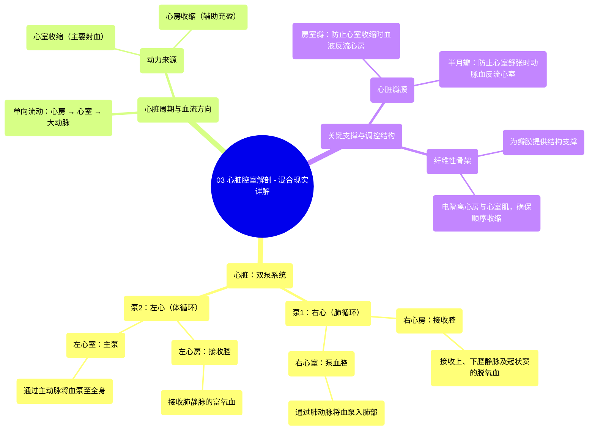

# 03 Heart Chambers Anatomy - Explained in Mixed Reality

  <video controls preload="metadata" playsinline>
    <source src="https://helly.s3.bitiful.net/心血管学科/%E4%B8%93%E8%BE%91%2001%EF%BC%9A%E5%BF%83%E8%84%8F%E8%A7%A3%E5%89%96%E5%AD%A6%E5%AE%9E%E6%99%AF%E8%AF%BE%20%28Heart%20Anatomy%20-%20Course%29/03%20Heart%20Chambers%20Anatomy%20-%20Explained%20in%20Mixed%20Reality.mp4" type="video/mp4">
    
您的浏览器不支持播放，请升级。

  </video>

::: tip ⚡️ 核心考点 (30s速读)
*   **核心考点**：心脏是一个“双泵”，由四个腔室组成：两个心房（接收血液）和两个心室（泵出血液）。血液流动遵循“心房→心室→大动脉”的单向路径，由瓣膜系统精确控制。
*   **临床意义**：理解心脏腔室的结构与功能是诊断和治疗各类心脏疾病（如心力衰竭、瓣膜病、先天性心脏病）的基础。例如，心室收缩功能下降会导致泵血不足（心衰），瓣膜功能异常会导致血液反流或流出受阻。
:::

## 🧠 深度精讲

*   **心脏的双泵结构**：心脏并非一个单一的泵，而是一个高效的“双泵”系统。右心（右心房和右心室）负责肺循环（小循环），将身体回流的脱氧血泵入肺部进行气体交换；左心（左心房和左心室）负责体循环（大循环），将肺部回来的富氧血泵送至全身。这两个泵同步工作，共同维持生命。
*   **心房与心室的功能分工**：
    *   **心房**：是“接收腔”和“初级泵”。它们壁薄，主要功能是接收回心血液（右心房接收体循环静脉血，左心房接收肺循环动脉血），并在心室舒张末期主动收缩（心房收缩期），将最后一部分血液挤入心室，使心室充盈更充分，这被称为“心房辅助泵”作用。
    *   **心室**：是“主泵血腔”。它们壁厚（尤其是左心室），肌肉发达，负责产生将血液泵出心脏所需的主要压力。心室收缩（心室收缩期）是心脏泵血的主要动力来源。
*   **心脏周期与压力变化**：心脏工作具有周期性，即“心脏周期”。当心室舒张（松弛）时，心房收缩，将血液送入心室；接着心室收缩，内部压力急剧升高，超过心房和大动脉压力，从而推开动脉瓣将血液泵出，同时房室瓣关闭防止血液倒流回心房。这种压力的精密变化是单向血流的基础。
*   **纤维性骨架的关键作用**：这是一个由致密结缔组织构成的坚固框架。它不仅为四个心脏瓣膜提供了牢固的附着点，保证了瓣膜的稳定性和功能，还像“绝缘垫”一样将心房肌和心室肌电隔离，使得心房和心室能够顺序收缩（先心房后心室），确保泵血效率。

## 📚 双语术语表 (Terminology)
| 英文术语 | 中文翻译 | 定义/解释 |
| :--- | :--- | :--- |
| Heart | 心脏 | 位于胸腔的中空肌性器官，作为循环系统的动力泵。 |
| Dual Pump | 双泵 | 描述心脏同时驱动肺循环和体循环两个独立但串联的循环系统的功能概念。 |
| Atrium (pl. Atria) | 心房 | 心脏上部的腔室，负责接收回心血液并初步将其送入心室。 |
| Ventricle | 心室 | 心脏下部厚壁的腔室，是泵血的主要动力来源，将血液射入动脉。 |
| Right Atrium | 右心房 | 接收来自全身的脱氧血（通过上、下腔静脉和冠状窦）。 |
| Left Atrium | 左心房 | 接收来自肺部的富氧血（通过肺静脉）。 |
| Right Ventricle | 右心室 | 将脱氧血泵入肺动脉，送至肺部进行氧合。 |
| Left Ventricle | 左心室 | 将富氧血泵入主动脉，输送至全身各器官组织。 |
| Systole | 收缩期 | 心肌（特指心房或心室）收缩、腔内压力升高的时期。 |
| Diastole | 舒张期 | 心肌（特指心房或心室）舒张、腔内压力降低的时期。 |
| Vena Cava (Superior/Inferior) | 腔静脉（上/下） | 将身体上半身和下半身的脱氧血输送回右心房的大静脉。 |
| Pulmonary Veins | 肺静脉 | 将肺部氧合后的富氧血输送回左心房的静脉（是唯一输送动脉血的静脉）。 |
| Pulmonary Artery | 肺动脉 | 将右心室的脱氧血输送至肺部的大动脉（是唯一输送静脉血的动脉）。 |
| Aorta | 主动脉 | 将左心室的富氧血输送至全身的体循环主干动脉。 |
| Valve | 瓣膜 | 心脏内保证血液单向流动的结构，防止反流。 |
| Atrioventricular Valve (AV Valve) | 房室瓣 | 位于心房与心室之间的瓣膜（右侧为三尖瓣，左侧为二尖瓣）。 |
| Semilunar Valve (SL Valve) | 半月瓣 | 位于心室与大动脉出口处的瓣膜（主动脉瓣和肺动脉瓣）。 |
| Fibrous Skeleton | 纤维性骨架 | 心脏中央的结缔组织框架，支撑瓣膜并分隔心房与心室肌。 |
| Myocardium | 心肌 | 构成心脏壁的肌肉层，负责心脏的收缩。 |

## 🗺️ 知识图谱

