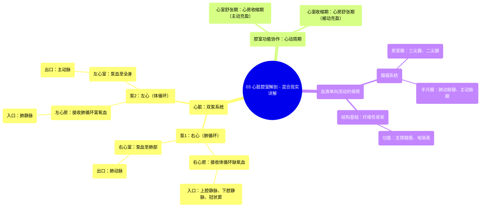

# 03 Heart Chambers Anatomy - Explained in Mixed Reality

  <video controls preload="metadata" playsinline>
    <source src="https://helly.bitiful.net/心血管学科/%E4%B8%93%E8%BE%91%2001%EF%BC%9A%E5%BF%83%E8%84%8F%E8%A7%A3%E5%89%96%E5%AD%A6%E5%AE%9E%E6%99%AF%E8%AF%BE%20%28Heart%20Anatomy%20-%20Course%29/03%20Heart%20Chambers%20Anatomy%20-%20Explained%20in%20Mixed%20Reality.mp4" type="video/mp4">
    
您的浏览器不支持播放，请升级。

  </video>

::: tip ⚡️ 核心考点 (30s速读)
*   **核心考点**：心脏是一个双泵系统，由四个腔室组成：两个心房（接收血液）和两个心室（泵出血液）。血液单向流动，依靠瓣膜防止倒流。
*   **临床意义**：理解心脏腔室的结构与功能是诊断和治疗各类心脏疾病（如心力衰竭、瓣膜病、先天性心脏病）的基础。例如，心室收缩功能下降会导致泵血不足。
:::

## 🧠 深度精讲
*   **心脏的双泵功能**：心脏并非一个简单的泵，而是一个精密的“双泵”。右心系统（右心房、右心室）负责将身体回流的缺氧血泵入肺部进行气体交换（肺循环）；左心系统（左心房、左心室）负责将肺部回来的富氧血泵至全身各处（体循环）。两个泵同步工作，维持生命。
*   **心房与心室的功能协作**：心房和心室的收缩是交替进行的，称为心动周期。当心室舒张（松弛）时，心房收缩（心房收缩期），将血液主动挤入心室，使心室在收缩前充盈更充分，从而提高泵血效率。这被称为“心房助推”作用。
*   **血液的单向流动与瓣膜机制**：血液从心房流向心室，再从心室流向动脉，绝不会倒流。这依赖于两套关键的单向瓣膜：
    1.  **房室瓣**：位于心房和心室之间，包括右心的三尖瓣和左心的二尖瓣。心室收缩时，室内压升高，迫使瓣膜关闭，防止血液反流回心房。
    2.  **半月瓣**：位于心室和动脉之间，包括肺动脉瓣和主动脉瓣。心室舒张时，动脉内压力高于心室内压，迫使瓣膜关闭，防止动脉血倒流回心室。
*   **纤维性骨架的核心作用**：这是心脏内致密的结缔组织框架。它不仅为上述瓣膜（尤其是房室瓣）提供了牢固的附着点，保证了其稳定性和功能，还像“绝缘层”一样将心房肌和心室肌的电活动隔离开，确保心房先收缩、心室后收缩的顺序，这对心脏的有效泵血至关重要。

## 📚 双语术语表 (Terminology)
| 英文术语 | 中文翻译 | 定义/解释 |
| :--- | :--- | :--- |
| Heart | 心脏 | 位于胸腔内的肌性器官，作为循环系统的动力泵。 |
| Dual Pump | 双泵 | 指心脏同时作为肺循环（右心）和体循环（左心）两个独立但协同工作的泵。 |
| Atria (单数: Atrium) | 心房 | 心脏上部的两个腔室，主要功能是接收回心血液并将其送入心室。 |
| Ventricles | 心室 | 心脏下部的两个厚壁腔室，是心脏的主要泵血结构，将血液泵入动脉。 |
| Diastole | 舒张期 | 心脏（通常指心室）肌肉松弛、腔室扩大以容纳血液的时期。 |
| Systole | 收缩期 | 心脏（心房或心室）肌肉收缩、将血液泵出的时期。 |
| Superior Vena Cava | 上腔静脉 | 将头部、颈部、上肢和胸部回流的缺氧血输送至右心房的大静脉。 |
| Inferior Vena Cava | 下腔静脉 | 将腹部、盆部和下肢回流的缺氧血输送至右心房的大静脉。 |
| Pulmonary Veins | 肺静脉 | 将肺部经过氧合后的富氧血输送至左心房的静脉（通常有四条）。 |
| Pulmonary Artery | 肺动脉 | 将右心室的缺氧血输送至肺部的动脉。 |
| Aorta | 主动脉 | 将左心室的富氧血输送至全身（除肺部外）的最大动脉。 |
| Atrioventricular Valves | 房室瓣 | 位于心房与心室之间的瓣膜，包括三尖瓣（右）和二尖瓣（左），防止心室收缩时血液反流回心房。 |
| Semilunar Valves | 半月瓣 | 位于心室与动脉之间的瓣膜，包括肺动脉瓣（右）和主动脉瓣（左），防止心室舒张时动脉血反流回心室。 |
| Fibrous Skeleton | 纤维性骨架 | 心脏内由致密结缔组织构成的框架，支撑瓣膜、隔离心房与心室肌的电传导。 |
| Myocardium | 心肌 | 构成心脏壁中间层的肌肉组织，负责心脏的收缩。 |

## 🗺️ 知识图谱

