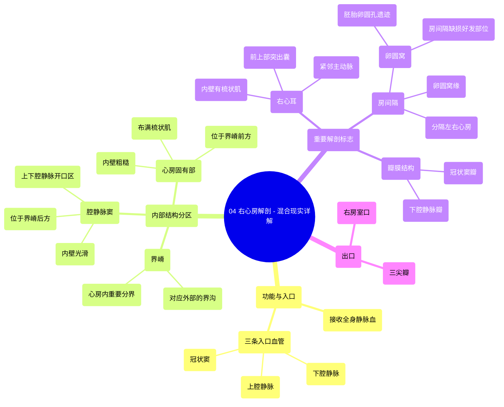

# 04 Right Atrium Anatomy - Explained in Mixed Reality

  <video controls preload="metadata" playsinline>
    <source src="https://helly.bitiful.net/心血管学科/%E4%B8%93%E8%BE%91%2001%EF%BC%9A%E5%BF%83%E8%84%8F%E8%A7%A3%E5%89%96%E5%AD%A6%E5%AE%9E%E6%99%AF%E8%AF%BE%20%28Heart%20Anatomy%20-%20Course%29/04%20Right%20Atrium%20Anatomy%20-%20Explained%20in%20Mixed%20Reality.mp4" type="video/mp4">
    
您的浏览器不支持播放，请升级。

  </video>

::: tip ⚡️ 核心考点 (30s速读)
*   **核心考点**：右心房是心脏的“入口”，接收来自全身（上、下腔静脉）和心脏本身（冠状窦）的静脉血，并通过三尖瓣口将血液泵入右心室。其内部结构以“界嵴”为界，分为光滑的“腔静脉窦”和布满“梳状肌”的“心房固有部”。
*   **临床意义**：理解右心房结构是诊断和治疗相关疾病（如房间隔缺损、卵圆孔未闭、心房颤动等）的基础。例如，卵圆窝是房间隔缺损的好发部位，而梳状肌的排列与心房颤动的电生理机制有关。
:::

## 🧠 深度精讲

*   **右心房的功能与入口**：右心房是心脏四个腔室之一，主要功能是接收全身回流的静脉血。血液通过三条主要血管进入右心房：
    1.  **上腔静脉**：收集头部、颈部、上肢和胸部的静脉血，开口于右心房上后部。
    2.  **下腔静脉**：收集腹部、盆部和下肢的静脉血，开口于右心房下后部。
    3.  **冠状窦**：收集心脏自身（心肌）的静脉血，开口于下腔静脉口与右房室口之间。

*   **右心房的内部结构分区**：右心房内部以“界嵴”为标志，分为两个部分：
    1.  **腔静脉窦**：位于界嵴后方，内壁光滑。是上、下腔静脉和冠状窦开口的区域，因此得名。
    2.  **心房固有部**：位于界嵴前方，内壁粗糙，布满了平行排列的肌性隆起，称为“梳状肌”。这些肌肉增强了心房壁的收缩力。

*   **重要的解剖标志与结构**：
    *   **界沟与界嵴**：在右心房外表面，从上腔静脉口到下腔静脉口之间的一条浅沟，称为“界沟”。其对应于心房内壁的一条肌性隆起，称为“界嵴”。这是划分心房内部两个区域的关键标志。
    *   **房间隔与卵圆窝**：分隔左、右心房的肌性壁称为“房间隔”。在成人房间隔的右心房面，有一个椭圆形的凹陷，称为“卵圆窝”，是胚胎时期“卵圆孔”闭合后的遗迹。卵圆窝的上缘稍隆起，称为“卵圆窝缘”。
    *   **右心耳**：是右心房前上部一个向左前上方突出的耳状小囊，其内壁也布满了梳状肌。右心耳紧邻主动脉根部。
    *   **瓣膜结构**：
        *   **下腔静脉瓣**：位于下腔静脉口前缘的半月形瓣膜，又称欧氏瓣，在胎儿时期有引导血流的作用。
        *   **冠状窦瓣**：覆盖在冠状窦口上的瓣膜，又称特贝西乌斯瓣，可防止血液从右心房倒流回冠状窦。

*   **血液流出通道**：血液从右心房流向右心室的通道称为“右房室口”。此口由“三尖瓣”守卫，确保血液在心室收缩时不会从心室倒流回心房。

## 📚 双语术语表 (Terminology)
| 英文术语 | 中文翻译 | 定义/解释 |
| :--- | :--- | :--- |
| Right Atrium | 右心房 | 心脏的四个腔室之一，接收全身静脉血。 |
| Superior Vena Cava | 上腔静脉 | 将上半身静脉血输送回右心房的大血管。 |
| Inferior Vena Cava | 下腔静脉 | 将下半身静脉血输送回右心房的大血管。 |
| Coronary Sinus | 冠状窦 | 位于心脏后方的静脉窦，收集心脏自身的静脉血并开口于右心房。 |
| Sulcus Terminalis | 界沟 | 右心房外表面从上腔静脉口延伸至下腔静脉口的浅沟。 |
| Crista Terminalis | 界嵴 | 右心房内壁与界沟对应的肌性隆起，是划分心房内部结构的重要标志。 |
| Sinus of Vena Cavae | 腔静脉窦 | 界嵴后方、上下腔静脉开口之间的光滑区域。 |
| Pectinate Muscles | 梳状肌 | 位于右心房固有部内壁的平行肌束，形似梳齿。 |
| Atrium Proper | 心房固有部 | 界嵴前方、布满梳状肌的右心房部分。 |
| Right Auricle | 右心耳 | 右心房前上部突出的耳状结构，内壁有梳状肌。 |
| Interatrial Septum | 房间隔 | 分隔左心房和右心房的肌性壁。 |
| Fossa Ovalis | 卵圆窝 | 成人房间隔右心房面的椭圆形凹陷，为胚胎期卵圆孔闭合后的遗迹。 |
| Limbus of Fossa Ovalis | 卵圆窝缘 | 卵圆窝上缘的稍隆起部分。 |
| Valve of Inferior Vena Cava | 下腔静脉瓣 | 位于下腔静脉口前缘的瓣膜，又称欧氏瓣。 |
| Valve of Coronary Sinus | 冠状窦瓣 | 覆盖冠状窦口的瓣膜，又称特贝西乌斯瓣。 |
| Right Atrioventricular Orifice | 右房室口 | 连接右心房和右心室的开口。 |
| Tricuspid Valve | 三尖瓣 | 位于右房室口，由三个瓣叶组成，防止心室收缩时血液倒流回心房。 |

## 🗺️ 知识图谱

