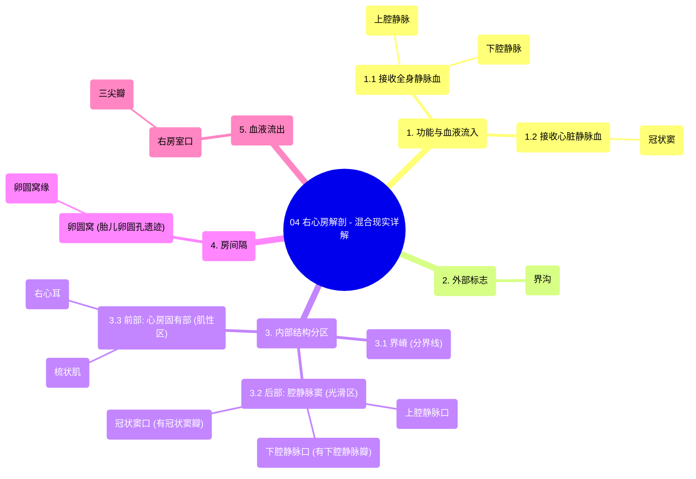

# 04 Right Atrium Anatomy - Explained in Mixed Reality

  <video controls preload="metadata" playsinline>
    <source src="https://helly.s3.bitiful.net/心血管学科/%E4%B8%93%E8%BE%91%2001%EF%BC%9A%E5%BF%83%E8%84%8F%E8%A7%A3%E5%89%96%E5%AD%A6%E5%AE%9E%E6%99%AF%E8%AF%BE%20%28Heart%20Anatomy%20-%20Course%29/04%20Right%20Atrium%20Anatomy%20-%20Explained%20in%20Mixed%20Reality.mp4" type="video/mp4">
    
您的浏览器不支持播放，请升级。

  </video>

::: tip ⚡️ 核心考点 (30s速读)
*   **核心考点**：右心房是心脏的“入口”，接收来自全身和心脏自身的静脉血，并通过三尖瓣将其泵入右心室。其内部结构（如界嵴、梳状肌、卵圆窝）是解剖学的重要标志。
*   **临床意义**：卵圆窝是房间隔缺损介入封堵术的关键定位标志。冠状窦口是心脏电生理检查和治疗（如射频消融、起搏器电极植入）的重要通路入口。理解这些结构对诊断和治疗相关心脏疾病至关重要。
:::

## 🧠 深度精讲

*   **右心房的功能与入口**：右心房是心脏四个腔室之一，主要功能是接收全身（通过上、下腔静脉）和心脏自身（通过冠状窦）回流的缺氧静脉血，并将其作为“中转站”输送到右心室。这三条血管的开口位置固定：上腔静脉口位于上后部，下腔静脉口和冠状窦口位于下后部。
*   **内部结构分区与标志**：右心房内壁以“界嵴”为界，分为后部的“腔静脉窦”（光滑区）和前部的“心房固有部”（肌性区）。
    *   **界嵴**：对应心外表的“界沟”，是一条起自上腔静脉口、止于下腔静脉口附近的肌性隆起，是心房内重要的解剖学分界线。
    *   **腔静脉窦**：位于界嵴后方，是上下腔静脉开口之间的光滑四边形区域。
    *   **心房固有部与梳状肌**：位于界嵴前方，内壁布满了平行隆起的肌束，称为“梳状肌”。这些肌束增加了心房收缩时的力量。
*   **右心耳**：是右心房前上部一个向左前上方突出的耳状小囊，其内壁也布满了梳状肌。它在心脏超声等影像检查中是重要的识别标志。
*   **房间隔与卵圆窝**：房间隔是分隔左、右心房的肌性壁。在成人心脏的房间隔右心房面，下部有一个椭圆形的凹陷，称为“卵圆窝”，是胎儿时期“卵圆孔”闭合后的遗迹。卵圆窝的上缘稍隆起，称为“卵圆窝缘”。卵圆窝是房间隔最薄弱的区域，也是房间隔缺损的好发部位，同时也是介入手术的关键定位点。
*   **重要瓣膜结构**：
    *   **下腔静脉瓣（欧氏瓣）**：位于下腔静脉口前缘的半月形瓣膜，在胎儿时期引导血液经卵圆孔流入左心房，成人后多退化。
    *   **冠状窦瓣（特贝西乌斯瓣）**：覆盖在冠状窦口上的瓣膜，可防止右心房收缩时血液反流回冠状窦。
*   **出口：右房室口与三尖瓣**：血液从右心房流向右心室的通道称为“右房室口”，此口由“三尖瓣”守卫，确保血液单向流动，防止心室收缩时血液倒流回心房。

## 📚 双语术语表 (Terminology)
| 英文术语 | 中文翻译 | 定义/解释 |
| :--- | :--- | :--- |
| Right Atrium | 右心房 | 心脏的四个腔室之一，接收全身静脉血并泵入右心室。 |
| Superior Vena Cava (SVC) | 上腔静脉 | 将头部、颈部、上肢和胸部血液引流入右心房的粗大静脉。 |
| Inferior Vena Cava (IVC) | 下腔静脉 | 将腹部、盆部和下肢血液引流入右心房的粗大静脉。 |
| Coronary Sinus | 冠状窦 | 位于心脏后方的静脉窦，收集心脏自身（心肌）的静脉血并开口于右心房。 |
| Sulcus Terminalis | 界沟 | 右心房外表的一条浅沟，对应内部的界嵴。 |
| Crista Terminalis | 界嵴 | 右心房内的一条肌性隆起，是腔静脉窦（光滑部）和心房固有部（肌性部）的分界。 |
| Sinus of Vena Cavae / Sinus Venarum | 腔静脉窦 | 位于界嵴后方，上下腔静脉开口之间的光滑四边形区域。 |
| Valve of the Inferior Vena Cavae / Eustachian Valve | 下腔静脉瓣 / 欧氏瓣 | 位于下腔静脉口前缘的瓣膜，胎儿期重要，成人常退化。 |
| Valve of the Coronary Sinus / Thebesian Valve | 冠状窦瓣 / 特贝西乌斯瓣 | 覆盖于冠状窦口上的瓣膜，防止血液反流。 |
| Interatrial Septum | 房间隔 | 分隔左心房和右心房的肌性壁。 |
| Fossa Ovalis | 卵圆窝 | 房间隔右心房面的椭圆形凹陷，是胎儿卵圆孔闭合后的遗迹。 |
| Limbus of Fossa Ovalis | 卵圆窝缘 | 卵圆窝上缘的弓形隆起。 |
| Pectinate Muscles | 梳状肌 | 右心房前部（心房固有部）和右心耳内壁的平行肌束。 |
| Right Auricle | 右心耳 | 右心房前上部向左前上方突出的耳状小囊，内壁有梳状肌。 |
| Right Atrioventricular Orifice | 右房室口 | 右心房通向右心室的开口。 |
| Tricuspid Valve | 三尖瓣 | 位于右房室口，由三个瓣叶组成，防止右心室收缩时血液反流回右心房。 |

## 🗺️ 知识图谱

