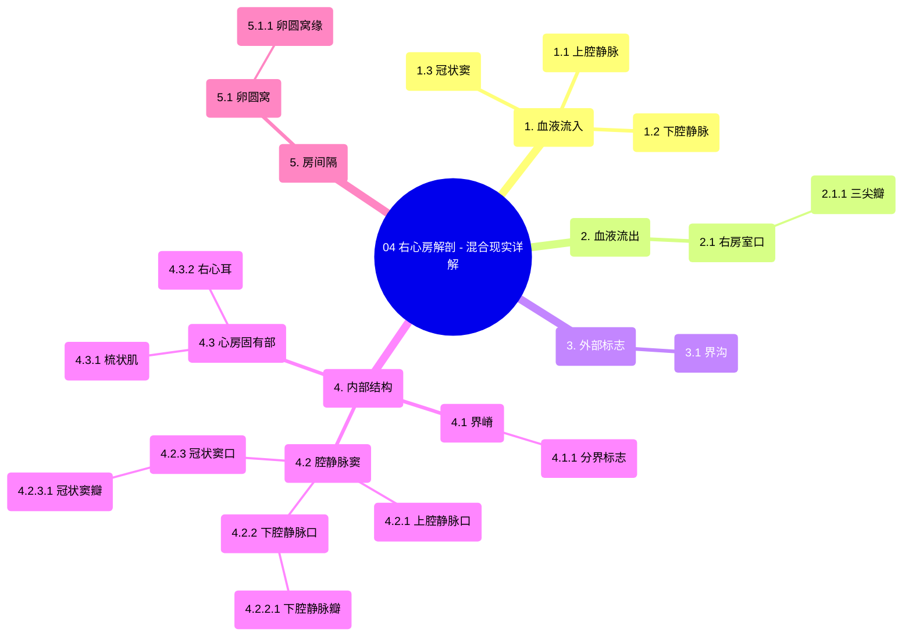

# 04 Right Atrium Anatomy - Explained in Mixed Reality

  <video controls preload="metadata" playsinline>
    <source src="https://helly.s3.bitiful.net/心血管学科/%E4%B8%93%E8%BE%91%2001%EF%BC%9A%E5%BF%83%E8%84%8F%E8%A7%A3%E5%89%96%E5%AD%A6%E5%AE%9E%E6%99%AF%E8%AF%BE%20%28Heart%20Anatomy%20-%20Course%29/04%20Right%20Atrium%20Anatomy%20-%20Explained%20in%20Mixed%20Reality.mp4" type="video/mp4">
    
您的浏览器不支持播放，请升级。

  </video>

::: tip ⚡️ 核心考点 (30s速读)
*   **核心考点**：右心房是心脏的“入口”，接收来自全身和心脏自身的静脉血。其内部结构以“界嵴”为界，分为光滑的“腔静脉窦”和布满肌束的“心房固有部”，并包含重要的胚胎遗迹“卵圆窝”。
*   **临床意义**：理解右心房结构是诊断房间隔缺损、卵圆孔未闭等先天性心脏病的基础。冠状窦口是心脏介入手术（如起搏器电极植入）的重要路径。
:::

## 🧠 深度精讲

*   **入口与出口**：右心房接收来自**上腔静脉**、**下腔静脉**和**冠状窦**的血液。血液通过**右房室口**（由**三尖瓣**守卫）流入右心室。
*   **外部标志**：心房表面有一条**界沟**，是内部结构的外部投影。
*   **内部结构**：
    *   **界嵴**：心房内一条光滑的肌性隆起，是心房内部结构的分界线。
    *   **腔静脉窦**：位于界嵴后方，是一个光滑的四角形区域，上下腔静脉开口于此。
    *   **心房固有部**：位于界嵴前方，内壁粗糙，布满**梳状肌**。
    *   **右心耳**：是心房固有部向上延伸的囊状突出，内部也布满梳状肌，紧邻主动脉。
*   **重要开口与瓣膜**：
    *   **上腔静脉口**：位于顶部。
    *   **下腔静脉口**：位于上腔静脉口下方，前方有**下腔静脉瓣**（欧氏瓣）。
    *   **冠状窦口**：位于下腔静脉口前方，有**冠状窦瓣**（特贝西乌斯瓣）保护。
*   **房间隔**：分隔左右心房的肌性壁。
    *   **卵圆窝**：房间隔下部的一个椭圆形凹陷，是胎儿时期**卵圆孔**闭合后的遗迹。
    *   **卵圆窝缘**：卵圆窝上缘的隆起。

## 📚 双语术语表 (Terminology)
| 英文术语 | 中文翻译 | 定义/解释 |
| :--- | :--- | :--- |
| Right Atrium | 右心房 | 心脏的四个腔室之一，接收全身的静脉血。 |
| Superior Vena Cava | 上腔静脉 | 将上半身静脉血输送回右心房的血管。 |
| Inferior Vena Cava | 下腔静脉 | 将下半身静脉血输送回右心房的血管。 |
| Coronary Sinus | 冠状窦 | 收集心脏自身静脉血并汇入右心房的血管。 |
| Tricuspid Valve | 三尖瓣 | 位于右房室口，防止心室收缩时血液从右心室反流回右心房。 |
| Sulcus Terminalis | 界沟 | 右心房外部的一条浅沟，对应内部的界嵴。 |
| Crista Terminalis | 界嵴 | 右心房内部的一条肌性隆起，是腔静脉窦和心房固有部的分界。 |
| Sinus of Vena Cavae | 腔静脉窦 | 界嵴后方光滑的区域，上下腔静脉开口于此。 |
| Pectinate Muscles | 梳状肌 | 右心房心房固有部内壁的平行肌束，使内壁粗糙。 |
| Right Auricle | 右心耳 | 右心房前上部向左前突出的囊状结构，内部有梳状肌。 |
| Interatrial Septum | 房间隔 | 分隔左、右心房的肌性壁。 |
| Fossa Ovalis | 卵圆窝 | 房间隔下部的椭圆形凹陷，是胎儿卵圆孔闭合后的遗迹。 |
| Limbus of Fossa Ovalis | 卵圆窝缘 | 卵圆窝上缘的肌性隆起。 |
| Valve of Coronary Sinus | 冠状窦瓣 | 覆盖在冠状窦口上的瓣膜，又称特贝西乌斯瓣。 |
| Valve of Inferior Vena Cava | 下腔静脉瓣 | 位于下腔静脉口前方的瓣膜，又称欧氏瓣。 |

## 🗺️ 知识图谱

