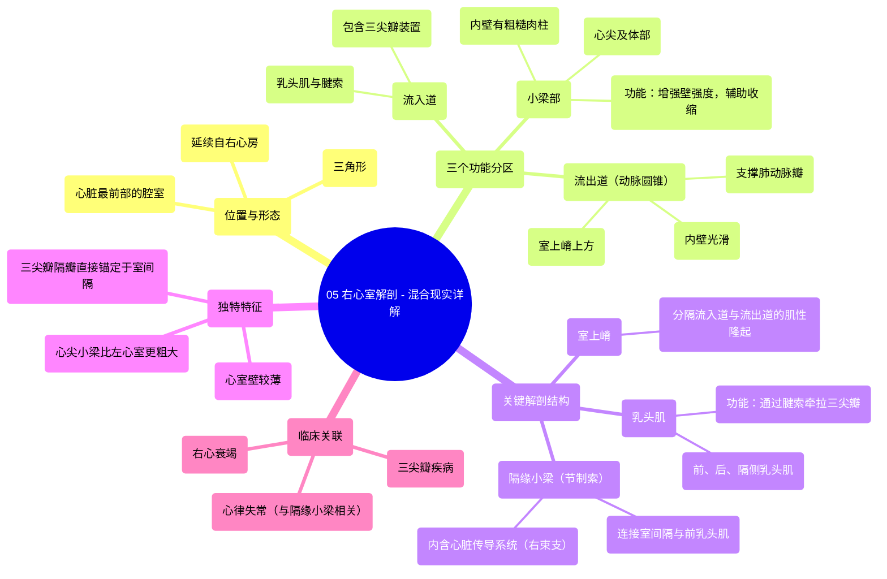

# 05 Right Ventricle Anatomy - Explained in Mixed Reality

  <video controls preload="metadata" playsinline>
    <source src="https://helly.s3.bitiful.net/心血管学科/%E4%B8%93%E8%BE%91%2001%EF%BC%9A%E5%BF%83%E8%84%8F%E8%A7%A3%E5%89%96%E5%AD%A6%E5%AE%9E%E6%99%AF%E8%AF%BE%20%28Heart%20Anatomy%20-%20Course%29/05%20Right%20Ventricle%20Anatomy%20-%20Explained%20in%20Mixed%20Reality.mp4" type="video/mp4">
    
您的浏览器不支持播放，请升级。

  </video>

::: tip ⚡️ 核心考点 (30s速读)
*   **核心考点**：右心室是心脏最靠前的腔室，呈三角形，分为“流入道”、“小梁部”和“流出道”三个部分。其内部有“室上嵴”、“乳头肌”、“腱索”和“隔缘小梁”等关键结构，共同保障血液从右心房流向肺动脉。
*   **临床意义**：理解右心室解剖是诊断和治疗相关心脏病（如三尖瓣反流、肺动脉瓣狭窄、右心衰竭）的基础。例如，乳头肌功能失调可导致三尖瓣关闭不全；“隔缘小梁”是心脏传导系统的一部分，与心律失常相关。
:::

## 🧠 深度精讲

*   **位置与形态**：右心室位于心脏最前方，紧邻胸骨后。它呈不规则的三角形，是连接右心房与肺动脉的“泵血中转站”。其前壁与胸骨及左侧胸膜相邻，这在临床听诊和影像学检查中具有重要意义。
*   **三个功能分区**：
    1.  **流入道**：从“三尖瓣”口延伸至“室上嵴”。核心结构是“三尖瓣”装置，包括瓣叶、连接瓣叶与“乳头肌”的“腱索”，以及收缩时拉紧腱索防止瓣膜反流的“乳头肌”。
    2.  **小梁部**：构成心尖和大部分前壁、下壁。其内表面布满网状的肌肉隆起，即“肉柱”。这些结构能增强心室壁强度，并在收缩时协助心室内血液的混合与排空。右心室的“肉柱”比左心室更粗大明显。
    3.  **流出道（动脉圆锥/漏斗部）**：位于“室上嵴”上方，呈漏斗形，向上延续为“肺动脉瓣”口。此处内壁光滑，是血液射入肺动脉的最后通道。
*   **关键解剖结构**：
    *   **室上嵴**：位于“三尖瓣”与“肺动脉瓣”之间的一个显著肌性隆起，是划分流入道与流出道的解剖学标志。
    *   **乳头肌**：分为“前乳头肌”、“后乳头肌”和“隔侧乳头肌”。它们通过“腱索”牵拉“三尖瓣”瓣叶，防止心室收缩时血液倒流回右心房。
    *   **隔缘小梁（节制索）**：一条连接“室间隔”与“前乳头肌”的特化肉柱。它不仅提供结构支撑，其内还走行着右束支的一部分，是心脏传导系统的重要通路。
*   **独特特征**：与左心室不同，右心室的“三尖瓣”有一个瓣叶（隔瓣）直接附着在室间隔上。此外，右心室壁较薄，小梁结构更粗糙，这与其只需将血液泵入低阻力的肺循环的生理功能相适应。

## 📚 双语术语表 (Terminology)
| 英文术语 | 中文翻译 | 定义/解释 |
| :--- | :--- | :--- |
| Right Ventricle | 右心室 | 心脏最靠前的腔室，接收来自右心房的静脉血，并将其泵入肺动脉进行氧合。 |
| Inlet | 流入道 | 右心室包含三尖瓣装置的部分，血液由此进入。 |
| Trabecular Region / Part | 小梁部 | 右心室心尖及体部区域，内壁有粗糙的网状肌束（肉柱）隆起。 |
| Outlet / Conus Arteriosus / Infundibulum | 流出道 / 动脉圆锥 / 漏斗部 | 右心室上部光滑的漏斗形区域，引导血液流向肺动脉瓣。 |
| Tricuspid Valve | 三尖瓣 | 位于右房室口的瓣膜，由三个瓣叶组成，防止心室收缩时血液反流回右心房。 |
| Supraventricular Crest | 室上嵴 | 右心室内分隔流入道与流出道的肌性隆起。 |
| Papillary Muscles | 乳头肌 | 心室壁上的锥形肌性突起，通过腱索连接并牵拉房室瓣瓣叶。 |
| Chordae Tendineae | 腱索 | 连接乳头肌尖端与房室瓣瓣叶边缘的纤维索，防止瓣叶在收缩期翻入心房。 |
| Trabeculae Carnae | 肉柱 | 心室壁内层不规则交错的肌束，在右心室尤为发达。 |
| Septomarginal Trabecula (Moderator Band) | 隔缘小梁（节制索） | 右心室内连接室间隔与前乳头肌基底的肌束，内含右束支纤维。 |

## 🗺️ 知识图谱

