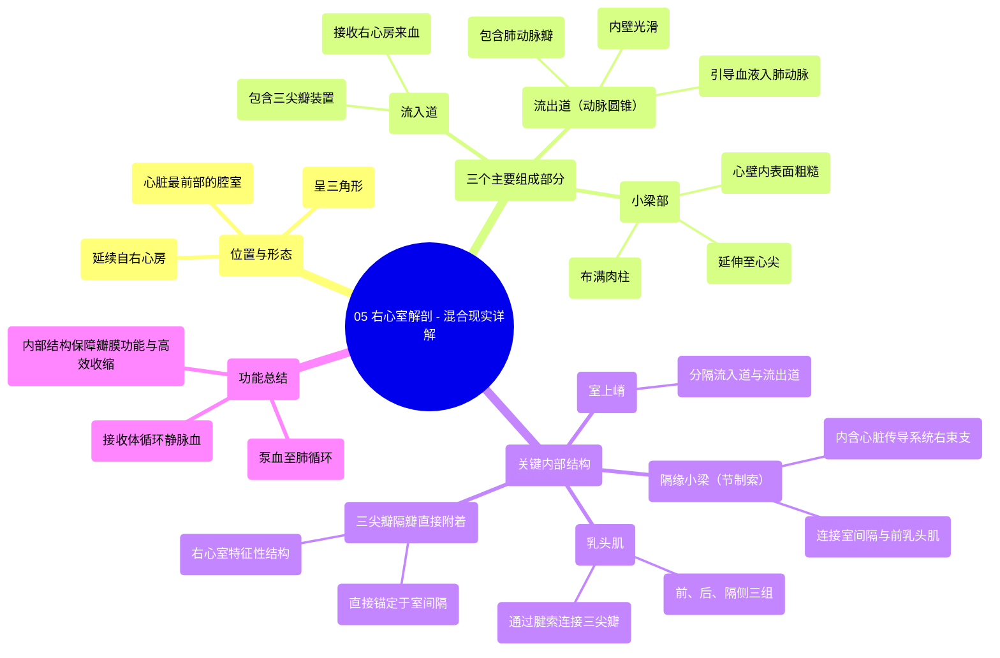

# 05 Right Ventricle Anatomy - Explained in Mixed Reality

  <video controls preload="metadata" playsinline>
    <source src="https://helly.bitiful.net/心血管学科/%E4%B8%93%E8%BE%91%2001%EF%BC%9A%E5%BF%83%E8%84%8F%E8%A7%A3%E5%89%96%E5%AD%A6%E5%AE%9E%E6%99%AF%E8%AF%BE%20%28Heart%20Anatomy%20-%20Course%29/05%20Right%20Ventricle%20Anatomy%20-%20Explained%20in%20Mixed%20Reality.mp4" type="video/mp4">
    
您的浏览器不支持播放，请升级。

  </video>

::: tip ⚡️ 核心考点 (30s速读)
*   **核心考点**：右心室是心脏最靠前的腔室，呈三角形，由流入道、小梁部和流出道三部分构成。其内部有独特的肌性结构（如室上嵴、乳头肌、小梁），对心脏的泵血功能和瓣膜正常工作至关重要。
*   **临床意义**：理解右心室解剖是诊断和治疗相关心脏病（如右心衰竭、肺动脉瓣疾病、三尖瓣反流）的基础。隔缘小梁是心脏传导系统的一部分，其异常可能影响心律。
:::

## 🧠 深度精讲

*   **位置与形态**：右心室位于心脏最前方，紧邻胸骨后。它呈三角形，是连接右心房与肺动脉的“泵血中转站”。其入口（三尖瓣口）位于后上方，出口（肺动脉口）位于左上方，两者之间由室上嵴分隔。
*   **三个主要部分**：
    1.  **流入道**：从三尖瓣口延伸至心尖，包含三尖瓣装置（瓣叶、腱索、乳头肌）。这是血液从右心房进入右心室的通道。
    2.  **小梁部**：构成右心室的主体和下壁，内表面粗糙，布满交错的肌性隆起，称为“肉柱”。这些结构能增强心室壁强度，并辅助收缩。
    3.  **流出道（动脉圆锥/漏斗部）**：位于室上嵴上方，通向肺动脉口，内壁光滑。它像一个光滑的管道，引导血液高效射入肺动脉。
*   **关键内部结构**：
    *   **室上嵴**：右心室内一个显著的弓形肌性隆起，是划分流入道和流出道的解剖学标志。
    *   **乳头肌**：右心室通常有三组（前、后、隔侧），它们通过腱索连接并牵拉三尖瓣叶，防止心室收缩时血液反流回心房。
    *   **隔缘小梁（节制索）**：一条连接室间隔与前乳头肌基底的肌束。它不仅提供结构支撑，还**内含右束支的一部分**，是心脏电信号传导的重要通路。
    *   **三尖瓣隔瓣的直接附着**：三尖瓣的隔侧瓣叶直接附着在室间隔上，这是右心室区别于左心室（二尖瓣无此结构）的一个特征。

## 📚 双语术语表 (Terminology)
| 英文术语 | 中文翻译 | 定义/解释 |
| :--- | :--- | :--- |
| Right Ventricle | 右心室 | 心脏四个腔室之一，接收来自右心房的静脉血，并将其泵入肺动脉进行氧合。 |
| Inlet | 流入道 | 右心室接收血液的部分，包含三尖瓣及其附属结构。 |
| Trabecular Region / Part | 小梁部 | 右心室壁内表面粗糙、布满肌性小梁（肉柱）的区域，主要位于心尖部。 |
| Outlet / Conus Arteriosus / Infundibulum | 流出道 / 动脉圆锥 / 漏斗部 | 右心室上部通向肺动脉口的平滑肌性管道。 |
| Tricuspid Valve | 三尖瓣 | 位于右房室口，由三个瓣叶组成，防止心室收缩时血液从右心室反流回右心房。 |
| Supraventricular Crest | 室上嵴 | 右心室内分隔流入道和流出道的肌性隆起。 |
| Papillary Muscles | 乳头肌 | 心室壁上的锥形肌性突起，通过腱索连接房室瓣，在收缩时牵拉瓣膜防止反流。 |
| Chordae Tendineae | 腱索 | 连接乳头肌尖端与房室瓣瓣叶的纤维索，传递牵拉力。 |
| Trabeculae Carnae | 肉柱 | 心室壁内表面交错隆起的肌束，在右心室尤为发达。 |
| Septomarginal Trabecula (Moderator Band) | 隔缘小梁（节制索） | 右心室内连接室间隔与前乳头肌的肌束，内含右束支传导纤维。 |

## 🗺️ 知识图谱

