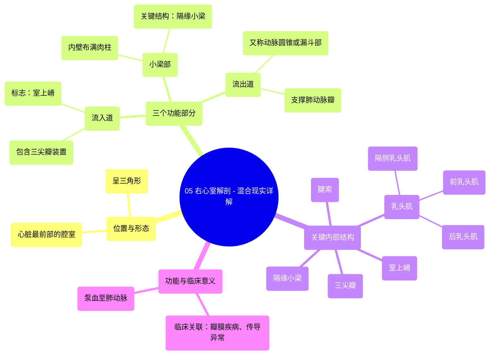

# 05 Right Ventricle Anatomy - Explained in Mixed Reality

  <video controls preload="metadata" playsinline>
    <source src="https://helly.s3.bitiful.net/心血管学科/%E4%B8%93%E8%BE%91%2001%EF%BC%9A%E5%BF%83%E8%84%8F%E8%A7%A3%E5%89%96%E5%AD%A6%E5%AE%9E%E6%99%AF%E8%AF%BE%20%28Heart%20Anatomy%20-%20Course%29/05%20Right%20Ventricle%20Anatomy%20-%20Explained%20in%20Mixed%20Reality.mp4" type="video/mp4">
    
您的浏览器不支持播放，请升级。

  </video>

::: tip ⚡️ 核心考点 (30s速读)
*   **核心考点**：右心室是心脏最靠前的腔室，呈三角形，由“流入道”、“小梁部”和“流出道”三部分构成。其核心结构包括“三尖瓣”、“室上嵴”、“乳头肌”、“腱索”及“隔缘小梁”，共同完成接收右心房血液并泵入肺动脉的功能。
*   **临床意义**：理解右心室解剖是诊断“肺动脉瓣狭窄”、“三尖瓣反流”等疾病的基础。“隔缘小梁”是心脏传导系统的一部分，其异常可能影响心律。右心室壁薄、小梁粗大，使其在压力负荷下易发生形态改变（如右心室肥厚）。
:::

## 🧠 深度精讲

*   **位置与形态**：右心室位于心脏最前部，胸骨后方。它呈不规则的三角形，是心脏四个腔室中最靠前的一个。其入口（房室口）位于后方，接收来自右心房的血液；出口（肺动脉口）位于左上方，将血液泵入肺动脉。
*   **三个功能部分**：
    1.  **流入道**：包含“三尖瓣”装置（瓣叶、腱索、乳头肌），是血液从右心房进入的通道。其上方有一显著的肌性隆起，称为“室上嵴”，是划分流入道与流出道的解剖标志。
    2.  **小梁部**：连接流入道与流出道的主体部分。其内壁布满网状肌束，即“肉柱”，使内表面粗糙不平。这些肉柱能增强心室壁强度，并辅助收缩。其中，“隔缘小梁”连接室间隔与前乳头肌，内有右束支通过，具有重要功能。
    3.  **流出道（动脉圆锥/漏斗部）**：位于“室上嵴”上方，呈圆锥形，内壁光滑。其上端支撑“肺动脉瓣”，是血液射入肺动脉的最终通道。
*   **关键内部结构**：
    *   **乳头肌**：为突入心室腔的锥形肉柱，共有三组：“前乳头肌”（最大）、“后乳头肌”和“隔侧乳头肌”。它们通过“腱索”牵拉“三尖瓣”瓣叶，防止心室收缩时血液反流回心房。
    *   **腱索**：连接乳头肌尖端与三尖瓣瓣叶的纤维细索，是瓣膜开闭的关键支撑结构。
    *   **室上嵴**：分隔流入道与流出道的肌性隆起，在影像学上是一个重要的识别标志。
    *   **隔缘小梁**：连接室间隔与前乳头肌基底的肌束，是右心室特有的结构，内含有右束支的一部分，与心脏电传导密切相关。

## 📚 双语术语表 (Terminology)
| 英文术语 | 中文翻译 | 定义/解释 |
| :--- | :--- | :--- |
| Right Ventricle | 右心室 | 心脏最靠前的腔室，负责将静脉血泵入肺动脉进行氧合。 |
| Inlet | 流入道 | 右心室包含三尖瓣的部分，血液由此进入。 |
| Trabecular Region / Part | 小梁部 | 右心室壁内布满肉柱（肌小梁）的主体区域，连接流入道与流出道。 |
| Outlet / Conus Arteriosus / Infundibulum | 流出道 / 动脉圆锥 / 漏斗部 | 右心室上部光滑的圆锥形区域，支撑肺动脉瓣，是血液流出通道。 |
| Tricuspid Valve | 三尖瓣 | 位于右房室口，由三个瓣叶组成，防止心室收缩时血液反流回心房。 |
| Supraventricular Crest | 室上嵴 | 右心室内分隔流入道与流出道的肌性隆起。 |
| Papillary Muscles | 乳头肌 | 心室壁突入腔内的锥形肌柱，通过腱索连接并牵拉房室瓣。 |
| Chordae Tendineae | 腱索 | 连接乳头肌与房室瓣瓣叶的纤维索，防止瓣膜翻入心房。 |
| Trabeculae Carnae | 肉柱 | 心室壁内层不规则交错的肌束，尤在右心室显著，能增强壁的强度。 |
| Septomarginal Trabecula / Moderator Band | 隔缘小梁 / 节制索 | 右心室内连接室间隔与前乳头肌的肌束，内含右束支纤维。 |

## 🗺️ 知识图谱

