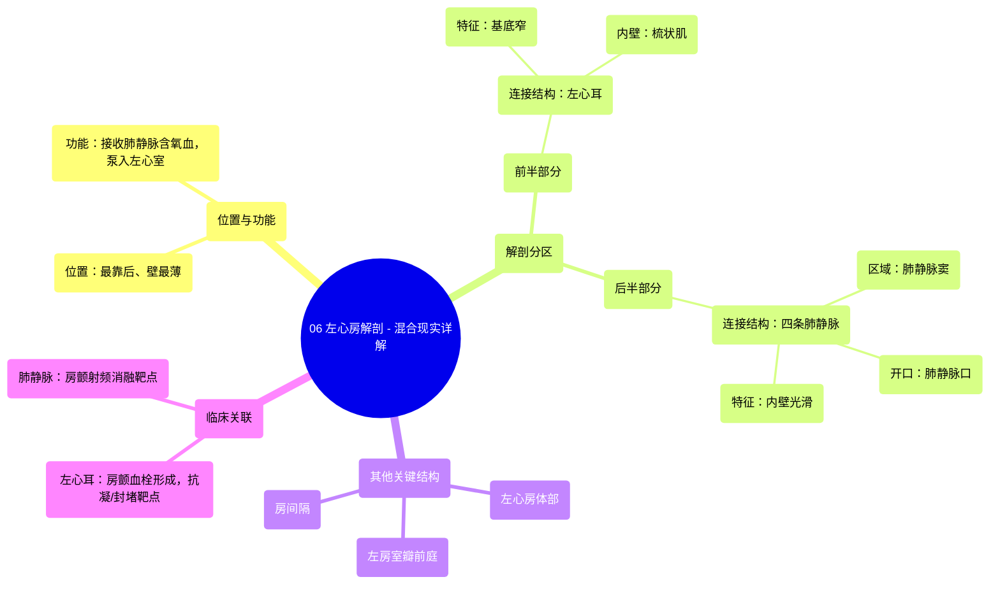

# 06 Left Atrium Anatomy - Explained in Mixed Reality

  <video controls preload="metadata" playsinline>
    <source src="https://helly.s3.bitiful.net/心血管学科/%E4%B8%93%E8%BE%91%2001%EF%BC%9A%E5%BF%83%E8%84%8F%E8%A7%A3%E5%89%96%E5%AD%A6%E5%AE%9E%E6%99%AF%E8%AF%BE%20%28Heart%20Anatomy%20-%20Course%29/06%20Left%20Atrium%20Anatomy%20-%20Explained%20in%20Mixed%20Reality.mp4" type="video/mp4">
    
您的浏览器不支持播放，请升级。

  </video>

::: tip ⚡️ 核心考点 (30s速读)
*   **核心考点**：左心房是心脏最靠后、壁最薄的腔室，负责接收来自肺部的含氧血，并将其泵入左心室。其解剖结构可分为前、后两部分，分别与左心耳和肺静脉相关。
*   **临床意义**：左心耳是心房颤动时血栓形成的常见部位，是临床抗凝治疗和左心耳封堵术的关键靶点。肺静脉是房颤射频消融术的重要靶点。
:::

## 🧠 深度精讲
*   **概念1：左心房的位置与功能**
    左心房位于心脏的最后方，是四个心腔中壁最薄的。它的核心功能是作为肺循环和体循环之间的“中转站”：通过四条肺静脉接收来自肺部、富含氧气的血液，然后通过左房室口将血液排入左心室，由左心室泵送至全身。

*   **概念2：左心房的解剖分区**
    左心房可分为前、后两个部分：
    *   **前半部分**：主要连接**左心耳**。左心耳是一个基底狭窄的指状突起，其内壁有隆起的肌束，称为**梳状肌**。这些肌束使内壁粗糙，是血流淤滞和血栓形成的易发区域。
    *   **后半部分**：是**肺静脉**汇入的区域。此部分内壁光滑，包含接收肺静脉初始段的腔室，称为**肺静脉窦**。四条肺静脉通过各自的开口（肺静脉口）汇入此处。

*   **概念3：左心房的其他关键结构**
    *   **左心房体部**：是肺静脉窦的延续，是血液在泵入左心室前暂时储存的区域。
    *   **左房室瓣前庭**：环绕左房室瓣（二尖瓣）的区域，是血液从左心房流入左心室的关键通道。
    *   **房间隔**：将左心房与右心房分隔开的隔膜，是胎儿期卵圆孔所在的位置，其异常（如房间隔缺损）是常见的先天性心脏病。

## 📚 双语术语表 (Terminology)
| 英文术语 | 中文翻译 | 定义/解释 |
| :--- | :--- | :--- |
| Left Atrium | 左心房 | 心脏最靠后、壁最薄的腔室，接收肺静脉的含氧血并泵入左心室。 |
| Pulmonary Veins | 肺静脉 | 共四条，将肺部氧合后的血液输送回左心房。 |
| Left Atrial Appendage (LAA) / Left Oracle | 左心耳 | 左心房前部的指状突起，内壁有梳状肌，是房颤时血栓好发部位。 |
| Pectinate Muscles | 梳状肌 | 位于心耳内壁的隆起肌束，使内表面粗糙。 |
| Sinus of Pulmonary Veins | 肺静脉窦 | 左心房后部光滑的区域，接收四条肺静脉的开口。 |
| Openings of Pulmonary Veins | 肺静脉口 | 四条肺静脉汇入左心房的具体开口。 |
| Body of the Left Atrium | 左心房体部 | 肺静脉窦的延续，是血液的临时储存区。 |
| Vestibule of the Left Atrioventricular Valve | 左房室瓣前庭 | 环绕二尖瓣开口的区域，是血液流入左心室的通道。 |
| Interatrial Septum | 房间隔 | 分隔左心房和右心房的隔膜。 |

## 🗺️ 知识图谱

