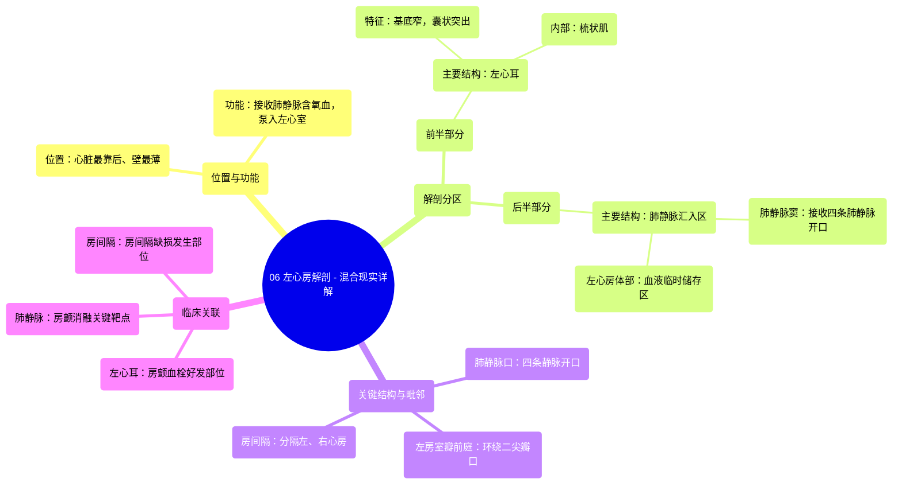

# 06 Left Atrium Anatomy - Explained in Mixed Reality

  <video controls preload="metadata" playsinline>
    <source src="https://helly.bitiful.net/心血管学科/%E4%B8%93%E8%BE%91%2001%EF%BC%9A%E5%BF%83%E8%84%8F%E8%A7%A3%E5%89%96%E5%AD%A6%E5%AE%9E%E6%99%AF%E8%AF%BE%20%28Heart%20Anatomy%20-%20Course%29/06%20Left%20Atrium%20Anatomy%20-%20Explained%20in%20Mixed%20Reality.mp4" type="video/mp4">
    
您的浏览器不支持播放，请升级。

  </video>

::: tip ⚡️ 核心考点 (30s速读)
*   **核心考点**：左心房是心脏最靠后、壁最薄的腔室，负责接收来自肺部的含氧血，并将其泵入左心室。其解剖结构可分为前、后两部分，分别与左心耳和肺静脉相关。
*   **临床意义**：左心耳是心房颤动时血栓好发部位，常需抗凝或封堵治疗。肺静脉是房颤射频消融的关键靶点。房间隔缺损是常见的先天性心脏病之一。
:::

## 🧠 深度精讲

*   **概念1：左心房的位置与功能**
    左心房位于心脏的最后方（最靠后），是四个心腔中壁最薄的。它的核心功能是作为一个“中转站”：通过四条肺静脉接收从肺部返回的、富含氧气的血液，然后通过左房室口将血液排入左心室，由左心室泵向全身。

*   **概念2：左心房的解剖分区**
    为便于理解，常将左心房分为前、后两个部分。
    1.  **前半部分**：主要结构是“左心耳”。它是一个基底较窄、向外突出的囊状结构，内壁有隆起的肌束，称为“梳状肌”。左心耳内血流相对缓慢，是房颤时血栓形成的常见部位。
    2.  **后半部分**：这是肺静脉汇入的区域，表面光滑。此部分包含“肺静脉窦”，是四条肺静脉开口汇入的腔室，也是含氧血首次进入心脏的区域。与肺静脉窦相延续的是“左心房体部”，是血液在泵入左心室前暂时储存的地方。

*   **概念3：关键结构与毗邻**
    1.  **肺静脉口**：四条肺静脉（通常为左上、左下、右上、右下）开口于左心房后壁，这些开口即肺静脉口。
    2.  **左房室瓣前庭**：环绕左房室瓣（二尖瓣）开口的区域，是血液从左心房流入左心室的关键通道。
    3.  **房间隔**：将左心房与右心房分隔开的隔膜，是维持左、右心血流分开的重要屏障。房间隔缺损会导致左向右分流。

## 📚 双语术语表 (Terminology)
| 英文术语 | 中文翻译 | 定义/解释 |
| :--- | :--- | :--- |
| Left Atrium | 左心房 | 心脏最靠后、壁最薄的腔室，接收肺静脉回流的含氧血。 |
| Pulmonary Veins | 肺静脉 | 通常为四条，将肺部氧合后的血液输送回左心房。 |
| Left Atrial Appendage (LAA) / Left Oracle | 左心耳 | 左心房前部向外突出的囊状结构，内壁有梳状肌，易形成血栓。 |
| Pectinate Muscles | 梳状肌 | 心耳内壁呈梳齿状的隆起肌束。 |
| Sinus of Pulmonary Veins | 肺静脉窦 | 左心房后壁接收肺静脉开口的平滑区域。 |
| Body of the Left Atrium | 左心房体部 | 左心房的主要部分，位于肺静脉窦前方，临时储存血液。 |
| Vestibule of the Left Atrioventricular Valve | 左房室瓣前庭 | 环绕二尖瓣口的光滑区域，引导血液流入左心室。 |
| Interatrial Septum | 房间隔 | 分隔左心房和右心房的隔膜。 |
| Opening of Pulmonary Veins | 肺静脉口 | 肺静脉在左心房后壁的开口。 |

## 🗺️ 知识图谱

