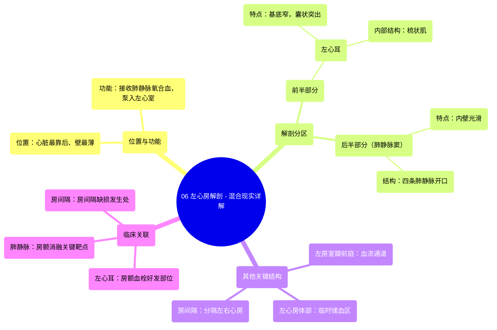

# 06 Left Atrium Anatomy - Explained in Mixed Reality

  <video controls preload="metadata" playsinline>
    <source src="https://helly.s3.bitiful.net/心血管学科/%E4%B8%93%E8%BE%91%2001%EF%BC%9A%E5%BF%83%E8%84%8F%E8%A7%A3%E5%89%96%E5%AD%A6%E5%AE%9E%E6%99%AF%E8%AF%BE%20%28Heart%20Anatomy%20-%20Course%29/06%20Left%20Atrium%20Anatomy%20-%20Explained%20in%20Mixed%20Reality.mp4" type="video/mp4">
    
您的浏览器不支持播放，请升级。

  </video>

::: tip ⚡️ 核心考点 (30s速读)
*   **核心考点**：左心房是心脏最靠后、壁最薄的腔室，负责接收来自肺部的含氧血，并将其泵入左心室。其解剖结构可分为前、后两部分，分别与左心耳和肺静脉相关。
*   **临床意义**：左心耳是心房颤动时血栓形成的常见部位，常需进行封堵或切除以预防卒中。肺静脉是房颤射频消融术的关键靶点。房间隔缺损会影响左右心房的血液分流。
:::

## 🧠 深度精讲
*   **概念1：左心房的位置与功能**
    左心房位于心脏的最后方，是四个心腔中壁最薄的。它的核心功能是作为肺循环的终点和体循环的起点：通过四条肺静脉接收来自肺部、富含氧气的血液，然后通过左房室口将血液排入左心室，为全身供血做好准备。

*   **概念2：左心房的解剖分区**
    左心房可分为前、后两个功能和解剖上不同的部分：
    1.  **前半部分**：主要结构是**左心耳**。它是一个基底狭窄、指状突出的囊袋，内壁有**梳状肌**形成的肌性小梁。左心耳收缩有助于左心房排空，但其复杂的结构也容易导致血流淤滞。
    2.  **后半部分**：也称为**肺静脉窦**，是四条肺静脉汇入的区域。此部分内壁光滑，包含接收肺静脉初始段的腔室。四个肺静脉开口将含氧血首次引入心脏。

*   **概念3：左心房的其他关键结构**
    1.  **左心房体部**：连接肺静脉窦，是血液在泵入左心室前暂时储存的主要区域。
    2.  **左房室瓣前庭**：环绕二尖瓣（左房室瓣）开口的区域，是血液从左心房流入左心室的关键通道。
    3.  **房间隔**：将左心房与右心房分隔开的隔膜，是维持左右心血流分开的重要屏障。卵圆窝是房间隔上的一个薄弱区。

## 📚 双语术语表 (Terminology)
| 英文术语 | 中文翻译 | 定义/解释 |
| :--- | :--- | :--- |
| Left Atrium | 左心房 | 心脏最靠后、壁最薄的腔室，接收肺静脉的含氧血并泵入左心室。 |
| Pulmonary Veins | 肺静脉 | 共四条，将来自肺部的氧合血液输送至左心房。 |
| Left Atrial Appendage (Left Auricle) | 左心耳 | 左心房前部突出的囊状结构，内壁有梳状肌，易形成血栓。 |
| Pectinate Muscles | 梳状肌 | 心耳内壁的隆起肌束，形成小梁样结构。 |
| Sinus of Pulmonary Veins | 肺静脉窦 | 左心房后部光滑的区域，是四条肺静脉汇入和开口的部位。 |
| Body of the Left Atrium | 左心房体部 | 左心房的主要部分，连接肺静脉窦，临时储存血液。 |
| Vestibule of the Left Atrioventricular Valve | 左房室瓣前庭 | 环绕二尖瓣开口的区域，引导血液流入左心室。 |
| Interatrial Septum | 房间隔 | 分隔左心房和右心房的隔膜。 |
| Mitral Valve (Left Atrioventricular Valve) | 二尖瓣（左房室瓣） | 位于左心房和左心室之间的瓣膜，防止血液回流。 |

## 🗺️ 知识图谱

