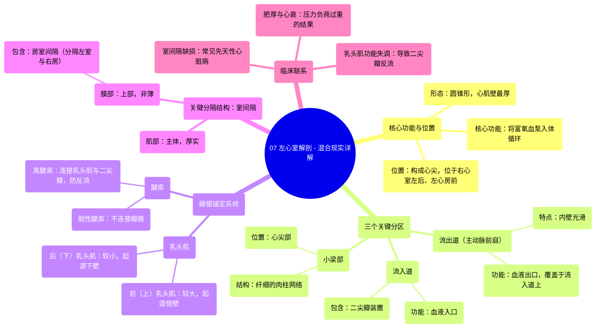

# 07 Left Ventricle Anatomy - Explained in Mixed Reality

  <video controls preload="metadata" playsinline>
    <source src="https://helly.bitiful.net/心血管学科/%E4%B8%93%E8%BE%91%2001%EF%BC%9A%E5%BF%83%E8%84%8F%E8%A7%A3%E5%89%96%E5%AD%A6%E5%AE%9E%E6%99%AF%E8%AF%BE%20%28Heart%20Anatomy%20-%20Course%29/07%20Left%20Ventricle%20Anatomy%20-%20Explained%20in%20Mixed%20Reality.mp4" type="video/mp4">
    
您的浏览器不支持播放，请升级。

  </video>

::: tip ⚡️ 核心考点 (30s速读)
*   **核心考点**：左心室是心脏泵血的核心，其结构（厚壁、圆锥形、特殊分区）完全服务于将富氧血高效泵送至全身的功能。需重点掌握其与右心室的区别、关键分区（流入道、流出道、小梁部）、乳头肌与腱索的协同作用，以及室间隔的复杂构成。
*   **临床意义**：左心室结构与功能的异常是绝大多数心血管疾病（如高血压性心脏病、心肌梗死、心力衰竭、瓣膜病）的核心病理基础。理解其解剖是诊断和治疗这些疾病的关键。
:::

## 🧠 深度精讲

*   **左心室概述与位置**：左心室是心脏四个腔室中肌肉最厚、泵血压力最高的部分，负责将来自左心房的富氧血泵入主动脉，进而供应全身（除肺脏外）。其呈圆锥形，构成心尖的大部分。从心脏正面观，左心室大部分被前方的右心室所遮挡，位于左心房的前方、右心室的左后方。
*   **左心室壁与形态特征**：左心室壁的心肌层非常厚实，通常是右心室壁厚度的2-3倍，这与其承受体循环高压的工作负荷相适应。其内表面可分为三个关键功能区域：
    *   **流入道**：包含二尖瓣（ mitral valve ）装置，是血液从左心房进入左心室的入口。
    *   **流出道（主动脉前庭）**：内壁光滑，是血液从左心室射入主动脉的出口。其独特之处在于，流出道直接覆盖在流入道之上，形成血液“出口覆盖入口”的紧凑结构。
    *   **小梁部**：主要位于心尖部1/3区域，内壁有网状肌束（肉柱）。左心室的肉柱比右心室的更纤细。
*   **乳头肌与腱索系统**：左心室内壁有两组重要的乳头肌，它们通过腱索（ cordae tendineae ）连接并控制二尖瓣的瓣叶。
    *   **前（上）乳头肌**：较粗大，起源于左心室侧壁。
    *   **后（下）乳头肌**：相对较小，起源于左心室下壁。
    *   **功能**：在心室收缩时，乳头肌同步收缩，拉紧腱索，防止二尖瓣瓣叶翻转入左心房，从而避免血液反流。此外，心室内还存在不连接瓣膜的“假性腱索”。
*   **室间隔**：室间隔是分隔左、右心室的关键结构，大部分为厚实的**肌部**，小部分上方为菲薄的**膜部**。膜部中，位于三尖瓣隔瓣附着缘上方的部分，分隔左心室和右心房，特称为**房室间隔**。室间隔的完整性对维持左右心室的独立泵血功能至关重要。

## 📚 双语术语表 (Terminology)
| 英文术语 | 中文翻译 | 定义/解释 |
| :--- | :--- | :--- |
| Left Ventricle (LV) | 左心室 | 心脏左下腔室，负责将富氧血泵入体循环。 |
| Myocardium | 心肌（层） | 构成心壁的肌肉组织，左心室的心肌最厚。 |
| Apex | 心尖 | 心脏左下端的锥形部分，主要由左心室构成。 |
| Inlet Portion | 流入道（部分） | 左心室接收来自左心房血液的区域，包含二尖瓣。 |
| Outlet Portion / Aortic Vestibule | 流出道 / 主动脉前庭 | 左心室血液射入主动脉的通道，内壁光滑。 |
| Trabecular Part / Trabeculae Carnae | 小梁部 / 肉柱 | 心室内壁的肌性网状或柱状突起，左心室的较纤细。 |
| Mitral Valve | 二尖瓣 | 位于左心房与左心室之间的瓣膜，有两个瓣叶。 |
| Papillary Muscles | 乳头肌 | 心室内壁的锥形肌肉，通过腱索连接房室瓣。 |
| Anterior Papillary Muscle | 前乳头肌 | 左心室较大的乳头肌，起源于侧壁。 |
| Posterior Papillary Muscle | 后乳头肌 | 左心室较小的乳头肌，起源于下壁。 |
| Chordae Tendineae | 腱索 | 连接乳头肌与房室瓣瓣叶的纤维索带，防止瓣膜反流。 |
| False Chordae Tendineae | 假性腱索 | 心室内不连接瓣膜，而是连接于乳头肌之间或室壁的纤维肌束。 |
| Interventricular Septum | 室间隔 | 分隔左、右心室的结构。 |
| Muscular Septum | 肌部（室间隔） | 室间隔的主要部分，由厚心肌构成。 |
| Membranous Septum | 膜部（室间隔） | 室间隔上部非薄的纤维性部分。 |
| Atrioventricular Septum | 房室间隔 | 室间隔膜部中分隔左心室与右心房的部分。 |

## 🗺️ 知识图谱

