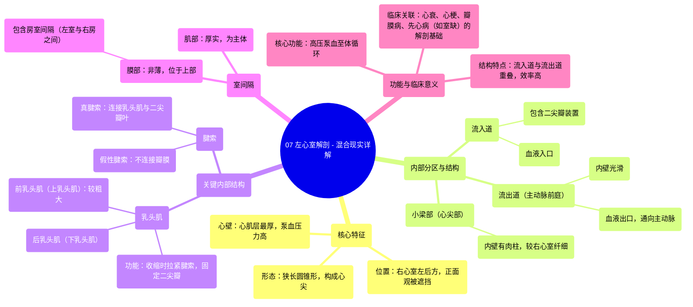

# 07 Left Ventricle Anatomy - Explained in Mixed Reality

  <video controls preload="metadata" playsinline>
    <source src="https://helly.s3.bitiful.net/心血管学科/%E4%B8%93%E8%BE%91%2001%EF%BC%9A%E5%BF%83%E8%84%8F%E8%A7%A3%E5%89%96%E5%AD%A6%E5%AE%9E%E6%99%AF%E8%AF%BE%20%28Heart%20Anatomy%20-%20Course%29/07%20Left%20Ventricle%20Anatomy%20-%20Explained%20in%20Mixed%20Reality.mp4" type="video/mp4">
    
您的浏览器不支持播放，请升级。

  </video>

::: tip ⚡️ 核心考点 (30s速读)
*   **核心考点**：左心室是心脏泵血功能的核心，其结构（厚壁、圆锥形、复杂内腔）完全服务于将含氧血高压泵送至全身的需求。
*   **临床意义**：左心室结构与功能异常是绝大多数心血管疾病（如高血压心脏病、心肌梗死、心力衰竭）的核心病理基础。理解其解剖是诊断和治疗的关键。
:::

## 🧠 深度精讲

*   **整体形态与位置**：左心室呈狭长的圆锥形，构成心尖。其心肌壁最厚，是右心室壁厚度的2-3倍，这与其需要产生高压（约120 mmHg）以克服体循环阻力直接相关。从心脏正面观，左心室大部分被右心室遮挡，位于右心室的左后方。
*   **内部分区**：左心室内腔可分为三个功能区域：
    1.  **流入道**：包含二尖瓣装置（二尖瓣、腱索、乳头肌），是血液从左心房进入的入口。
    2.  **流出道（主动脉前庭）**：内壁光滑，通向主动脉口，是血液泵出的出口。
    3.  **小梁部**：位于心尖部，内壁有网状肌束（肉柱），但较右心室的更薄、更细。
*   **独特的血流路径**：左心室的一个关键解剖特点是其**流入道与流出道相互重叠**。血液入口（二尖瓣）与出口（主动脉瓣）非常接近，这种设计允许血液进入后能高效、直接地转向并被泵出，优化了泵血效率。
*   **乳头肌与腱索**：左心室内有两组强大的乳头肌（前/上乳头肌和后/下乳头肌），它们通过**腱索**与二尖瓣叶相连。在心室收缩时，乳头肌同步收缩，拉紧腱索，防止二尖瓣翻入左心房，从而避免血液反流。此外，心室内还存在不连接瓣膜的“假性腱索”。
*   **室间隔**：分隔左、右心室。主要由厚实的**肌部**构成，上部有一小部分非薄的**膜部**。膜部上方、三尖瓣隔瓣附着处之上的区域，位于左心室和右心房之间，特称为**房室间隔**，是心脏传导系统和某些先天性心脏病（如室间隔缺损）的关键区域。

## 📚 双语术语表 (Terminology)
| 英文术语 | 中文翻译 | 定义/解释 |
| :--- | :--- | :--- |
| Left Ventricle | 左心室 | 心脏左下腔室，负责将含氧血泵入主动脉，供应全身（除肺脏）。 |
| Myocardium | 心肌（层） | 构成心脏壁的肌肉组织，左心室的心肌最厚。 |
| Apex | 心尖 | 心脏左下端的锥形部分，主要由左心室构成。 |
| Inlet Portion | 流入道（部分） | 心腔接收血液的区域，左心室的流入道包含二尖瓣装置。 |
| Outlet Portion / Aortic Vestibule | 流出道 / 主动脉前庭 | 心腔血液流出的通道，左心室流出道内壁光滑，通向主动脉瓣。 |
| Trabecular Carnea | 肉柱 | 心室腔内表面突出的肌性小梁网络，左心室的较右心室的纤细。 |
| Papillary Muscle | 乳头肌 | 心室壁突出的锥形肌肉，通过腱索连接房室瓣，防止瓣膜反流。 |
| Chordae Tendineae | 腱索 | 连接乳头肌与房室瓣叶的纤维索带，像“缆绳”一样固定瓣膜。 |
| False Chordae Tendineae | 假性腱索 | 不附着于房室瓣的纤维肌性条索，连接于乳头肌之间或心室壁。 |
| Interventricular Septum | 室间隔 | 分隔左、右心室的心脏结构。 |
| Muscular Septum | 肌部（室间隔） | 室间隔的主体部分，由厚心肌构成。 |
| Membranous Septum | 膜部（室间隔） | 室间隔上部非薄的纤维性区域。 |
| Atrioventricular Septum | 房室间隔 | 膜部室间隔中，位于左心室与右心房之间的部分。 |
| Mitral Valve | 二尖瓣 | 位于左心房与左心室之间的房室瓣，有两个瓣叶。 |

## 🗺️ 知识图谱

