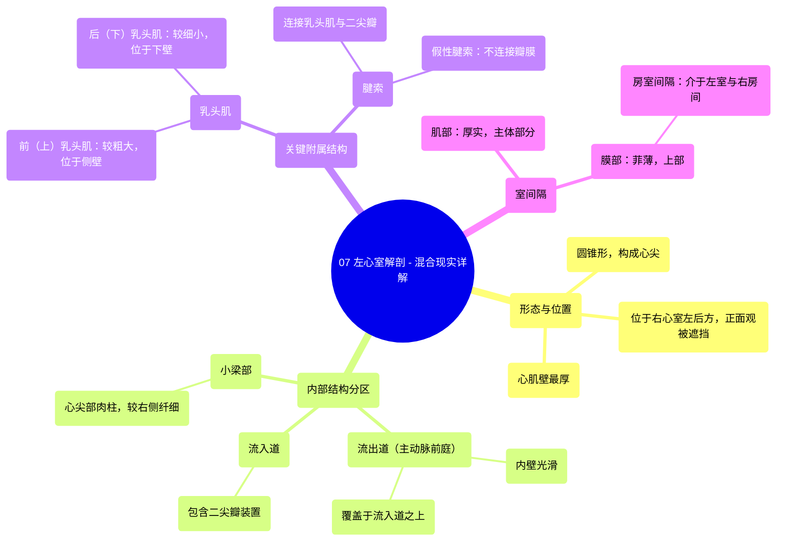

# 07 Left Ventricle Anatomy - Explained in Mixed Reality

  <video controls preload="metadata" playsinline>
    <source src="https://helly.s3.bitiful.net/心血管学科/%E4%B8%93%E8%BE%91%2001%EF%BC%9A%E5%BF%83%E8%84%8F%E8%A7%A3%E5%89%96%E5%AD%A6%E5%AE%9E%E6%99%AF%E8%AF%BE%20%28Heart%20Anatomy%20-%20Course%29/07%20Left%20Ventricle%20Anatomy%20-%20Explained%20in%20Mixed%20Reality.mp4" type="video/mp4">
    
您的浏览器不支持播放，请升级。

  </video>

::: tip ⚡️ 核心考点 (30s速读)
*   **核心考点**：左心室是心脏泵血的核心，其结构（厚壁、圆锥形、特定分区）完全服务于将富氧血高效泵送至全身的功能。
*   **临床意义**：左心室壁增厚（如高血压性心脏病）、室间隔缺损、乳头肌功能异常或腱索断裂（导致二尖瓣关闭不全）是常见临床问题，深刻理解其解剖是诊断和治疗的基础。
:::

## 🧠 深度精讲

*   **形态与位置**：左心室呈**圆锥形**，构成心尖、膈面及左肺面的大部分。其**心肌壁最厚**，以适应体循环所需的高压泵血。从心脏正面观，左心室大部分被右心室遮挡，位于左心房前方、右心室的左后方。
*   **内部结构分区**：左心室内腔可分为三个关键部分：
    1.  **流入道**：包含**二尖瓣装置**（瓣叶、腱索、乳头肌），是血液从左心房进入的入口。
    2.  **流出道（主动脉前庭）**：内壁光滑，是血液泵入主动脉的通道。其独特之处在于**直接覆盖在流入道之上**，形成血液“出口覆盖入口”的紧凑结构。
    3.  **小梁部**：位于心尖部，内壁有网状肌束（**肉柱**），但较右心室的更薄、更细。
*   **关键附属结构**：
    *   **乳头肌**：**前（上）乳头肌**和**后（下）乳头肌**，均起自左心室壁，通过**腱索**连接并牵拉二尖瓣瓣叶，防止心室收缩时血液反流入心房。
    *   **腱索**：连接乳头肌与二尖瓣的纤维索。存在不连接瓣膜的“**假性腱索**”，通常无功能意义。
*   **室间隔**：分隔左、右心室。主要由厚实的**肌部**构成，其上部有一小片非薄的**膜部**。膜部上方、介于左心室与右心房之间的区域特称为**房室间隔**，是室间隔缺损的好发部位之一。

## 📚 双语术语表 (Terminology)
| 英文术语 | 中文翻译 | 定义/解释 |
| :--- | :--- | :--- |
| Left Ventricle | 左心室 | 心脏左下腔室，负责将含氧血泵入主动脉，输送至全身（除肺）。 |
| Myocardium | 心肌（层） | 构成心脏壁的肌肉组织，左心室处最厚。 |
| Apex of the heart | 心尖 | 心脏左下端的锥形部分，主要由左心室构成。 |
| Inlet portion | 流入道（部分） | 心腔接收血液流入的区域，左心室流入道包含二尖瓣。 |
| Outlet portion / Aortic vestibule | 流出道 / 主动脉前庭 | 心腔血液流出的通道，左心室流出道通向主动脉，内壁光滑。 |
| Trabeculae carneae | 肉柱 | 心室腔内表面突出的肌性小梁网络，左心室的较右心室纤细。 |
| Papillary muscles | 乳头肌 | 心室壁突出的锥形肌肉，通过腱索连接房室瓣（左心室为二尖瓣）。 |
| Chordae tendineae | 腱索 | 连接乳头肌尖端与房室瓣瓣叶的纤维性条索，防止瓣膜翻入心房。 |
| False chordae tendineae | 假性腱索 | 不附着于房室瓣的纤维肌性索带，连接于乳头肌之间或心室壁。 |
| Interventricular septum | 室间隔 | 分隔左、右心室的间隔结构。 |
| Muscular septum | 肌部（室间隔） | 室间隔的主要部分，由厚心肌构成。 |
| Membranous septum | 膜部（室间隔） | 室间隔上部非薄的纤维性部分。 |
| Atrioventricular septum | 房室间隔 | 室间隔膜部中，位于左心室与右心房之间的部分。 |
| Mitral valve | 二尖瓣 | 位于左心房与左心室之间的房室瓣，有两个瓣叶。 |

## 🗺️ 知识图谱

