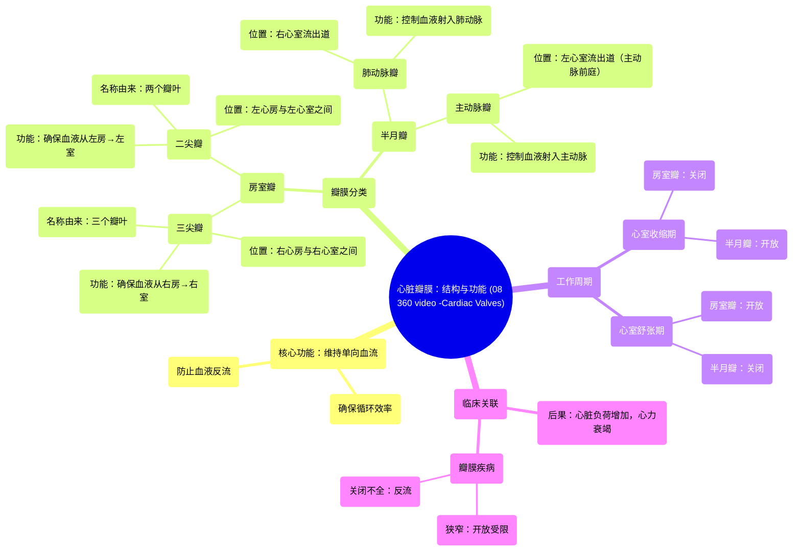

# 08 360 video -Cardiac Valves - Explained in Mixed Reality

  <video controls preload="metadata" playsinline>
    <source src="https://helly.bitiful.net/心血管学科/%E4%B8%93%E8%BE%91%2001%EF%BC%9A%E5%BF%83%E8%84%8F%E8%A7%A3%E5%89%96%E5%AD%A6%E5%AE%9E%E6%99%AF%E8%AF%BE%20%28Heart%20Anatomy%20-%20Course%29/08%20360%20video%20-Cardiac%20Valves%20-%20Explained%20in%20Mixed%20Reality.mp4" type="video/mp4">
    
您的浏览器不支持播放，请升级。

  </video>

::: tip ⚡️ 核心考点 (30s速读)
*   **核心考点**：心脏瓣膜复合体通过两组共四个瓣膜（房室瓣与半月瓣）确保血液在心腔内单向流动，防止反流，这是维持循环系统高效运作的关键。
*   **临床意义**：瓣膜功能障碍（如狭窄或关闭不全）会破坏单向血流，导致心脏负荷增加、泵血效率下降，是心力衰竭、心律失常等严重心血管疾病的重要病因。
:::

## 🧠 深度精讲
*   **概念1：心脏瓣膜的功能与分类**
    心脏瓣膜是心脏内的单向“阀门”，其核心功能是**确保血液沿正确方向（心房→心室→动脉）流动，并防止血液逆流**。根据位置和结构，可分为两大类：
    1.  **房室瓣**：位于心房与心室之间，包括**三尖瓣（右心）** 和**二尖瓣（左心）**。它们在心室舒张期开放，允许血液从心房流入心室；在心室收缩期关闭，防止血液倒流回心房。
    2.  **半月瓣**：位于心室与动脉之间，包括**肺动脉瓣（右心室出口）** 和**主动脉瓣（左心室出口）**。它们在心室收缩期开放，允许血液射入动脉；在心室舒张期关闭，防止动脉血液反流回心室。

*   **概念2：各瓣膜的详细解剖与功能**
    1.  **三尖瓣**：位于右心房与右心室之间，因其有三个瓣叶而得名。确保**去氧血**只能从右心房流向右心室。心室收缩时关闭，防止血液返流。
    2.  **二尖瓣**：位于左心房与左心室之间，有两个瓣叶。确保**富氧血**从左心房顺畅流入左心室。心室收缩时关闭，是防止左心系统血液反流的关键结构。
    3.  **肺动脉瓣**：位于右心室流出道与肺动脉入口处。心室收缩时开放，让去氧血射入肺动脉流向肺部进行氧合；心室舒张时关闭，防止血液从肺动脉返回右心室。
    4.  **主动脉瓣**：位于左心室流出道（主动脉前庭）与升主动脉入口处。心室收缩时开放，让富氧血射入主动脉供应全身；心室舒张时关闭，是维持体循环血压、防止血液倒流回左心室的最重要屏障。

*   **概念3：心脏周期中的瓣膜协同**
    心脏的泵血功能依赖于瓣膜在**心脏周期（收缩期与舒张期）** 中的精确、协同开闭。这种精密的时序控制确保了血液的单向、连续流动，是心脏高效工作的基础。任何瓣膜的开放不全（狭窄）或关闭不全（反流）都会破坏这一协调性，增加心脏做功，最终导致心功能不全。

## 📚 双语术语表 (Terminology)
| 英文术语 | 中文翻译 | 定义/解释 |
| :--- | :--- | :--- |
| Heart Valves / Valvular Complex | 心脏瓣膜 / 瓣膜复合体 | 心脏内确保血液单向流动的结构总称，包括四个主要瓣膜。 |
| Atrioventricular Valves | 房室瓣 | 位于心房与心室之间的瓣膜，包括三尖瓣和二尖瓣。 |
| Tricuspid Valve | 三尖瓣 | 右心房与右心室之间的房室瓣，有三个瓣叶。 |
| Mitral Valve | 二尖瓣 | 左心房与左心室之间的房室瓣，有两个瓣叶。 |
| Semilunar Valves | 半月瓣 | 位于心室与动脉出口处的瓣膜，包括肺动脉瓣和主动脉瓣。 |
| Pulmonary Valve | 肺动脉瓣 | 位于右心室与肺动脉之间的半月瓣。 |
| Aortic Valve | 主动脉瓣 | 位于左心室与主动脉之间的半月瓣。 |
| Ventricular Systole | 心室收缩期 | 心脏搏动中心室收缩、射血的阶段。此时房室瓣关闭，半月瓣开放。 |
| Ventricular Diastole | 心室舒张期 | 心脏搏动中心室舒张、充盈的阶段。此时半月瓣关闭，房室瓣开放。 |
| Unidirectional Flow | 单向血流 | 血液在心脏内沿固定方向（心房→心室→动脉）流动，无反流。 |
| Backflow / Regurgitation | 反流 / 返流 | 血液逆正常方向流动，通常由瓣膜关闭不全引起。 |

## 🗺️ 知识图谱

