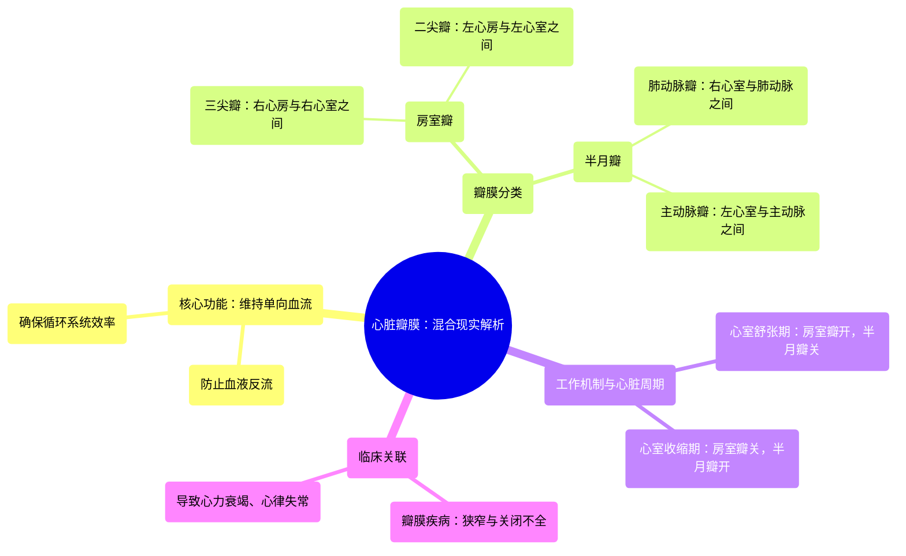

# 08 360 video -Cardiac Valves - Explained in Mixed Reality

  <video controls preload="metadata" playsinline>
    <source src="https://helly.s3.bitiful.net/心血管学科/%E4%B8%93%E8%BE%91%2001%EF%BC%9A%E5%BF%83%E8%84%8F%E8%A7%A3%E5%89%96%E5%AD%A6%E5%AE%9E%E6%99%AF%E8%AF%BE%20%28Heart%20Anatomy%20-%20Course%29/08%20360%20video%20-Cardiac%20Valves%20-%20Explained%20in%20Mixed%20Reality.mp4" type="video/mp4">
    
您的浏览器不支持播放，请升级。

  </video>

::: tip ⚡️ 核心考点 (30s速读)
*   **核心考点**：心脏瓣膜复合体是确保血液在心腔内单向流动的关键结构，防止血液反流，维持循环系统效率。
*   **临床意义**：瓣膜功能障碍（狭窄或关闭不全）会导致血液动力学紊乱，是心力衰竭、心律失常等严重心血管疾病的重要病因。
:::

## 🧠 深度精讲

*   **心脏瓣膜的功能与分类**：心脏瓣膜是心脏内的“单向阀门”，其核心功能是保证血液沿“心房→心室→动脉”的方向流动，防止逆流。根据位置和结构，分为两组：**房室瓣**（位于心房与心室之间，包括三尖瓣和二尖瓣）和**半月瓣**（位于心室与动脉之间，包括肺动脉瓣和主动脉瓣）。
*   **房室瓣的工作机制**：在心室舒张期，房室瓣开放，允许血液从心房流入心室；在心室收缩期，房室瓣关闭，防止血液倒流回心房。**三尖瓣**位于右心，有三个瓣叶；**二尖瓣**位于左心，有两个瓣叶，其关闭对维持左心系统的高压泵血至关重要。
*   **半月瓣的工作机制**：在心室收缩期，半月瓣被血流冲开，血液射入动脉；在心室舒张期，动脉内压力高于心室，半月瓣迅速关闭，防止动脉血液反流回心室。**肺动脉瓣**引导血液从右心室进入肺动脉进行氧合；**主动脉瓣**引导富氧血液从左心室进入主动脉供应全身。
*   **心脏周期中的协同作用**：心脏的泵血功能依赖于心肌收缩（机械活动）与瓣膜开闭（阀门活动）的精确时序配合。心房收缩、心室舒张、心室收缩、全心舒张这四个阶段中，各瓣膜的开闭状态严格交替，共同实现高效的单向血流。

## 📚 双语术语表 (Terminology)
| 英文术语 | 中文翻译 | 定义/解释 |
| :--- | :--- | :--- |
| Heart Valves / Valvular Complex | 心脏瓣膜 / 瓣膜复合体 | 心脏内确保血液单向流动的结构总称。 |
| Unidirectional Flow | 单向血流 | 血液在心脏和血管中沿固定方向（心房→心室→动脉）流动，是循环系统有效工作的基础。 |
| Atrioventricular Valves (AV Valves) | 房室瓣 | 位于心房与心室之间的瓣膜，包括三尖瓣和二尖瓣。 |
| Tricuspid Valve | 三尖瓣 | 位于右心房与右心室之间的房室瓣，由三个瓣叶组成。 |
| Mitral Valve (Bicuspid Valve) | 二尖瓣（僧帽瓣） | 位于左心房与左心室之间的房室瓣，由两个瓣叶组成。 |
| Semilunar Valves | 半月瓣 | 位于心室与动脉出口处的瓣膜，形似半月，包括肺动脉瓣和主动脉瓣。 |
| Pulmonary Valve | 肺动脉瓣 | 位于右心室与肺动脉之间的半月瓣，防止血液从肺动脉反流回右心室。 |
| Aortic Valve | 主动脉瓣 | 位于左心室与主动脉之间的半月瓣，防止血液从主动脉反流回左心室。 |
| Ventricular Systole | 心室收缩期 | 心脏搏动周期中心室收缩、射血的阶段。此时房室瓣关闭，半月瓣开放。 |
| Ventricular Diastole | 心室舒张期 | 心脏搏动周期中心室舒张、充盈的阶段。此时房室瓣开放，半月瓣关闭。 |
| Backflow / Regurgitation | 反流 / 返流 | 血液逆正常方向流动，通常由瓣膜关闭不全引起。 |

## 🗺️ 知识图谱

