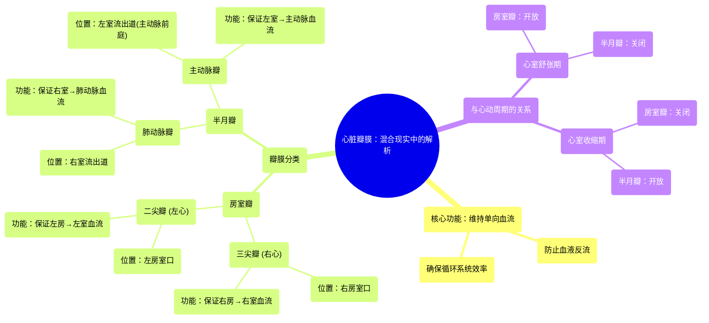

# 08 360 video -Cardiac Valves - Explained in Mixed Reality

  <video controls preload="metadata" playsinline>
    <source src="https://helly.s3.bitiful.net/心血管学科/%E4%B8%93%E8%BE%91%2001%EF%BC%9A%E5%BF%83%E8%84%8F%E8%A7%A3%E5%89%96%E5%AD%A6%E5%AE%9E%E6%99%AF%E8%AF%BE%20%28Heart%20Anatomy%20-%20Course%29/08%20360%20video%20-Cardiac%20Valves%20-%20Explained%20in%20Mixed%20Reality.mp4" type="video/mp4">
    
您的浏览器不支持播放，请升级。

  </video>

::: tip ⚡️ 核心考点 (30s速读)
*   **核心考点**：心脏瓣膜复合体是确保血液在心脏内单向流动的关键解剖结构，防止血液反流，维持循环系统效率。
*   **临床意义**：瓣膜功能障碍（狭窄或关闭不全）会导致血液反流或流出受阻，是心力衰竭、心律失常等严重心血管疾病的重要病因。
:::

## 🧠 深度精讲

*   **心脏瓣膜的功能与分类**：心脏瓣膜是心脏内的“单向阀门”，其核心功能是确保血液沿心房→心室→动脉（肺动脉/主动脉）的方向单向流动，防止血液倒流。根据位置和结构，它们分为两组：**房室瓣**（位于心房与心室之间，包括三尖瓣和二尖瓣）和**半月瓣**（位于心室与动脉之间，包括肺动脉瓣和主动脉瓣）。

*   **房室瓣详解**：
    *   **三尖瓣**：位于右心房与右心室之间，由三个瓣叶组成。在心室舒张期打开，允许血液从右心房流入右心室；在心室收缩期关闭，防止血液从右心室反流回右心房。
    *   **二尖瓣**：位于左心房与左心室之间，由两个瓣叶组成。功能与三尖瓣类似，确保富氧血液从左心房流入左心室，并在收缩期关闭以防止反流。

*   **半月瓣详解**：
    *   **肺动脉瓣**：位于右心室流出道与肺动脉入口之间。在心室收缩期打开，允许血液从右心室射入肺动脉；在心室舒张期关闭，防止血液从肺动脉反流回右心室。
    *   **主动脉瓣**：位于左心室流出道（主动脉前庭）与升主动脉入口之间。功能与肺动脉瓣类似，在收缩期打开使血液从左心室射入主动脉，在舒张期关闭防止主动脉血液反流回左心室。

*   **血流动力学与心动周期**：瓣膜的启闭与心动周期紧密相关。**心室舒张期**，房室瓣开放（半月瓣关闭），血液从心房流入心室；**心室收缩期**，房室瓣关闭（半月瓣开放），血液从心室泵入动脉。这种精密的时序配合是维持高效单向血流的基础。

## 📚 双语术语表 (Terminology)
| 英文术语 | 中文翻译 | 定义/解释 |
| :--- | :--- | :--- |
| Heart Valves / Valvular Complex | 心脏瓣膜 / 瓣膜复合体 | 心脏内确保血液单向流动的结构总称。 |
| Atrioventricular Valves | 房室瓣 | 位于心房与心室之间的瓣膜，包括三尖瓣和二尖瓣。 |
| Tricuspid Valve | 三尖瓣 | 右心房与右心室之间的房室瓣，由三个瓣叶组成。 |
| Mitral Valve | 二尖瓣 | 左心房与左心室之间的房室瓣，由两个瓣叶组成。 |
| Semilunar Valves | 半月瓣 | 位于心室与动脉出口处的瓣膜，包括肺动脉瓣和主动脉瓣。 |
| Pulmonary Valve | 肺动脉瓣 | 位于右心室与肺动脉之间的半月瓣。 |
| Aortic Valve | 主动脉瓣 | 位于左心室与主动脉之间的半月瓣。 |
| Ventricular Systole | 心室收缩期 | 心动周期中心室收缩、泵血出去的阶段。 |
| Ventricular Diastole | 心室舒张期 | 心动周期中心室舒张、充盈血液的阶段。 |
| Unidirectional Flow | 单向血流 | 血液在心脏和血管中沿固定方向（前向）流动，无反流。 |
| Backflow / Regurgitation | 反流 / 返流 | 血液朝相反方向（逆向）流动，通常由瓣膜关闭不全引起。 |
| Aortic Vestibule | 主动脉前庭 | 左心室流出道末端、主动脉瓣下方的漏斗形区域。 |

## 🗺️ 知识图谱

