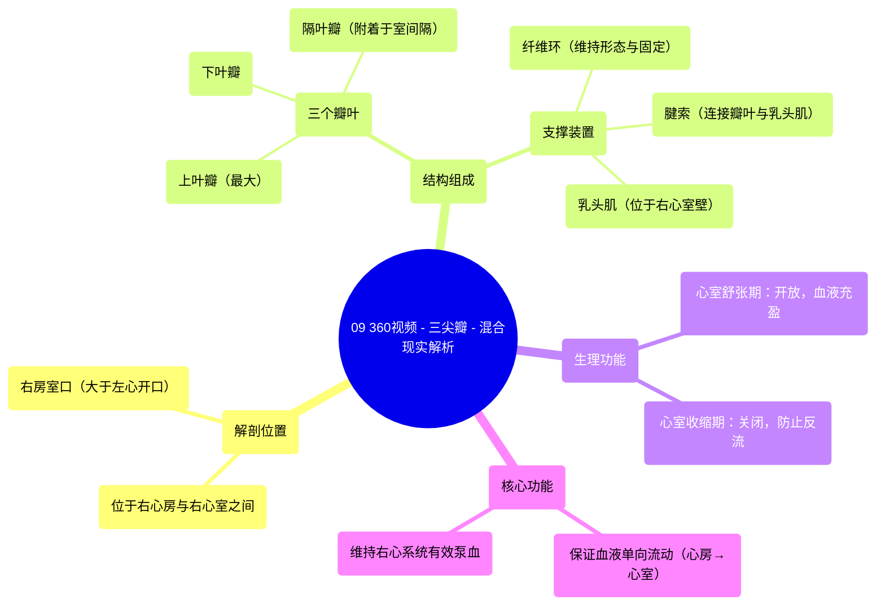

# 09 360 video -Tricuspid Valve - Explained in Mixed Reality

  <video controls preload="metadata" playsinline>
    <source src="https://helly.s3.bitiful.net/心血管学科/%E4%B8%93%E8%BE%91%2001%EF%BC%9A%E5%BF%83%E8%84%8F%E8%A7%A3%E5%89%96%E5%AD%A6%E5%AE%9E%E6%99%AF%E8%AF%BE%20%28Heart%20Anatomy%20-%20Course%29/09%20360%20video%20-Tricuspid%20Valve%20-%20Explained%20in%20Mixed%20Reality.mp4" type="video/mp4">
    
您的浏览器不支持播放，请升级。

  </video>

::: tip ⚡️ 核心考点 (30s速读)
*   **核心考点**：三尖瓣是位于右心房与右心室之间的房室瓣，由三个瓣叶、腱索、乳头肌及纤维环构成，其核心功能是保证血液从右心房单向流入右心室，防止心室收缩时血液反流。
*   **临床意义**：三尖瓣结构或功能异常（如关闭不全、狭窄）会导致右心系统血流动力学紊乱，引起体循环淤血，表现为颈静脉怒张、肝大、腹水及下肢水肿等右心衰竭体征。
:::

## 🧠 深度精讲

*   **概念1：三尖瓣的解剖结构与命名**
    三尖瓣，又称右房室瓣，位于右心房与右心室之间的右房室口。此开口显著大于左心室的二尖瓣口。瓣膜由三个三角形的瓣叶构成，它们突入右心室腔。根据其解剖位置，这三个瓣叶被命名为：位于上方的“上叶瓣”（最大）、位于下方的“下叶瓣”以及基底附着于室间隔的“隔叶瓣”。隔叶瓣通过腱索直接与室间隔相连，这是其独特特征。

*   **概念2：瓣膜的支撑与固定装置**
    三尖瓣并非独立存在，其正常功能依赖于一套精密的支撑系统。**纤维环**是环绕右房室口的纤维性结构，为瓣膜提供形态支撑和牢固的附着点。**腱索**是纤细的纤维条索，一端连接瓣叶的游离缘和心室面，另一端起源于右心室壁的**乳头肌**。在心室收缩时，乳头肌收缩，拉紧腱索，防止瓣叶翻转入心房，从而确保瓣膜紧密关闭，防止血液反流。

*   **概念3：三尖瓣在心动周期中的功能**
    三尖瓣的功能随心动周期精确切换。在**心室舒张期**，右心室舒张，室内压降低，三尖瓣开放，允许右心房的血液充盈右心室。在**心室收缩期**，右心室收缩，室内压急剧升高，推动三个瓣叶对合，瓣膜关闭。此时，腱索和乳头肌的协同作用防止了瓣膜翻转，确保血液只能向前泵入肺动脉，而不能反流回右心房。

## 📚 双语术语表 (Terminology)
| 英文术语 | 中文翻译 | 定义/解释 |
| :--- | :--- | :--- |
| Tricuspid Valve | 三尖瓣 | 位于右心房与右心室之间的房室瓣，由三个瓣叶构成。 |
| Right Atrioventricular Valve | 右房室瓣 | 三尖瓣的别称。 |
| Leaflets (Superior, Inferior, Septal) | 瓣叶（上叶、下叶、隔叶） | 构成三尖瓣的三个三角形膜状结构。 |
| Fibrous Ring (Annulus) | 纤维环（瓣环） | 环绕房室口的纤维结缔组织环，支撑和固定瓣膜。 |
| Cordae Tendineae | 腱索 | 连接瓣膜游离缘与乳头肌的纤维索，防止心室收缩时瓣膜翻入心房。 |
| Papillary Muscles | 乳头肌 | 心室壁突出的锥形肌柱，其尖端发出腱索。 |
| Right Atrioventricular Orifice | 右房室口 | 右心房与右心室之间的通道开口。 |
| Ventricular Systole | 心室收缩期 | 心动周期中心室肌肉收缩、泵血的阶段，此时房室瓣关闭。 |
| Ventricular Diastole | 心室舒张期 | 心动周期中心室肌肉舒张、充盈血液的阶段，此时房室瓣开放。 |
| Interventricular Septum | 室间隔 | 分隔左、右心室的肌性及膜性结构。 |

## 🗺️ 知识图谱

