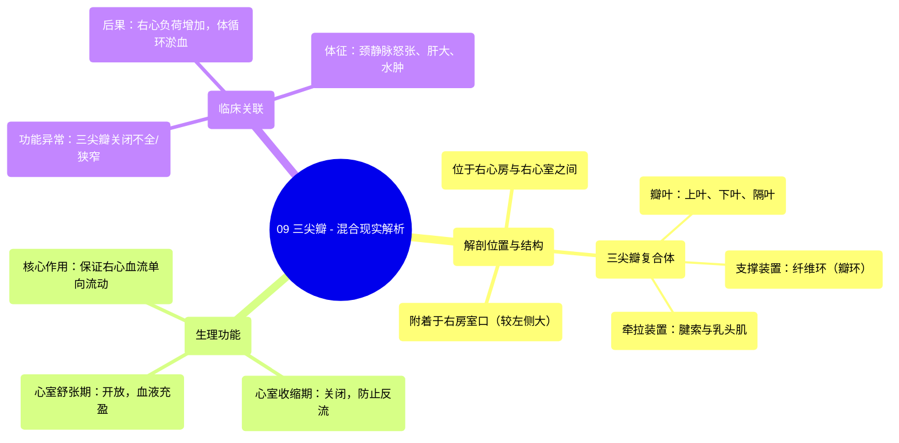

# 09 360 video -Tricuspid Valve - Explained in Mixed Reality

  <video controls preload="metadata" playsinline>
    <source src="https://helly.bitiful.net/心血管学科/%E4%B8%93%E8%BE%91%2001%EF%BC%9A%E5%BF%83%E8%84%8F%E8%A7%A3%E5%89%96%E5%AD%A6%E5%AE%9E%E6%99%AF%E8%AF%BE%20%28Heart%20Anatomy%20-%20Course%29/09%20360%20video%20-Tricuspid%20Valve%20-%20Explained%20in%20Mixed%20Reality.mp4" type="video/mp4">
    
您的浏览器不支持播放，请升级。

  </video>

::: tip ⚡️ 核心考点 (30s速读)
*   **核心考点**：三尖瓣是位于右心房与右心室之间的房室瓣，由三个瓣叶（上叶、下叶、隔叶）、纤维环、腱索和乳头肌构成，其核心功能是保证血液从右心房单向流入右心室，防止收缩期血液反流。
*   **临床意义**：三尖瓣结构或功能异常（如关闭不全、狭窄）会导致右心系统血流动力学紊乱，引起体循环淤血，表现为颈静脉怒张、肝大、腹水、下肢水肿等右心衰竭体征。
:::

## 🧠 深度精讲

*   **概念1：三尖瓣的解剖结构与命名**
    三尖瓣，又称右房室瓣，是心脏右心系统的入口阀门。它附着于“右房室口”的周缘，此开口显著大于左心室的二尖瓣口。瓣膜本身由三个三角形的“瓣叶”构成，它们突向右心室腔。根据其解剖位置，这三个瓣叶被明确命名为：“上叶”（最大，位于顶部）、“下叶”（位于上叶下方）和“隔叶”（基底附着于室间隔，是唯一直接通过腱索与室间隔相连的瓣叶）。维持瓣膜形态和位置的关键是“纤维环”，它是一个坚韧的结缔组织环。瓣叶的游离缘和心室面通过“腱索”与右心室壁的“乳头肌”尖端相连，这一装置对防止瓣叶在心脏收缩时翻入心房至关重要。

*   **概念2：三尖瓣在心动周期中的功能**
    三尖瓣的功能随心动周期精确变化。在“心室舒张期”，右心室舒张，室内压降低，三尖瓣开放，允许右心房的血液被动地、顺畅地流入右心室，完成心室充盈。在接下来的“心室收缩期”，右心室肌肉收缩，室内压急剧升高，超过右心房压力，此时三尖瓣的三个瓣叶在血流推动下对合、关闭。由于腱索的牵拉，瓣叶不会翻入心房，从而有效防止血液从心室“反流”回心房，确保血液只能通过肺动脉瓣被泵入肺动脉，进行肺循环。这种“单向阀门”机制是心脏高效泵血的基础。

*   **概念3：三尖瓣复合体**
    三尖瓣并非一个独立的薄膜，而是一个功能整体，称为“三尖瓣复合体”。它包括：1）**瓣叶**：直接拦截血流的柔软组织；2）**纤维环**：瓣叶的附着支架，维持开口形状；3）**腱索**：连接瓣叶与乳头肌的纤维条索，像风筝线一样控制瓣叶活动范围；4）**乳头肌**：心室壁的锥形肌肉突起，收缩时拉紧腱索。这四个部分协同工作，任何一个部分受损（如腱索断裂、瓣环扩张、乳头肌功能不全）都会导致三尖瓣关闭不全，引发临床问题。

## 📚 双语术语表 (Terminology)
| 英文术语 | 中文翻译 | 定义/解释 |
| :--- | :--- | :--- |
| Tricuspid Valve | 三尖瓣 | 位于右心房与右心室之间的房室瓣，由三个瓣叶构成。 |
| Right Atrioventricular Valve | 右房室瓣 | 三尖瓣的别称，强调其位于右心的房室交界处。 |
| Right Atrioventricular Orifice | 右房室口 | 右心房与右心室之间的通道开口，三尖瓣附着于此。 |
| Leaflet (Superior, Inferior, Septal) | 瓣叶（上叶、下叶、隔叶） | 构成三尖瓣的三个三角形薄膜结构。 |
| Fibrous Ring (Annulus) | 纤维环（瓣环） | 环绕右房室口的坚韧结缔组织环，支撑和固定瓣叶。 |
| Cordae Tendineae | 腱索 | 连接瓣叶游离缘与乳头肌的纤细、坚韧的索状结构。 |
| Papillary Muscles | 乳头肌 | 心室壁向内凸起的锥状肌肉，通过腱索牵拉瓣叶。 |
| Ventricular Systole | 心室收缩期 | 心动周期中心室肌肉收缩、射血的阶段，此时房室瓣关闭。 |
| Ventricular Diastole | 心室舒张期 | 心动周期中心室肌肉舒张、充盈的阶段，此时房室瓣开放。 |
| Backflow (Regurgitation) | 反流（关闭不全） | 瓣膜关闭不严，导致血液在收缩期从心室漏回心房的现象。 |

## 🗺️ 知识图谱

