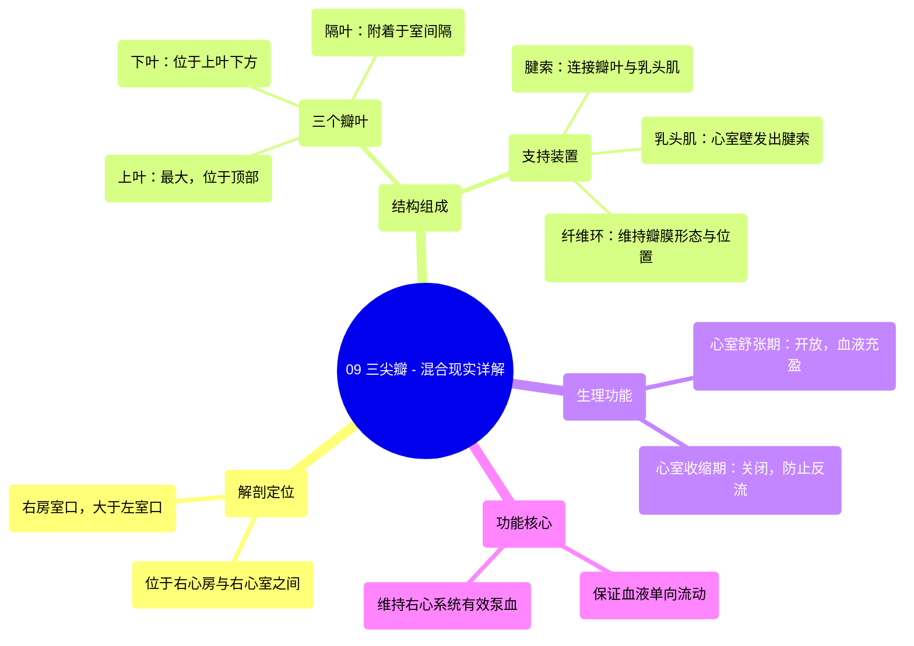

# 09 360 video -Tricuspid Valve - Explained in Mixed Reality

  <video controls preload="metadata" playsinline>
    <source src="https://helly.s3.bitiful.net/心血管学科/%E4%B8%93%E8%BE%91%2001%EF%BC%9A%E5%BF%83%E8%84%8F%E8%A7%A3%E5%89%96%E5%AD%A6%E5%AE%9E%E6%99%AF%E8%AF%BE%20%28Heart%20Anatomy%20-%20Course%29/09%20360%20video%20-Tricuspid%20Valve%20-%20Explained%20in%20Mixed%20Reality.mp4" type="video/mp4">
    
您的浏览器不支持播放，请升级。

  </video>

::: tip ⚡️ 核心考点 (30s速读)
*   **核心考点**：三尖瓣是位于右心房与右心室之间的房室瓣，由三个瓣叶、腱索、乳头肌及纤维环构成，其核心功能是保证血液从右心房单向流入右心室，防止心室收缩时血液反流。
*   **临床意义**：三尖瓣结构或功能异常（如关闭不全、狭窄）可导致右心系统血流动力学紊乱，引发右心衰竭、体循环淤血（如肝大、水肿）等临床表现。
:::

## 🧠 深度精讲
*   **解剖结构**：三尖瓣，又称右房室瓣，位于右心房与右心室之间的“右房室口”。此开口显著大于左心室的二尖瓣口。瓣膜由三个三角形的瓣叶（上叶、下叶、隔叶）、连接瓣叶与乳头肌的腱索、以及维持瓣膜形态和位置的纤维环共同构成一个精密的功能单位。
*   **瓣叶特征**：三个瓣叶根据其解剖位置命名。“上叶”最大，位于顶部；“下叶”位于其下方；“隔叶”位置独特，其基底部直接附着于室间隔上，并通过腱索与室间隔壁相连，这是其区别于其他瓣叶的关键特征。
*   **工作原理**：其功能随心动周期而变化。在“心室舒张期”，瓣膜开放，允许右心房的血液充盈右心室。在“心室收缩期”，心室压力升高，推动三个瓣叶对合关闭，同时乳头肌收缩、腱索拉紧，防止瓣叶翻入心房，从而有效防止血液反流，确保血液向前泵入肺动脉。

## 📚 双语术语表 (Terminology)
| 英文术语 | 中文翻译 | 定义/解释 |
| :--- | :--- | :--- |
| Tricuspid Valve | 三尖瓣 | 位于右心房与右心室之间的房室瓣，由三个瓣叶构成。 |
| Right Atrioventricular Valve | 右房室瓣 | 三尖瓣的别称。 |
| Leaflet (Cusp) | 瓣叶 | 构成心脏瓣膜的薄膜状结构。三尖瓣有三个：上叶、下叶、隔叶。 |
| Superior Leaflet | 上叶 | 三尖瓣中最大的瓣叶，位于瓣膜结构的顶部。 |
| Inferior Leaflet | 下叶 | 三尖瓣中位于上叶下方的瓣叶。 |
| Septal Leaflet | 隔叶 | 三尖瓣中基底部附着于室间隔的独特瓣叶。 |
| Cordae Tendineae | 腱索 | 连接瓣膜游离缘与乳头肌的纤维索状结构，防止心室收缩时瓣膜翻入心房。 |
| Papillary Muscles | 乳头肌 | 心室壁突出的锥形肌柱，其尖端发出腱索。 |
| Fibrous Ring (Annulus) | 纤维环（瓣环） | 环绕房室口的纤维结缔组织环，支撑并固定瓣膜基部。 |
| Right Atrioventricular Orifice | 右房室口 | 右心房与右心室之间的通道开口。 |
| Ventricular Systole | 心室收缩期 | 心动周期中心室肌收缩、射血的阶段，此时房室瓣关闭。 |
| Ventricular Diastole | 心室舒张期 | 心动周期中心室肌舒张、充盈的阶段，此时房室瓣开放。 |

## 🗺️ 知识图谱

