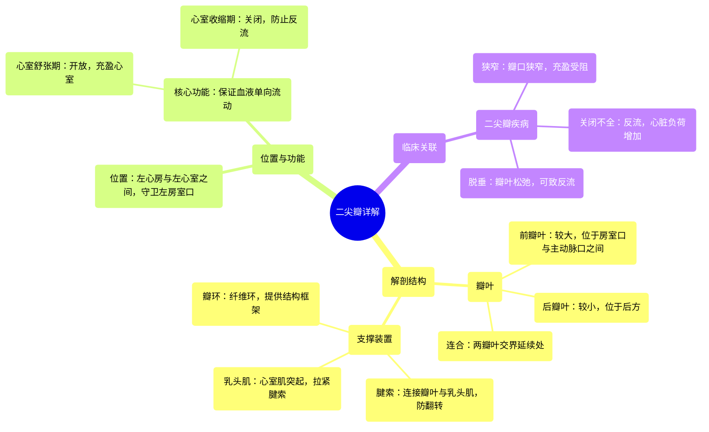

# 10 360 video - Mitral Valve - Explained in Mixed Reality

  <video controls preload="metadata" playsinline>
    <source src="https://helly.s3.bitiful.net/心血管学科/%E4%B8%93%E8%BE%91%2001%EF%BC%9A%E5%BF%83%E8%84%8F%E8%A7%A3%E5%89%96%E5%AD%A6%E5%AE%9E%E6%99%AF%E8%AF%BE%20%28Heart%20Anatomy%20-%20Course%29/10%20360%20video%20-%20Mitral%20Valve%20-%20Explained%20in%20Mixed%20Reality.mp4" type="video/mp4">
    
您的浏览器不支持播放，请升级。

  </video>

::: tip ⚡️ 核心考点 (30s速读)
*   **核心考点**：二尖瓣是位于左心房与左心室之间的双叶瓣膜，其核心功能是在心室收缩期防止血液反流入左心房，确保血液单向、高效地泵入体循环。
*   **临床意义**：二尖瓣的结构（瓣叶、瓣环、腱索、乳头肌）完整性至关重要。任何一部分的病变（如脱垂、狭窄、关闭不全）都会导致血流动力学异常，是心脏杂音、心力衰竭等常见心脏疾病的解剖基础。
:::

## 🧠 深度精讲

*   **概念1：二尖瓣的解剖结构与命名**
    *   **位置与功能**：二尖瓣位于左心房与左心室之间，守卫左房室口。其主要功能是作为单向阀门：在心室舒张期开放，允许血液从左心房充盈左心室；在心室收缩期紧密关闭，防止血液倒流回左心房，从而保证心脏向全身有效泵血。
    *   **形态与名称**：因其有两个突出的瓣叶，故得名“二尖瓣”或“双尖瓣”。其英文名“Mitral Valve”源于其形状类似主教法冠。两个瓣叶分别为较大的“前瓣叶”（位于房室口与主动脉口之间）和较小的“后瓣叶”，两者在交界处（连合处）相连续。
    *   **支撑结构**：二尖瓣并非独立存在，它由四个关键结构组成的“二尖瓣装置”共同工作：
        1.  **瓣环**：环绕房室口的纤维环，为瓣叶提供附着点和结构支撑，维持其形状。
        2.  **瓣叶**：前叶与后叶，是直接开合的结构。
        3.  **腱索**：连接瓣叶游离缘及心室面与乳头肌的纤维条索，防止心室收缩时瓣叶翻入心房。
        4.  **乳头肌**：心室壁的锥形肌肉突起，通过收缩拉紧腱索，协同瓣膜关闭。

*   **概念2：二尖瓣在心动周期中的动态变化**
    *   **心室舒张期**：心室肌松弛，室内压下降。当室内压低于房内压时，二尖瓣开放，血液被动地（舒张早期）和主动地（心房收缩期）从左心房流入左心室，完成心室充盈。
    *   **心室收缩期**：心室肌开始收缩，室内压迅速升高。当室内压超过房内压时，二尖瓣被血流推动而关闭。随后乳头肌收缩，拉紧腱索，防止瓣叶在高压下翻入心房，确保瓣膜严密关闭。血液随后只能通过主动脉瓣被泵入主动脉。

## 📚 双语术语表 (Terminology)
| 英文术语 | 中文翻译 | 定义/解释 |
| :--- | :--- | :--- |
| Mitral Valve | 二尖瓣 | 位于左心房与左心室之间的双叶瓣膜，因形似主教法冠而得名，功能为防止心室收缩时血液反流。 |
| Bicuspid Valve | 双尖瓣 | 二尖瓣的别称，强调其具有两个瓣叶的解剖特征。 |
| Left Atrioventricular Orifice | 左房室口 | 左心房与左心室之间的通道开口，由二尖瓣守卫。 |
| Anterior Leaflet | 前瓣叶 | 二尖瓣中较大、更显著的瓣叶，位于房室口与主动脉口之间。 |
| Posterior Leaflet | 后瓣叶 | 二尖瓣中较小的瓣叶，位于后方，与前叶协同确保瓣膜完全关闭。 |
| Commissure | 连合 | 指二尖瓣前、后两个瓣叶在交界处相延续的部分。 |
| Annulus (Fibrous Ring) | 瓣环（纤维环） | 环绕房室口的纤维性结构，为瓣叶提供附着和支撑，维持其形态。 |
| Chordae Tendineae | 腱索 | 连接瓣膜瓣叶与乳头肌的坚韧纤维索，防止心室收缩时瓣叶翻入心房。 |
| Papillary Muscles | 乳头肌 | 心室壁内突出的锥形肌柱，其尖端发出腱索，通过收缩协调瓣膜关闭。 |
| Ventricular Systole | 心室收缩期 | 心动周期中心室肌收缩、室内压升高、血液被泵出的阶段。此时二尖瓣关闭。 |
| Ventricular Diastole | 心室舒张期 | 心动周期中心室肌松弛、室内压下降、心室充盈血液的阶段。此时二尖瓣开放。 |

## 🗺️ 知识图谱

