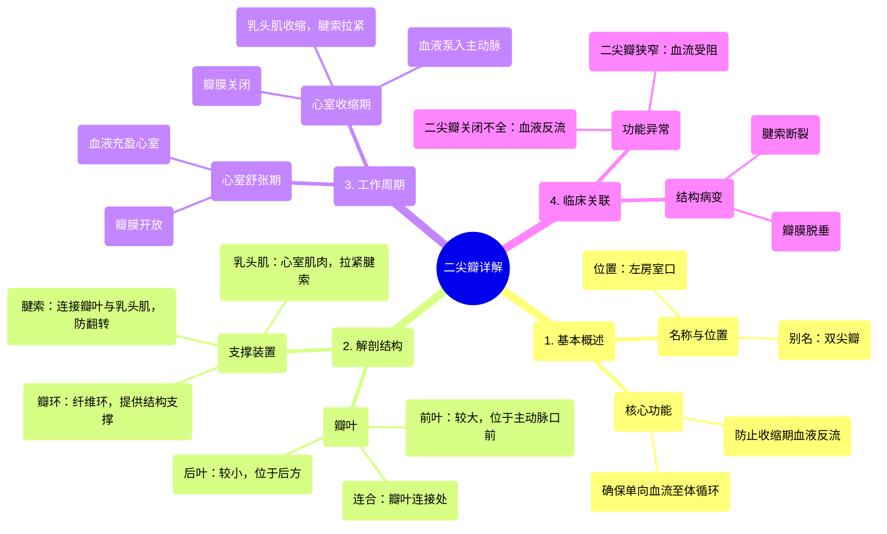

# 10 360 video - Mitral Valve - Explained in Mixed Reality

  <video controls preload="metadata" playsinline>
    <source src="https://helly.s3.bitiful.net/心血管学科/%E4%B8%93%E8%BE%91%2001%EF%BC%9A%E5%BF%83%E8%84%8F%E8%A7%A3%E5%89%96%E5%AD%A6%E5%AE%9E%E6%99%AF%E8%AF%BE%20%28Heart%20Anatomy%20-%20Course%29/10%20360%20video%20-%20Mitral%20Valve%20-%20Explained%20in%20Mixed%20Reality.mp4" type="video/mp4">
    
您的浏览器不支持播放，请升级。

  </video>

::: tip ⚡️ 核心考点 (30s速读)
*   **核心考点**：二尖瓣是位于左心房与左心室之间的双叶瓣膜，其核心功能是在心室收缩期防止血液反流回左心房，确保血液单向、高效地泵入体循环。
*   **临床意义**：二尖瓣结构（瓣叶、瓣环、腱索、乳头肌）的完整性至关重要。任何一部分的病变（如脱垂、狭窄、关闭不全）都会导致血流动力学异常，是心力衰竭、心律失常等心脏疾病的重要病因。
:::

## 🧠 深度精讲

*   **概念1：二尖瓣的解剖结构与命名**
    *   二尖瓣，又称**双尖瓣**，因其有两个主要瓣叶（前叶和后叶）而得名。它位于左心房与左心室之间的**左房室口**，此开口小于右侧的三尖瓣口。
    *   前叶较大，位于房室口与主动脉口之间，起到重要的屏障和协调作用。后叶较小，位于后方，与前叶协同确保瓣膜关闭严密。
    *   瓣叶在**连合处**相连，瓣膜关闭时，连合处的小瓣叶（连合瓣叶）变得明显，共同保证瓣膜无缝运作。

*   **概念2：二尖瓣的支撑结构与功能机制**
    *   二尖瓣的稳定性依赖于一个完整的“装置”系统：
        1.  **瓣环**：环绕瓣膜底部的纤维环，为瓣叶提供结构支撑和锚定点，维持其形状与对位。
        2.  **腱索**：连接瓣叶游离缘和心室面与**乳头肌**尖端的坚韧索状结构。其主要功能是防止心室收缩时，瓣叶在高压下翻入左心房（瓣膜脱垂）。
        3.  **乳头肌**：心室壁的锥形肌肉突起，通过收缩拉紧腱索，是防止瓣叶翻转的力学基础。
    *   这个装置（瓣环-瓣叶-腱索-乳头肌）作为一个功能整体，被称为**二尖瓣复合体**。

*   **概念3：二尖瓣在心动周期中的动态变化**
    *   **心室舒张期**：心室肌松弛，室内压下降。二尖瓣**开放**，血液从左心房快速流入左心室（心室充盈期）。
    *   **心室收缩期**：心室肌收缩，室内压急剧升高。二尖瓣**关闭**，同时乳头肌收缩拉紧腱索，使两个瓣叶紧密对合，有效防止血液反流回左心房，确保血液全部射入主动脉。

## 📚 双语术语表 (Terminology)
| 英文术语 | 中文翻译 | 定义/解释 |
| :--- | :--- | :--- |
| Mitral Valve | 二尖瓣 | 位于左心房与左心室之间的双叶瓣膜，因形似主教法冠而得名，主要功能是防止心室收缩时血液反流。 |
| Bicuspid Valve | 双尖瓣 | 二尖瓣的别称，强调其具有两个瓣叶的解剖特征。 |
| Left Atrioventricular Orifice | 左房室口 | 左心房与左心室之间的通道，由二尖瓣守卫。 |
| Anterior Leaflet | 前瓣叶 | 二尖瓣中较大、更显著的瓣叶，位于房室口与主动脉口之间。 |
| Posterior Leaflet | 后瓣叶 | 二尖瓣中较小的瓣叶，位于后方，与前叶协同关闭瓣膜。 |
| Commissure | 连合 | 指二尖瓣前、后两个瓣叶相遇连接的接合处。 |
| Annulus | 瓣环 | 环绕二尖瓣基部的纤维性环状结构，用于支撑和固定瓣叶。 |
| Chordae Tendineae | 腱索 | 连接瓣叶游离缘与乳头肌的纤细、坚韧的索状结构，防止瓣叶外翻。 |
| Papillary Muscles | 乳头肌 | 心室壁内突出的锥形肌肉，其尖端发出腱索，通过收缩来调节腱索张力。 |
| Ventricular Systole | 心室收缩期 | 心动周期中心室肌肉收缩、泵血的阶段，此时二尖瓣关闭。 |
| Ventricular Diastole | 心室舒张期 | 心动周期中心室肌肉松弛、充盈血液的阶段，此时二尖瓣开放。 |

## 🗺️ 知识图谱

