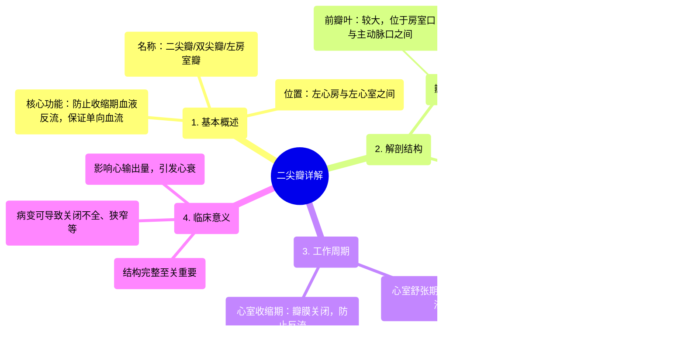

# 10 360 video - Mitral Valve - Explained in Mixed Reality

  <video controls preload="metadata" playsinline>
    <source src="https://helly.bitiful.net/心血管学科/%E4%B8%93%E8%BE%91%2001%EF%BC%9A%E5%BF%83%E8%84%8F%E8%A7%A3%E5%89%96%E5%AD%A6%E5%AE%9E%E6%99%AF%E8%AF%BE%20%28Heart%20Anatomy%20-%20Course%29/10%20360%20video%20-%20Mitral%20Valve%20-%20Explained%20in%20Mixed%20Reality.mp4" type="video/mp4">
    
您的浏览器不支持播放，请升级。

  </video>

::: tip ⚡️ 核心考点 (30s速读)
*   **核心考点**：二尖瓣是位于左心房与左心室之间的双叶瓣膜，其核心功能是在心室收缩期防止血液反流回左心房，确保血液单向、高效地泵入体循环。
*   **临床意义**：二尖瓣的结构（瓣叶、瓣环、腱索、乳头肌）完整性至关重要。任何一部分的病变（如脱垂、狭窄、关闭不全）都会严重影响心脏泵血功能，导致心力衰竭、心律失常等严重后果。
:::

## 🧠 深度精讲

*   **概念1：二尖瓣的解剖结构与命名**
    *   **位置与名称**：二尖瓣，又称**左房室瓣**或**双尖瓣**，位于左心房与左心室之间，守卫左房室口。其名称源于其形状类似主教的法冠（Mitre），且因其由两个瓣叶构成，故得名“双尖瓣”。
    *   **瓣叶构成**：由两个突出的瓣叶组成。
        *   **前瓣叶**：较大且显著，位于房室口与主动脉口之间，起到保护与协调血流的作用。
        *   **后瓣叶**：较小且位于后方，与前瓣叶协同工作，确保瓣膜关闭严密。
    *   **支撑结构**：
        *   **瓣环**：环绕瓣膜的纤维性环状结构，为瓣叶提供附着框架，维持其形态与完整性。
        *   **腱索与乳头肌**：瓣叶通过**腱索**连接到**乳头肌**。这些结构的主要作用是防止心室收缩时瓣叶翻入左心房，确保瓣膜正常关闭。

*   **概念2：二尖瓣的功能与心动周期**
    *   **工作原理**：二尖瓣的功能是作为单向阀门，其开闭与心动周期紧密协调。
        *   **心室舒张期**：心室肌松弛，室内压降低，二尖瓣**开放**，允许血液从左心房充盈至左心室。
        *   **心室收缩期**：心室肌收缩，室内压急剧升高，超过心房压，推动二尖瓣**紧密关闭**，防止血液反流回左心房，同时确保血液被泵入主动脉，进入体循环。
    *   **功能核心**：通过精确的定时开闭，确保血液从左心房到左心室的**单向、高效流动**，这是维持正常心输出量和全身血液循环的基础。

## 📚 双语术语表 (Terminology)
| 英文术语 | 中文翻译 | 定义/解释 |
| :--- | :--- | :--- |
| Mitral Valve | 二尖瓣 | 位于左心房与左心室之间的双叶瓣膜，因形似主教法冠而得名，功能为防止心室收缩时血液反流。 |
| Bicuspid Valve | 双尖瓣 | 二尖瓣的别称，强调其由两个瓣叶构成的结构特征。 |
| Left Atrioventricular Orifice | 左房室口 | 左心房与左心室之间的通道，由二尖瓣守卫。 |
| Anterior Leaflet | 前瓣叶 | 二尖瓣中较大、较显著的瓣叶，位于房室口与主动脉口之间。 |
| Posterior Leaflet | 后瓣叶 | 二尖瓣中较小、位于后方的瓣叶，与前瓣叶协同确保瓣膜关闭严密。 |
| Commissure | 连合 | 指二尖瓣前、后瓣叶在交界处相延续的部分，瓣膜关闭时更明显。 |
| Annulus (Fibrous Ring) | 瓣环（纤维环） | 环绕二尖瓣基部的纤维性环状结构，用于锚定瓣叶，维持其形状与功能。 |
| Chordae Tendineae | 腱索 | 连接二尖瓣瓣叶游离缘与乳头肌的纤维索状结构，防止心室收缩时瓣叶翻转。 |
| Papillary Muscles | 乳头肌 | 心室壁突出的锥形肌肉，通过腱索连接并牵拉二尖瓣瓣叶。 |
| Ventricular Systole | 心室收缩期 | 心动周期中心室肌收缩、泵血的阶段，此时二尖瓣关闭。 |
| Ventricular Diastole | 心室舒张期 | 心动周期中心室肌松弛、充盈血液的阶段，此时二尖瓣开放。 |

## 🗺️ 知识图谱

