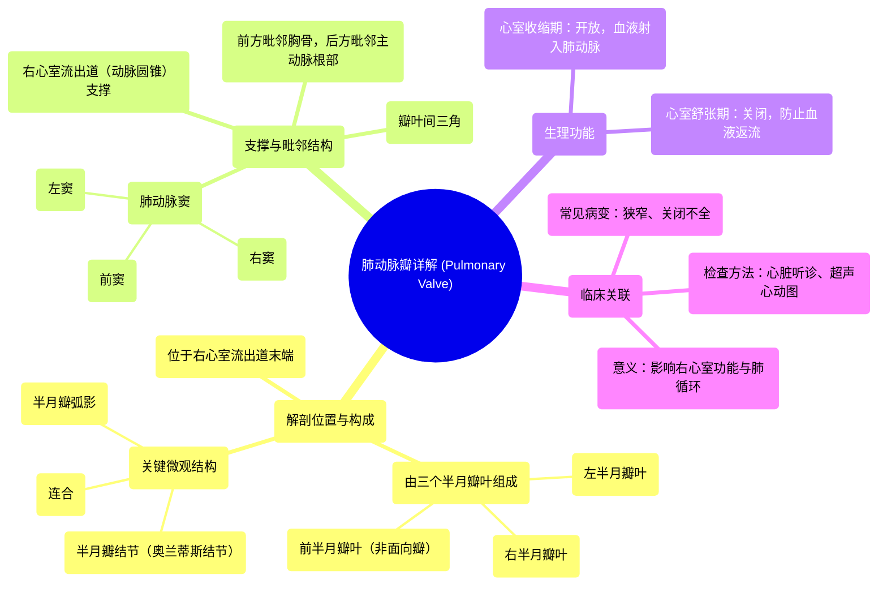

# 11 360 video - Pulmonary Valve - Explained in Mixed Reality

  <video controls preload="metadata" playsinline>
    <source src="https://helly.bitiful.net/心血管学科/%E4%B8%93%E8%BE%91%2001%EF%BC%9A%E5%BF%83%E8%84%8F%E8%A7%A3%E5%89%96%E5%AD%A6%E5%AE%9E%E6%99%AF%E8%AF%BE%20%28Heart%20Anatomy%20-%20Course%29/11%20360%20video%20-%20Pulmonary%20Valve%20-%20Explained%20in%20Mixed%20Reality.mp4" type="video/mp4">
    
您的浏览器不支持播放，请升级。

  </video>

::: tip ⚡️ 核心考点 (30s速读)
*   **核心考点**：肺动脉瓣是位于右心室流出道与肺动脉干之间的三叶半月瓣，其核心功能是防止血液从肺动脉返流回右心室。
*   **临床意义**：肺动脉瓣狭窄或关闭不全是常见的先天性心脏病，可导致右心室负荷增加、心力衰竭，是心脏听诊、超声心动图检查的重点区域。
:::

## 🧠 深度精讲

*   **概念1：肺动脉瓣的解剖结构与位置**
    *   肺动脉瓣位于右心室流出道的末端，即**动脉圆锥**的顶部，是肺动脉干的起始阀门。
    *   它由三个**半月形瓣叶**（瓣尖）组成，根据其方位分别命名为：**左半月瓣叶**、**右半月瓣叶**和**前半月瓣叶**。其中，前瓣叶因距离主动脉根部最远，也称为**非面向瓣**。
    *   每个瓣叶的游离缘中点有一个增厚的小结，称为**半月瓣结节**（或奥兰蒂斯结节）。结节两侧的新月形菲薄区域称为**半月瓣弧影**，它们与结节协同作用，使瓣膜关闭时能紧密对合，防止血液反流。
    *   两个相邻瓣叶边缘的附着交汇点称为**连合**，是瓣膜活动的支点。
    *   瓣膜根部的肺动脉干管壁向外膨出，形成三个**肺动脉窦**（右窦、左窦、前窦），分别对应于三个瓣叶，为瓣叶开放时提供容纳空间，并有助于冠状动脉（主动脉窦）的血流动力学。

*   **概念2：肺动脉瓣的功能与血流动力学**
    *   **心室收缩期**：右心室收缩，室内压升高并超过肺动脉压时，肺动脉瓣被血流冲开，血液射入肺动脉干，进入肺循环进行气体交换。
    *   **心室舒张期**：右心室舒张，室内压迅速下降。当肺动脉压高于右心室压时，血流回冲使三个瓣叶相互靠拢，瓣叶的游离缘（包括结节和弧影）紧密接触，**关闭瓣口**，从而有效防止血液从肺动脉返流回右心室。

*   **概念3：肺动脉瓣的支撑与毗邻结构**
    *   肺动脉瓣的骨架支撑主要来自**右心室流出道**的心肌，特别是动脉圆锥的肌性结构。
    *   在三个肺动脉窦之间，瓣叶附着缘下方的区域是纤维性的**瓣叶间三角**，是瓣膜装置的重要组成结构。
    *   肺动脉瓣前方是胸骨，后方毗邻**主动脉根部**，理解这一毗邻关系对于影像学解读和外科手术至关重要。

## 📚 双语术语表 (Terminology)
| 英文术语 | 中文翻译 | 定义/解释 |
| :--- | :--- | :--- |
| Pulmonary Valve | 肺动脉瓣 | 位于右心室与肺动脉干之间的心脏瓣膜，防止血液回流。 |
| Semilunar Cusp/Leaflet | 半月瓣叶/瓣尖 | 构成肺动脉瓣的三个袋状瓣膜结构。 |
| Conus Arteriosus | 动脉圆锥 | 右心室流出道的漏斗形肌性部分，其上端为肺动脉瓣。 |
| Right Ventricular Outflow Tract (RVOT) | 右心室流出道 | 右心室通向肺动脉瓣的通道。 |
| Nodule of Semilunar Leaflet / Nodule of Oranteus | 半月瓣结节 / 奥兰蒂斯结节 | 位于半月瓣游离缘中点的纤维性增厚结节，助于瓣膜闭合。 |
| Lunule | 半月瓣弧影 | 半月瓣结节两侧的新月形菲薄区域，闭合时与对侧瓣叶接触。 |
| Commissure | 连合 | 两个相邻瓣叶边缘附着于血管壁的交汇点。 |
| Sinus of Pulmonary Trunk | 肺动脉窦 | 肺动脉干根部对应于瓣叶后方的三个膨大部分。 |
| Interleaflet Triangle | 瓣叶间三角 | 位于肺动脉窦之间、瓣叶附着缘下方的纤维三角区域。 |
| Ventricular Systole | 心室收缩期 | 心室肌肉收缩、射血的时期，此时肺动脉瓣开放。 |
| Ventricular Diastole | 心室舒张期 | 心室肌肉舒张、充盈的时期，此时肺动脉瓣关闭。 |

## 🗺️ 知识图谱

