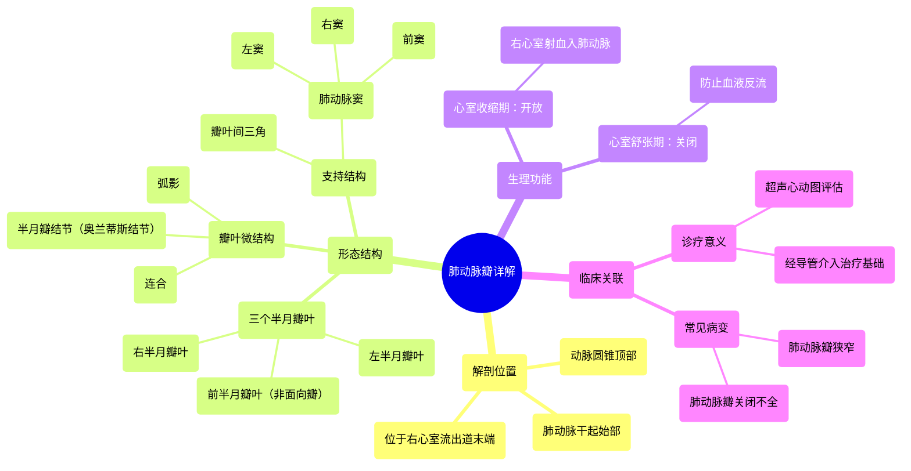

# 11 360 video - Pulmonary Valve - Explained in Mixed Reality

  <video controls preload="metadata" playsinline>
    <source src="https://helly.s3.bitiful.net/心血管学科/%E4%B8%93%E8%BE%91%2001%EF%BC%9A%E5%BF%83%E8%84%8F%E8%A7%A3%E5%89%96%E5%AD%A6%E5%AE%9E%E6%99%AF%E8%AF%BE%20%28Heart%20Anatomy%20-%20Course%29/11%20360%20video%20-%20Pulmonary%20Valve%20-%20Explained%20in%20Mixed%20Reality.mp4" type="video/mp4">
    
您的浏览器不支持播放，请升级。

  </video>

::: tip ⚡️ 核心考点 (30s速读)
*   **核心考点**：肺动脉瓣是位于右心室流出道与肺动脉干之间的三叶半月瓣，核心功能是保证血液从右心室向肺动脉的单向流动，防止舒张期血液反流。
*   **临床意义**：肺动脉瓣狭窄或关闭不全是常见的先天性或后天性心脏病，可导致右心室负荷增加、肥厚，最终引发右心衰竭。其解剖结构是经导管介入治疗（如球囊瓣膜成形术）的重要基础。
:::

## 🧠 深度精讲

*   **概念1：肺动脉瓣的解剖结构与位置**
    肺动脉瓣位于右心室流出道的末端，即动脉圆锥的顶部，是肺动脉干的起始“门户”。它由三个半月形的瓣叶（左、右、前瓣叶）构成，每个瓣叶的游离缘中点有一个增厚的小结（半月瓣结节/奥兰蒂斯结节），结节两侧为新月形的弧影。瓣叶基底部附着于肺动脉干的管壁，瓣叶之间的连接处称为“连合”。瓣叶与肺动脉干壁之间形成的三个膨大区域称为“肺动脉窦”（右窦、左窦、前窦），窦与窦之间的瓣叶附着区域则形成“瓣叶间三角”。这种精巧的结构共同确保了瓣膜在心室收缩时充分打开，在舒张时严密对合，防止血液反流。

*   **概念2：肺动脉瓣的功能与心动周期**
    肺动脉瓣的功能与心动周期紧密相关。在**心室收缩期**，右心室压力升高并超过肺动脉压力，肺动脉瓣的三个瓣叶被血流冲开，贴向肺动脉窦壁，血液顺利射入肺动脉。在**心室舒张期**，右心室压力骤降，肺动脉内的血液产生回流倾向，此时肺动脉窦内的血液产生涡流，推动三个瓣叶向中心对合，瓣叶的游离缘（特别是结节和弧影部分）紧密接触，从而关闭瓣口，有效阻止血液反流回右心室。这一开一闭的协调运动，是保证肺循环有效进行的关键。

*   **概念3：肺动脉瓣的命名与空间关系**
    肺动脉瓣的三个瓣叶根据其与周围结构的空间方位命名。**左半月瓣叶**和**右半月瓣叶**分别朝向左侧和右侧。**前半月瓣叶**位于前方，因其位置距离主动脉根部最远，也被称为“非面向瓣”。这种命名方式有助于在影像学检查（如超声心动图）和外科手术中精确定位。理解瓣叶与对应肺动脉窦（右窦、左窦、前窦）的关系，对于诊断瓣膜病变和规划治疗路径至关重要。

## 📚 双语术语表 (Terminology)
| 英文术语 | 中文翻译 | 定义/解释 |
| :--- | :--- | :--- |
| Pulmonary Valve | 肺动脉瓣 | 位于右心室与肺动脉之间的心脏瓣膜，由三个半月瓣叶组成，防止血液从肺动脉反流回右心室。 |
| Semilunar Cusp/Leaflet | 半月瓣叶 | 构成肺动脉瓣和主动脉瓣的瓣膜结构，形似半月。肺动脉瓣包含左、右、前三个瓣叶。 |
| Nodule of Semilunar Leaflet / Nodule of Oranteus | 半月瓣结节 / 奥兰蒂斯结节 | 位于每个半月瓣叶游离缘中点的纤维性增厚小结，有助于瓣膜关闭时的严密对合。 |
| Lunule | 弧影 | 半月瓣结节两侧的新月形薄区，与结节共同参与瓣膜关闭时的密封。 |
| Commissure | 连合 | 两个相邻瓣叶边缘相遇并附着于血管壁的交界点。 |
| Sinuses of Pulmonary Trunk | 肺动脉窦 | 肺动脉干根部与肺动脉瓣叶相对的三个膨大部分（右窦、左窦、前窦），舒张期窦内血液涡流有助于瓣膜关闭。 |
| Interleaflet Triangle | 瓣叶间三角 | 位于肺动脉窦之间、瓣叶附着线以下的纤维性三角形区域，是瓣膜结构的组成部分。 |
| Conus Arteriosus / Right Ventricular Outflow Tract (RVOT) | 动脉圆锥 / 右心室流出道 | 右心室上部通向肺动脉瓣的漏斗形肌性通道。 |
| Ventricular Systole | 心室收缩期 | 心脏周期中心室肌肉收缩、射血的阶段，此时肺动脉瓣开放。 |
| Ventricular Diastole | 心室舒张期 | 心脏周期中心室肌肉舒张、充盈的阶段，此时肺动脉瓣关闭。 |

## 🗺️ 知识图谱

