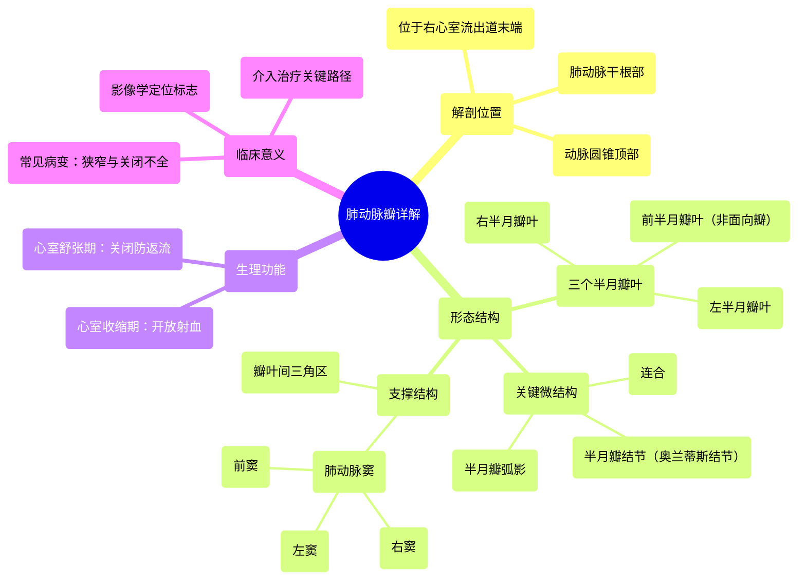

# 11 360 video - Pulmonary Valve - Explained in Mixed Reality

  <video controls preload="metadata" playsinline>
    <source src="https://helly.s3.bitiful.net/心血管学科/%E4%B8%93%E8%BE%91%2001%EF%BC%9A%E5%BF%83%E8%84%8F%E8%A7%A3%E5%89%96%E5%AD%A6%E5%AE%9E%E6%99%AF%E8%AF%BE%20%28Heart%20Anatomy%20-%20Course%29/11%20360%20video%20-%20Pulmonary%20Valve%20-%20Explained%20in%20Mixed%20Reality.mp4" type="video/mp4">
    
您的浏览器不支持播放，请升级。

  </video>

::: tip ⚡️ 核心考点 (30s速读)
*   **核心考点**：肺动脉瓣是位于右心室流出道与肺动脉干之间的三叶半月瓣，其核心功能是保证血液从右心室向肺动脉的单向流动，防止舒张期血液返流。
*   **临床意义**：肺动脉瓣狭窄或关闭不全是常见的先天性心脏病，可导致右心室负荷增加、肥厚，最终引发右心衰竭。其解剖位置是心脏介入手术（如经皮肺动脉瓣植入术）的关键路径。
:::

## 🧠 深度精讲

*   **概念1：肺动脉瓣的解剖结构与位置**
    肺动脉瓣是心脏四个瓣膜之一，位于右心室流出道的末端，肺动脉干的根部。它由三个半月形的瓣叶（左、右、前瓣叶）构成。每个瓣叶的游离缘中点有一个增厚的小结，称为“半月瓣结节”或“奥兰蒂斯结节”，结节两侧的新月形区域称为“半月瓣弧影”，这些结构共同确保瓣膜关闭时的严密对合。瓣叶附着处的肺动脉干壁向外膨出，形成三个“肺动脉窦”（左窦、右窦、前窦）。瓣叶之间的连接处称为“连合”，是瓣叶边缘与肺动脉壁相接的关键点。瓣叶基底部与肺动脉壁之间还存在纤维性的“瓣叶间三角区”。

*   **概念2：肺动脉瓣的功能与血流动力学**
    肺动脉瓣的功能完全由右心室与肺动脉之间的压力差驱动，属于被动启闭的“半月瓣”。
    *   **心室收缩期（射血期）**：右心室收缩，室内压力迅速升高并超过肺动脉压力，推动三个瓣叶向肺动脉干壁开放，血液顺利射入肺动脉。
    *   **心室舒张期（充盈期）**：右心室舒张，室内压力下降。肺动脉内的血液在重力及弹性回缩作用下产生回流倾向，血液涌入肺动脉窦，反向压力使三个瓣叶的游离缘（尤其是结节和弧影部分）相互对合，紧密关闭瓣口，有效防止血液返流回右心室。

*   **概念3：肺动脉瓣的命名与临床关联**
    三个瓣叶根据其与周围结构的空间方位命名：
    *   “左半月瓣叶”和“右半月瓣叶”分别面向心脏的左侧和右侧。
    *   “前半月瓣叶”位于前方，因其正对胸壁，且在超声心动图检查中是最容易被观察到的瓣叶。它也常被称为“非面向瓣”，因为其位置距离主动脉根部最远。
    这种命名方式在心脏影像学（如超声、CT）和外科手术中对于精确定位和描述病变至关重要。

## 📚 双语术语表 (Terminology)
| 英文术语 | 中文翻译 | 定义/解释 |
| :--- | :--- | :--- |
| Pulmonary Valve | 肺动脉瓣 | 位于右心室与肺动脉之间的半月瓣，保证血液单向流入肺动脉。 |
| Semilunar Cusp/Leaflet | 半月瓣叶 | 构成肺动脉瓣的三个口袋状瓣膜结构，以其半月形状命名。 |
| Nodule of Semilunar Leaflet / Nodule of Oranteus | 半月瓣结节 / 奥兰蒂斯结节 | 位于每个瓣叶游离缘中点的纤维性增厚结节，有助于瓣膜严密关闭。 |
| Lunule | 半月瓣弧影 | 位于结节两侧的新月形菲薄区域，与结节协同确保瓣膜密封。 |
| Commissure | 连合 | 两个相邻瓣叶的边缘相遇并附着于肺动脉壁的结合点。 |
| Sinuses of Pulmonary Trunk | 肺动脉窦 | 肺动脉干根部与瓣叶相对应的三个膨大部分，舒张期血液在此形成涡流帮助瓣膜关闭。 |
| Interleaflet Triangle | 瓣叶间三角区 | 位于瓣叶附着缘基底部、连合之间的纤维性三角区域，是瓣膜支架的一部分。 |
| Right Ventricular Outflow Tract (RVOT) | 右心室流出道 | 右心室通向肺动脉瓣的漏斗形肌性通道。 |
| Conus Arteriosus | 动脉圆锥 | 右心室流出道的别名，特指其漏斗状的形态。 |
| Ventricular Systole | 心室收缩期 | 心脏周期中心室肌收缩、射血的阶段，此时肺动脉瓣开放。 |
| Ventricular Diastole | 心室舒张期 | 心脏周期中心室肌舒张、充盈的阶段，此时肺动脉瓣关闭。 |

## 🗺️ 知识图谱

