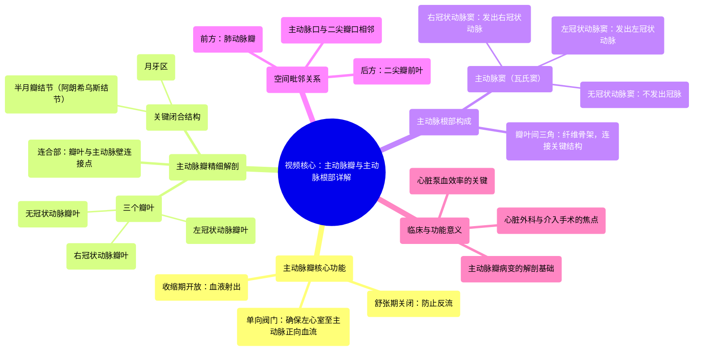

# 12 360 video - Aortic Valve - Explained in Mixed Reality

  <video controls preload="metadata" playsinline>
    <source src="https://helly.bitiful.net/心血管学科/%E4%B8%93%E8%BE%91%2001%EF%BC%9A%E5%BF%83%E8%84%8F%E8%A7%A3%E5%89%96%E5%AD%A6%E5%AE%9E%E6%99%AF%E8%AF%BE%20%28Heart%20Anatomy%20-%20Course%29/12%20360%20video%20-%20Aortic%20Valve%20-%20Explained%20in%20Mixed%20Reality.mp4" type="video/mp4">
    
您的浏览器不支持播放，请升级。

  </video>

::: tip ⚡️ 核心考点 (30s速读)
*   **核心考点**：主动脉瓣是位于左心室与主动脉之间的三叶瓣膜，其核心功能是确保血液从左心室向主动脉的单向流动，防止血液反流。其解剖基础是主动脉根部，包含主动脉窦、瓣叶间三角等关键结构。
*   **临床意义**：主动脉瓣的病变（如狭窄或关闭不全）会严重影响心脏泵血效率，导致心力衰竭。理解其精细解剖（如瓣叶、窦、连合部）对于心脏外科手术（如瓣膜置换、TAVR）和影像学诊断（如超声心动图）至关重要。
:::

## 🧠 深度精讲

*   **主动脉瓣与主动脉根部的功能关系**：主动脉瓣和主动脉根部是一个不可分割的功能-解剖复合体。主动脉根部为瓣膜提供了结构支撑和附着点，而瓣膜则作为“单向阀门”，精确调控血流。在心室收缩期（**systole**），瓣膜开放，血液从左心室射入主动脉根部及升主动脉；在舒张期（**diastole**），瓣膜关闭，其三个瓣叶在中心对合，依靠**半月瓣结节**和**月牙区**实现紧密密封，防止血液倒流回心脏。
*   **主动脉瓣的精细解剖**：
    *   **三个瓣叶**：根据其与冠状动脉开口的关系命名。**右冠状动脉瓣叶**和**左冠状动脉瓣叶**分别对应发出右冠状动脉和左冠状动脉的主动脉窦。**无冠状动脉瓣叶**位于后方，不发出冠状动脉。
    *   **关键结构**：每个瓣叶的游离缘中点有增厚的**半月瓣结节（阿朗希乌斯结节）**，其两侧为新月形的**月牙区**，这些结构是瓣膜有效闭合的关键。两个瓣叶边缘相遇并与主动脉壁相连的区域称为**连合部**，决定了瓣膜的开放口径。
*   **主动脉根部的构成**：
    *   **主动脉窦（瓦氏窦）**：位于瓣叶上方的主动脉管腔的三个膨大处。**右冠状动脉窦**和**左冠状动脉窦**分别发出相应的冠状动脉，保证心肌自身的血液供应。**无冠状动脉窦**位于后方。窦的独特形态能在舒张期形成涡流，既有助于瓣叶关闭，又能促进冠状动脉充盈。
    *   **瓣叶间三角**：位于主动脉窦底部、两个瓣叶附着缘之间的纤维三角区域。这是主动脉根部的“骨架”，连接着主动脉瓣环、二尖瓣前叶和心脏的纤维支架，对维持左心室流出道的结构和功能稳定性极为重要。
*   **空间毗邻关系**：主动脉瓣位于心脏中心，前方是肺动脉瓣（两者合称“半月瓣”），后方紧邻二尖瓣前叶。主动脉口与二尖瓣口由二尖瓣前叶分隔。理解这一“心脏十字路口”的毗邻关系，对于解读影像和避免手术损伤至关重要。

## 📚 双语术语表 (Terminology)
| 英文术语 | 中文翻译 | 定义/解释 |
| :--- | :--- | :--- |
| Aortic Valve | 主动脉瓣 | 位于左心室与主动脉之间的三叶瓣膜，确保血液单向流入主动脉。 |
| Aortic Root | 主动脉根部 | 主动脉的起始部分，为主动脉瓣提供解剖基础，包含主动脉窦等结构。 |
| Leaflet / Cusp | 瓣叶 | 构成心脏瓣膜的薄片状结构。主动脉瓣有三个瓣叶。 |
| Right Coronary Leaflet | 右冠状动脉瓣叶 | 位于前方偏右的主动脉瓣瓣叶，对应右冠状动脉窦。 |
| Left Coronary Leaflet | 左冠状动脉瓣叶 | 位于前方偏左的主动脉瓣瓣叶，对应左冠状动脉窦。 |
| Non-coronary Leaflet | 无冠状动脉瓣叶 | 位于后方的主动脉瓣瓣叶，对应无冠状动脉窦。 |
| Nodule of Semilunar Leaflets / Nodule of Arantius | 半月瓣结节 / 阿朗希乌斯结节 | 位于每个半月瓣瓣叶游离缘中点的纤维性增厚结节，有助于瓣膜闭合。 |
| Lunule | 月牙区 | 半月瓣结节两侧的新月形区域，瓣膜闭合时参与对合。 |
| Commissure | 连合部 | 两个瓣叶边缘相遇并与血管壁相连的最高点。 |
| Aortic Sinus / Sinus of Valsalva | 主动脉窦 / 瓦氏窦 | 位于主动脉瓣叶上方的主动脉管腔的囊状膨大，包括左、右、无冠三个窦。 |
| Interleaflet Triangle | 瓣叶间三角 | 位于主动脉窦底部、相邻两个瓣叶附着缘之间的纤维三角区域。 |
| Systole | （心室）收缩期 | 心动周期中心室肌肉收缩、射血的阶段，此时主动脉瓣开放。 |
| Diastole | （心室）舒张期 | 心动周期中心室肌肉舒张、充盈的阶段，此时主动脉瓣关闭。 |
| Aortic Orifice | 主动脉口 | 左心室流出道通向主动脉的圆形开口。 |

## 🗺️ 知识图谱

