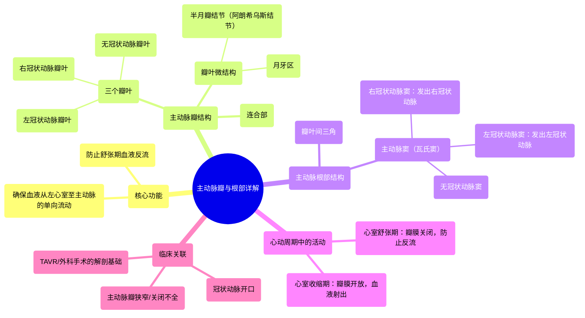

# 12 360 video - Aortic Valve - Explained in Mixed Reality

  <video controls preload="metadata" playsinline>
    <source src="https://helly.s3.bitiful.net/心血管学科/%E4%B8%93%E8%BE%91%2001%EF%BC%9A%E5%BF%83%E8%84%8F%E8%A7%A3%E5%89%96%E5%AD%A6%E5%AE%9E%E6%99%AF%E8%AF%BE%20%28Heart%20Anatomy%20-%20Course%29/12%20360%20video%20-%20Aortic%20Valve%20-%20Explained%20in%20Mixed%20Reality.mp4" type="video/mp4">
    
您的浏览器不支持播放，请升级。

  </video>

::: tip ⚡️ 核心考点 (30s速读)
*   **核心考点**：主动脉瓣与主动脉根部是确保血液从左心室单向流入主动脉的关键结构。主动脉瓣由三个瓣叶（右冠瓣、左冠瓣、无冠瓣）组成，其精细结构（如半月瓣结节、月牙区）和主动脉窦（瓦氏窦）共同保证了瓣膜的有效开闭和冠状动脉的血液供应。
*   **临床意义**：理解这些结构是诊断和治疗主动脉瓣狭窄、关闭不全等疾病的基础。瓣叶、连合部及主动脉窦的病变直接影响心脏泵血效率和心肌供血，是心脏外科和介入治疗（如TAVR）的解剖学依据。
:::

## 🧠 深度精讲

*   **主动脉瓣与主动脉根部**：它们是心脏左心室出口的“守门员”和“门框”。主动脉根部是主动脉的起始膨大部分，为主动脉瓣提供附着基础，并连接左心室与全身动脉系统。主动脉瓣则是一个单向阀门，确保血液只能向前进入主动脉，而不能倒流回心脏。
*   **主动脉瓣的精细结构**：
    *   **三个瓣叶**：这是正常主动脉瓣的标志。每个瓣叶呈半月形，故名半月瓣。它们根据对应的冠状动脉开口被命名为：**右冠状动脉瓣叶**（前方偏右）、**左冠状动脉瓣叶**（前方偏左）和**无冠状动脉瓣叶**（后方）。
    *   **关键微结构**：在每个瓣叶游离缘的中点，有一个增厚的小结，称为**半月瓣结节**（阿朗希乌斯结节）。结节两侧延伸至连合部的薄而透明的区域称为**月牙区**。这些结构在瓣膜关闭时能紧密对合，防止血液反流。
    *   **连合部**：指两个相邻瓣叶边缘相遇并与主动脉壁相连的点。三个连合部的对合高度一致是瓣膜正常关闭的关键。
*   **主动脉根部的重要构成**：
    *   **主动脉窦**（瓦氏窦）：位于主动脉瓣叶上方的主动脉管壁的三个袋状膨大。右冠窦和左冠窦分别发出右冠状动脉和左冠状动脉，为心肌供血。无冠窦则不发出冠状动脉。窦的独特结构能在心脏舒张期形成涡流，促进冠状动脉充盈，并减轻瓣叶关闭时的冲击应力。
    *   **瓣叶间三角**：位于主动脉窦底部、瓣叶附着缘之间的纤维三角区域。它们是主动脉根与左心室流出道心肌之间的重要纤维连接点，在维持根部几何结构和力学稳定性中起关键作用。
*   **心动周期中的功能**：
    *   **心室收缩期**：左心室压力升高，冲开主动脉瓣，血液高速射入主动脉。
    *   **心室舒张期**：左心室压力下降，主动脉内血液回流，推动三个瓣叶对合关闭，阻止血液反流。

## 📚 双语术语表 (Terminology)
| 英文术语 | 中文翻译 | 定义/解释 |
| :--- | :--- | :--- |
| Aortic Valve | 主动脉瓣 | 位于左心室和主动脉之间的心脏瓣膜，确保血液单向流入主动脉。 |
| Aortic Root | 主动脉根部 | 主动脉的起始段，包含主动脉瓣环、主动脉窦和窦管交界，是瓣膜的解剖基础。 |
| Leaflet / Cusp | 瓣叶 | 构成心脏瓣膜的薄片状结构。主动脉瓣通常有三个瓣叶。 |
| Right Coronary Leaflet | 右冠状动脉瓣叶 | 主动脉瓣中位于前方偏右的瓣叶，对应右冠状动脉窦。 |
| Left Coronary Leaflet | 左冠状动脉瓣叶 | 主动脉瓣中位于前方偏左的瓣叶，对应左冠状动脉窦。 |
| Non-coronary Leaflet | 无冠状动脉瓣叶 | 主动脉瓣中位于后方的瓣叶，对应无冠状动脉窦。 |
| Nodule of Semilunar Leaflets / Nodule of Arantius | 半月瓣结节 / 阿朗希乌斯结节 | 位于每个主动脉瓣叶游离缘中点的纤维性增厚结节，有助于瓣膜严密关闭。 |
| Lunule | 月牙区 | 半月瓣结节两侧的半月形菲薄区域，在瓣膜关闭时参与对合。 |
| Commissure | 连合部 | 两个相邻瓣叶边缘相遇并附着于主动脉壁的结合点。 |
| Aortic Sinus / Sinus of Valsalva | 主动脉窦 / 瓦氏窦 | 主动脉根部位于瓣叶上方的三个膨大部分，其中两个发出冠状动脉。 |
| Interleaflet Triangle | 瓣叶间三角 | 位于主动脉窦底部、瓣叶附着处之间的纤维三角区域。 |
| Ventricular Systole | 心室收缩期 | 心动周期中心室肌肉收缩、射血的阶段，此时主动脉瓣开放。 |
| Ventricular Diastole | 心室舒张期 | 心动周期中心室肌肉舒张、充盈的阶段，此时主动脉瓣关闭。 |

## 🗺️ 知识图谱

