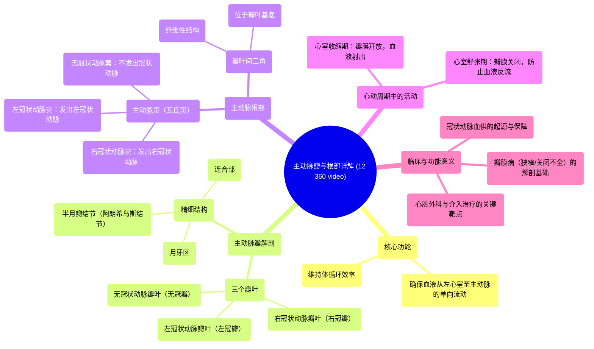

# 12 360 video - Aortic Valve - Explained in Mixed Reality

  <video controls preload="metadata" playsinline>
    <source src="https://helly.s3.bitiful.net/心血管学科/%E4%B8%93%E8%BE%91%2001%EF%BC%9A%E5%BF%83%E8%84%8F%E8%A7%A3%E5%89%96%E5%AD%A6%E5%AE%9E%E6%99%AF%E8%AF%BE%20%28Heart%20Anatomy%20-%20Course%29/12%20360%20video%20-%20Aortic%20Valve%20-%20Explained%20in%20Mixed%20Reality.mp4" type="video/mp4">
    
您的浏览器不支持播放，请升级。

  </video>

::: tip ⚡️ 核心考点 (30s速读)
*   **核心考点**：主动脉瓣与主动脉根部是确保血液从左心室单向流入主动脉的关键结构。主动脉瓣由三个瓣叶（右冠瓣、左冠瓣、无冠瓣）组成，其精细结构（如半月瓣结节、月牙区）和主动脉窦（瓦氏窦）共同保证了瓣膜的有效开闭和冠状动脉的血液供应。
*   **临床意义**：理解这些结构的解剖关系对于诊断主动脉瓣狭窄、关闭不全等疾病至关重要。瓣叶、连合部及主动脉窦的病变直接影响心脏泵血效率和心肌供血，是心脏外科手术（如瓣膜置换、修复）和介入治疗（如TAVR）的解剖学基础。
:::

## 🧠 深度精讲

*   **主动脉瓣与主动脉根部的功能关系**：主动脉瓣并非孤立存在，它“坐落”于主动脉根部之上。主动脉根部是连接左心室与升主动脉的管道状结构，为瓣膜提供了固定的附着框架。两者协同工作：心室收缩时，主动脉瓣开放，血液经主动脉根部射入主动脉；心室舒张时，瓣膜关闭，主动脉根部的主动脉窦内形成涡流，有助于瓣膜轻柔闭合并促进冠状动脉充盈。因此，主动脉根部是瓣膜功能正常的“地基”。
*   **主动脉瓣的精细结构与功能**：主动脉瓣的三个半月形瓣叶是执行开闭功能的核心。每个瓣叶的游离缘中点有一个增厚的小结，称为**半月瓣结节（阿朗希乌斯结节）**，它在瓣膜关闭时能与对侧瓣叶的结节紧密对合，是防止血液反流的第一道密封点。结节两侧的菲薄区域称为**月牙区**，在关闭时能提供更大的接触面积，确保密封严密。两个瓣叶之间的连接处称为**连合部**，其高度和宽度决定了瓣膜的有效开口面积，是评估瓣膜狭窄的重要指标。
*   **主动脉窦（瓦氏窦）的独特作用**：位于瓣叶上方的主动脉壁向外膨出，形成三个**主动脉窦**。右冠窦和左冠窦分别发出右冠状动脉和左冠状动脉，为心肌供血。这些窦的膨大设计有两大关键作用：第一，在心室舒张期，窦内形成的血液涡流能将瓣叶推离主动脉壁，使其能迅速、完全地闭合，避免碰撞损伤；第二，为冠状动脉开口提供了“避风港”，防止瓣叶在开放时堵塞冠脉入口，确保心肌无论在收缩期还是舒张期都能获得血液供应。
*   **瓣叶间三角的结构意义**：在主动脉窦之间，瓣叶附着缘下方的区域是**瓣叶间三角**。这是纤维性的区域，向下与左心室流出道的心肌相邻，向外与心包腔毗邻。这个区域是主动脉根部最薄弱的部分之一，也是主动脉夹层等病变的好发部位。在心脏外科手术中，这里是重要的解剖标志，缝合或放置人工瓣膜时必须谨慎处理，避免损伤周围的传导系统（如房室束）或导致瓣周漏。

## 📚 双语术语表 (Terminology)
| 英文术语 | 中文翻译 | 定义/解释 |
| :--- | :--- | :--- |
| Aortic Valve | 主动脉瓣 | 位于左心室和主动脉之间的心脏瓣膜，确保血液单向流入主动脉。 |
| Aortic Root | 主动脉根部 | 主动脉的起始部分，连接左心室，是主动脉瓣的解剖学附着基础。 |
| Leaflet / Cusp | 瓣叶 | 构成心脏瓣膜的薄片状结构。主动脉瓣有三个瓣叶。 |
| Right Coronary Leaflet | 右冠状动脉瓣叶（右冠瓣） | 主动脉瓣中位于前方偏右的瓣叶，其对应的主动脉窦发出右冠状动脉。 |
| Left Coronary Leaflet | 左冠状动脉瓣叶（左冠瓣） | 主动脉瓣中位于前方偏左的瓣叶，其对应的主动脉窦发出左冠状动脉。 |
| Non-Coronary Leaflet | 无冠状动脉瓣叶（无冠瓣） | 主动脉瓣中位于后方的瓣叶，其对应的主动脉窦不发出冠状动脉。 |
| Nodule of Semilunar Leaflets / Nodule of Arantius | 半月瓣结节 / 阿朗希乌斯结节 | 位于每个主动脉瓣瓣叶游离缘中点的纤维性增厚结节，有助于瓣膜关闭时的密封。 |
| Lunule | 月牙区 | 半月瓣结节两侧的新月形菲薄区域，在瓣膜关闭时提供额外的密封接触面。 |
| Commissure | 连合部 | 两个相邻瓣叶边缘相遇并与主动脉壁相连的区域，决定了瓣膜的开口大小。 |
| Aortic Sinus / Sinus of Valsalva | 主动脉窦 / 瓦氏窦 | 主动脉根部位于瓣叶上方的三个膨大结构，有助于瓣膜关闭和冠状动脉血流。 |
| Interleaflet Triangle | 瓣叶间三角 | 位于主动脉瓣瓣叶附着缘下方、主动脉窦之间的纤维性三角区域，是根部的薄弱点。 |
| Aortic Orifice | 主动脉口 | 左心室流出道通向主动脉的圆形开口。 |
| Ventricular Systole | 心室收缩期 | 心动周期中心室肌肉收缩、射血的阶段，此时主动脉瓣开放。 |
| Ventricular Diastole | 心室舒张期 | 心动周期中心室肌肉舒张、充盈的阶段，此时主动脉瓣关闭。 |

## 🗺️ 知识图谱

