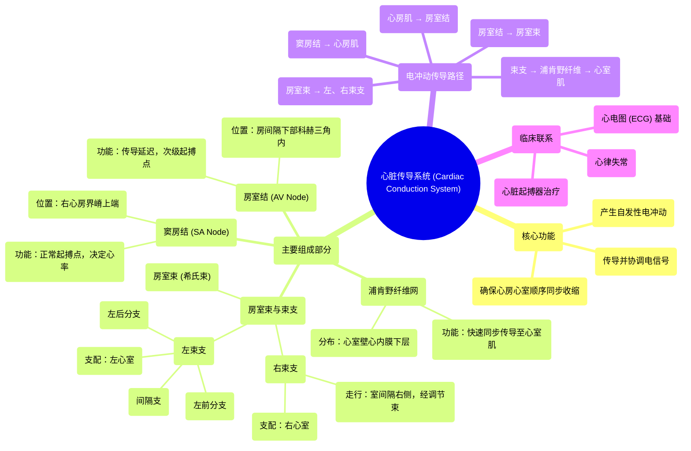

# 13 360 video - Cardiac Conduction System - Explained in Mixed Reality

  <video controls preload="metadata" playsinline>
    <source src="https://helly.bitiful.net/心血管学科/%E4%B8%93%E8%BE%91%2001%EF%BC%9A%E5%BF%83%E8%84%8F%E8%A7%A3%E5%89%96%E5%AD%A6%E5%AE%9E%E6%99%AF%E8%AF%BE%20%28Heart%20Anatomy%20-%20Course%29/13%20360%20video%20-%20Cardiac%20Conduction%20System%20-%20Explained%20in%20Mixed%20Reality.mp4" type="video/mp4">
    
您的浏览器不支持播放，请升级。

  </video>

::: tip ⚡️ 核心考点 (30s速读)
*   **核心考点**：心脏传导系统是位于心肌内层的特化组织，负责产生、传导并协调电冲动，确保心房和心室有序、同步地收缩，从而高效泵血。
*   **临床意义**：该系统任一环节（如窦房结、房室结、束支）的功能障碍或结构损伤，都会导致心律失常（如心动过缓、心动过速、传导阻滞），是心电图诊断和心脏起搏器治疗的生理基础。
:::

## 🧠 深度精讲

*   **概念1：心脏传导系统的组成与功能**
    心脏传导系统是一个由特化心肌细胞构成的网络，其核心功能是启动并协调心脏的节律性收缩。它并非神经组织，而是心肌中具有自律性和快速传导能力的特殊部分。整个系统的工作流程遵循严格的顺序：**窦房结（起搏点）** 自发产生兴奋 → 冲动经心房肌传至 **房室结**（在此延迟，确保心房收缩完毕心室再开始收缩）→ 冲动经 **房室束（希氏束）** 下传 → 分为 **左、右束支** → 最终通过遍布心室的 **浦肯野纤维网** 将电信号快速同步地传递至所有心室肌细胞，引发心室同步收缩。

*   **概念2：关键结构详解**
    1.  **窦房结**：位于右心房上腔静脉入口处的界嵴内，是正常心脏的“最高级起搏点”，其自律性最高，决定了心率。它通过指状突起与心房肌紧密连接，确保冲动能有效启动心房收缩。
    2.  **房室结**：位于房间隔下部的科赫三角内，靠近冠状窦口和三尖瓣隔侧瓣。主要功能是**传导延迟**（约0.1秒），为心房血液充盈心室留出时间，并作为次级起搏点（当窦房结功能障碍时）。
    3.  **房室束与束支**：房室束穿过中心纤维体，分为左、右束支。**右束支**沿室间隔右侧下行，经调节束（隔缘肉柱）至右心室前乳头肌和心尖。**左束支**在室间隔左侧心内膜下呈扇形分为三个分支：**左前分支**（至上壁和前外侧乳头肌）、**间隔支**（至室间隔中下部）、**左后分支**（至下壁和后内侧乳头肌）。
    4.  **浦肯野纤维**：是束支的终末分支，呈网状分布于心室壁的心内膜下层。其细胞粗大，传导速度极快（约4m/s），能确保电冲动几乎同时到达所有心室肌，实现心室的同步、强力收缩。

*   **概念3：电冲动的传导路径与协调**
    电冲动传导的路径和时序是心脏高效泵血的关键。心房先收缩（由窦房结冲动驱动），将血液挤入心室；经过房室结的生理性延迟后，冲动快速通过希-浦系统使心室同步收缩，将血液泵入主动脉和肺动脉。这种精密的“心房-心室顺序收缩”机制，依赖于传导系统各部分的解剖位置和电生理特性的完美配合。

## 📚 双语术语表 (Terminology)
| 英文术语 | 中文翻译 | 定义/解释 |
| :--- | :--- | :--- |
| Cardiac Conduction System | 心脏传导系统 | 由特化心肌细胞组成的网络，负责产生和传导电冲动以协调心脏收缩。 |
| Sinuatrial (SA) Node | 窦房结 | 位于右心房界嵴上端，是正常心脏的初级起搏点，自发产生节律性兴奋。 |
| Atrioventricular (AV) Node | 房室结 | 位于科赫三角内，传导并延迟来自心房的冲动，是次级起搏点。 |
| Atrioventricular Bundle (Bundle of His) | 房室束（希氏束） | 连接房室结与束支的纤维束，穿过中心纤维体将冲动传向心室。 |
| Right Bundle Branch (RBB) | 右束支 | 房室束的分支，沿室间隔右侧下行，支配右心室。 |
| Left Bundle Branch (LBB) | 左束支 | 房室束的分支，在室间隔左侧分为左前、间隔、左后分支，支配左心室。 |
| Purkinje Fibers | 浦肯野纤维 | 束支的终末网状分支，传导速度极快，确保心室肌同步兴奋。 |
| Crista Terminalis | 界嵴 | 右心房内的一条肌性隆起，窦房结位于其上端。 |
| Triangle of Koch | 科赫三角 | 右心房内的一个三角区域，其内包含房室结，是心脏介入手术的重要标志。 |
| Moderator Band (Septomarginal Trabecula) | 调节束（隔缘肉柱） | 右心室内的一条肌束，内含右束支分支，连接室间隔与前乳头肌。 |
| Papillary Muscle | 乳头肌 | 心室壁突入腔内的锥形肌束，通过腱索连接房室瓣，防止收缩时瓣膜翻入心房。 |

## 🗺️ 知识图谱

