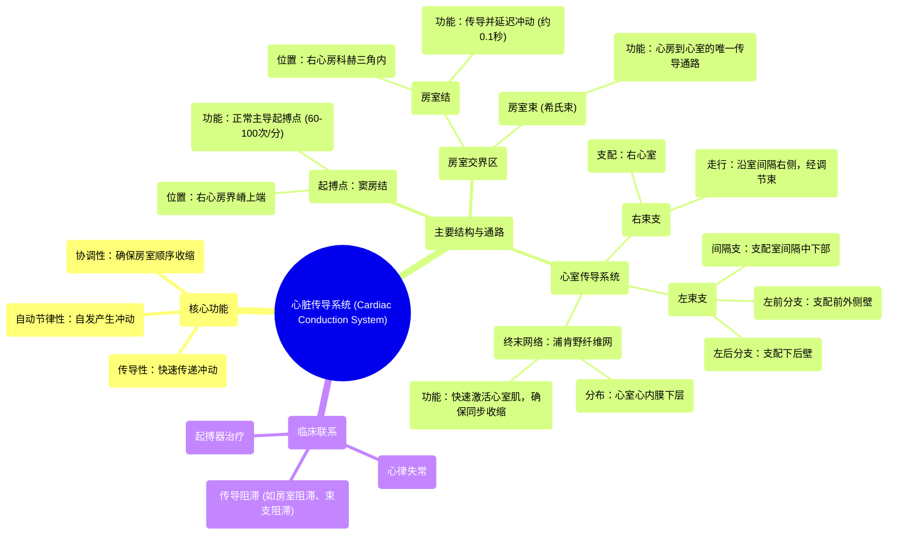

# 13 360 video - Cardiac Conduction System - Explained in Mixed Reality

  <video controls preload="metadata" playsinline>
    <source src="https://helly.s3.bitiful.net/心血管学科/%E4%B8%93%E8%BE%91%2001%EF%BC%9A%E5%BF%83%E8%84%8F%E8%A7%A3%E5%89%96%E5%AD%A6%E5%AE%9E%E6%99%AF%E8%AF%BE%20%28Heart%20Anatomy%20-%20Course%29/13%20360%20video%20-%20Cardiac%20Conduction%20System%20-%20Explained%20in%20Mixed%20Reality.mp4" type="video/mp4">
    
您的浏览器不支持播放，请升级。

  </video>

::: tip ⚡️ 核心考点 (30s速读)
*   **核心考点**：心脏传导系统是位于心肌内层的特化组织，负责产生、传导并协调电冲动，确保心房和心室按顺序、同步地收缩，从而高效泵血。
*   **临床意义**：传导系统任一环节（如窦房结、房室结、束支）的功能障碍或结构损伤，都会导致心律失常（如心动过缓、心动过速、传导阻滞），影响心脏泵血功能，是临床心电图诊断和起搏器治疗的核心解剖生理基础。
:::

## 🧠 深度精讲

*   **心脏传导系统概述**：心脏传导系统是一组特化的心肌细胞，它们不参与机械收缩，而是专门负责产生和传导电信号。这个系统确保了心脏能够自发地、有节律地跳动，并且心房和心室的收缩高度协调。其核心功能是：**自动节律性**（自发产生冲动）、**传导性**（快速传递冲动）和**协调性**（确保收缩顺序）。

*   **窦房结**：这是整个系统的“总司令”或“天然起搏点”。它位于右心房上腔静脉入口处的界嵴上端，形状像蝌蚪。在健康心脏中，窦房结以每分钟60-100次的频率规律地发放电冲动，启动每一次心跳。它发出的信号首先引起左右心房的同步收缩。

*   **房室结**：位于右心房科赫三角内，靠近冠状窦开口和三尖瓣隔瓣。它的关键作用有两个：一是作为心房和心室之间的**唯一电生理连接**，将心房来的冲动传向心室；二是起到 **“延迟”作用**，让电冲动在此处稍作停留（约0.1秒）。这个延迟至关重要，它保证了心房有足够时间完成收缩并将血液挤入心室，然后心室才开始收缩，避免了房室同时收缩的混乱。

*   **房室束**：又称希氏束，起源于房室结，穿过心脏中心的纤维骨架，进入室间隔顶部。它是连接心房和心室肌的“电缆主干道”，负责将经过房室结延迟和整合后的冲动快速下传至心室。

*   **束支系统**：房室束在室间隔顶端分为左、右束支。
    *   **右束支**：较细长，沿室间隔右侧面下行，通过调节束（隔缘肉柱）跨越右心室腔，将冲动传导至右心室心尖部和前乳头肌，最终分布到整个右心室。
    *   **左束支**：较粗短，在室间隔左侧心内膜下立即分为三个分支（或称“三支系统”）：
        *   **左前分支**：走向左心室前外侧壁，支配前外侧乳头肌。
        *   **左后分支**：走向左心室下后壁，支配后内侧乳头肌。
        *   **间隔支**：走向室间隔中下部及心尖部。
    束支系统确保了电冲动能几乎同时到达左右心室的心尖部。

*   **浦肯野纤维网**：这是束支系统的终末分支，呈网状广泛分布于左右心室的心内膜下层。浦肯野纤维是特化的快速传导细胞，它们将来自束支的冲动以极快的速度（约4米/秒）传播至整个心室工作心肌，触发心室肌细胞几乎同步地收缩，形成强大而协调的射血力量。

## 📚 双语术语表 (Terminology)
| 英文术语 | 中文翻译 | 定义/解释 |
| :--- | :--- | :--- |
| Cardiac Conduction System | 心脏传导系统 | 由特化心肌细胞组成的网络，负责产生和传导电冲动，协调心脏收缩。 |
| Sinuatrial (SA) Node | 窦房结 | 位于右心房界嵴上端的起搏点，正常心脏中主导心率。 |
| Atrioventricular (AV) Node | 房室结 | 位于科赫三角内，延迟并传导冲动从心房到心室的关键结构。 |
| Atrioventricular Bundle (Bundle of His) | 房室束（希氏束） | 连接房室结与束支的纤维束，是心房到心室冲动的唯一通路。 |
| Right Bundle Branch (RBB) | 右束支 | 房室束的分支，沿室间隔右侧下行，支配右心室。 |
| Left Bundle Branch (LBB) | 左束支 | 房室束的分支，在室间隔左侧分为多个分支，支配左心室。 |
| Purkinje Fibers | 浦肯野纤维 | 束支的终末网状分支，快速将冲动传导至整个心室肌。 |
| Crista Terminalis | 界嵴 | 右心房内的一条肌性隆起，窦房结位于其上端。 |
| Triangle of Koch | 科赫三角 | 右心房内的一个解剖三角区域，房室结位于其中。 |
| Moderator Band (Septomarginal Trabecula) | 调节束（隔缘肉柱） | 右心室内连接室间隔与前乳头肌的肌束，右束支的一部分穿行其中。 |
| Depolarization | 去极化 | 心肌细胞膜电位由静息状态变为兴奋状态的过程，即电冲动的传播。 |
| Myocardium | 心肌 | 构成心脏壁的肌肉层，负责收缩泵血。 |
| Subendocardium | 心内膜下层 | 紧贴心内膜的心肌层，浦肯野纤维网分布于此。 |

## 🗺️ 知识图谱

