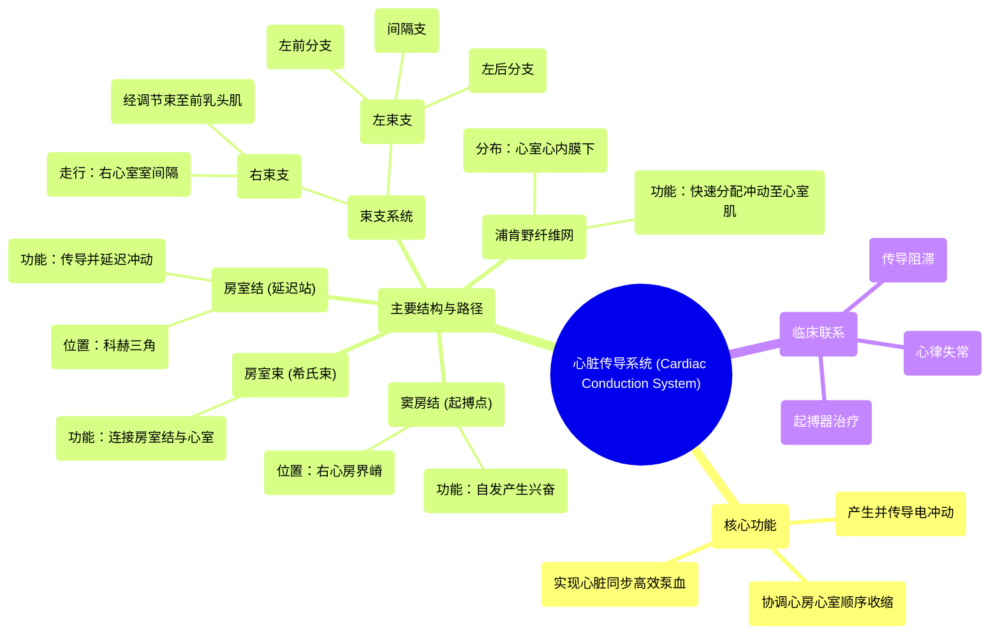

# 13 360 video - Cardiac Conduction System - Explained in Mixed Reality

  <video controls preload="metadata" playsinline>
    <source src="https://helly.s3.bitiful.net/心血管学科/%E4%B8%93%E8%BE%91%2001%EF%BC%9A%E5%BF%83%E8%84%8F%E8%A7%A3%E5%89%96%E5%AD%A6%E5%AE%9E%E6%99%AF%E8%AF%BE%20%28Heart%20Anatomy%20-%20Course%29/13%20360%20video%20-%20Cardiac%20Conduction%20System%20-%20Explained%20in%20Mixed%20Reality.mp4" type="video/mp4">
    
您的浏览器不支持播放，请升级。

  </video>

::: tip ⚡️ 核心考点 (30s速读)
*   **核心考点**：心脏传导系统是位于心肌内层的特殊组织，负责产生、传导并协调电冲动，使心脏能够自发、同步地收缩，从而有效泵血。
*   **临床意义**：传导系统任一环节（如窦房结、房室结、束支）的功能障碍或结构损伤，都会导致心律失常（如心动过缓、心动过速、传导阻滞），影响心脏泵血功能，是临床心电图诊断和心脏起搏器治疗的核心解剖生理基础。
:::

## 🧠 深度精讲

*   **概念1：心脏传导系统的组成与功能**
    心脏传导系统并非由普通心肌细胞构成，而是一系列特化的、具有自律性和快速传导能力的细胞组成的网络。它的核心功能是充当心脏的“电路系统”，确保心房和心室按照“心房先收缩、心室后收缩”的顺序进行协调、高效的同步收缩。这个系统保证了每次心跳都能将血液有效地射向全身。

*   **概念2：窦房结——心脏的天然起搏器**
    窦房结是传导系统的起点，位于右心房上腔静脉入口处的界嵴内。在健康心脏中，它具有最高的自律性，能规律地自动产生电兴奋（去极化），因此被称为“心脏的起搏点”。其产生的电冲动首先扩散至整个心房，引起心房肌收缩。

*   **概念3：房室结——关键的“延迟站”**
    电冲动从心房传向心室时，必须经过位于房间隔下部科赫三角内的房室结。房室结的关键作用在于**传导延迟**。它使电冲动在此处停留约0.1秒，这短暂的延迟至关重要，它保证了心房有足够的时间完成收缩并将血液充盈到心室，之后心室才开始收缩，实现了房室顺序活动。

*   **概念4：希氏束与束支——心室的“高速公路”**
    冲动通过房室结后，进入房室束（又称希氏束）。希氏束穿过心脏的纤维骨架，在室间隔顶端分为**右束支**和**左束支**。左束支又进一步分为**左前分支**、**间隔支**和**左后分支**。这些束支像高速公路一样，将电冲动快速、准确地传向左右心室的心尖部和乳头肌。

*   **概念5：浦肯野纤维网——最终的“配电网”**
    束支的末端分支成无数细密的**浦肯野纤维网**，广泛分布于心室壁的心内膜下层。它们与普通心室肌细胞直接相连，功能是将来自束支的快速电冲动瞬间“分配”到整个心室肌，确保所有心室肌细胞几乎在同一时间接收到收缩指令，从而实现心室的同步、强力收缩，将血液泵入主动脉和肺动脉。

## 📚 双语术语表 (Terminology)
| 英文术语 | 中文翻译 | 定义/解释 |
| :--- | :--- | :--- |
| Cardiac Conduction System | 心脏传导系统 | 由特化心肌细胞组成的网络，负责产生和传导电冲动，协调心脏收缩。 |
| Sinuatrial (SA) Node | 窦房结 | 位于右心房，是正常心脏的起搏点，自动产生节律性兴奋。 |
| Atrioventricular (AV) Node | 房室结 | 位于房间隔下部，传导冲动并产生生理性延迟，保证房室顺序收缩。 |
| Atrioventricular Bundle (Bundle of His) | 房室束（希氏束） | 连接房室结与束支的纤维束，穿过心脏纤维骨架。 |
| Right Bundle Branch (RBB) | 右束支 | 房室束的分支，沿室间隔右侧下行，将冲动传至右心室。 |
| Left Bundle Branch (LBB) | 左束支 | 房室束的分支，在室间隔左侧分为多个分支，将冲动传至左心室。 |
| Purkinje Fibers | 浦肯野纤维 | 束支的终末分支，形成网状分布于心内膜下，快速将冲动传至心室肌。 |
| Crista Terminalis | 界嵴 | 右心房内的一条肌性隆起，窦房结位于其上端。 |
| Triangle of Koch | 科赫三角 | 右心房内的一个三角区域，是房室结的解剖定位标志。 |
| Moderator Band (Septomarginal Trabecula) | 调节束（隔缘肉柱） | 右心室内的一条肌束，右束支的一部分纤维经此到达前乳头肌。 |

## 🗺️ 知识图谱

