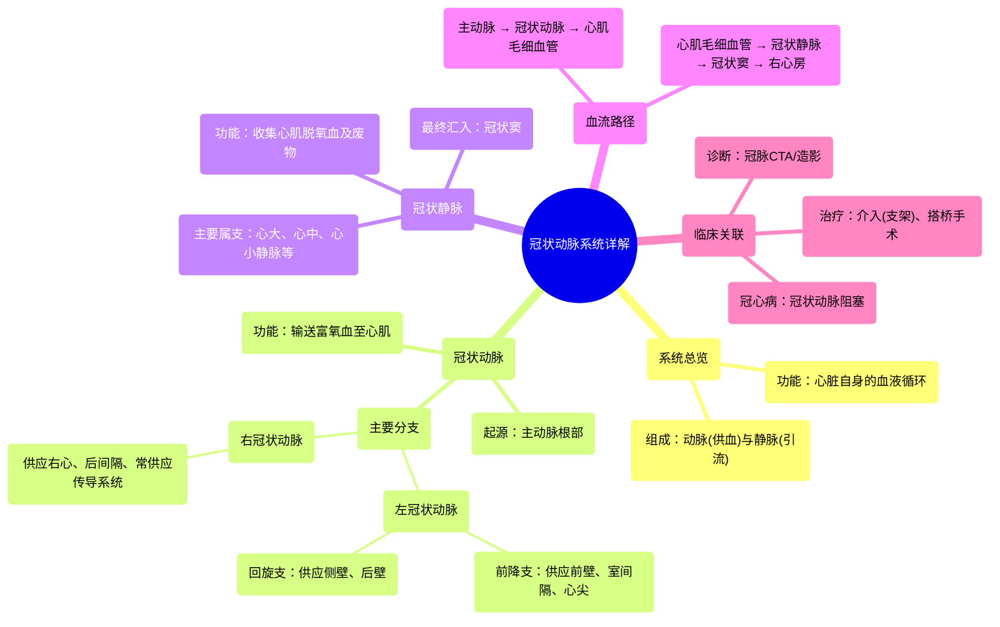

# 14 360 video - Coronary Vessels - Explained in Mixed Reality

  <video controls preload="metadata" playsinline>
    <source src="https://helly.bitiful.net/心血管学科/%E4%B8%93%E8%BE%91%2001%EF%BC%9A%E5%BF%83%E8%84%8F%E8%A7%A3%E5%89%96%E5%AD%A6%E5%AE%9E%E6%99%AF%E8%AF%BE%20%28Heart%20Anatomy%20-%20Course%29/14%20360%20video%20-%20Coronary%20Vessels%20-%20Explained%20in%20Mixed%20Reality.mp4" type="video/mp4">
    
您的浏览器不支持播放，请升级。

  </video>

::: tip ⚡️ 核心考点 (30s速读)
*   **核心考点**：冠状动脉系统是心脏自身的供血系统，由冠状动脉（供血）和冠状静脉（引流）组成，确保心肌获得氧气和营养，并带走代谢废物。
*   **临床意义**：冠状动脉粥样硬化导致管腔狭窄或闭塞，是冠心病（如心绞痛、心肌梗死）的根本原因。理解其解剖是进行冠脉介入治疗（如支架植入）和冠脉搭桥手术的基础。
:::

## 🧠 深度精讲
*   **概念1：冠状动脉系统的功能与组成**
    冠状动脉系统是心脏的“生命线”，它并非心脏泵出血液的通道，而是专门为心肌本身供血的独立循环网络。其核心功能是维持心肌细胞的代谢需求。该系统由两部分构成：
    1.  **冠状动脉**：负责输送富含氧气和营养物质的动脉血**到**心肌。它们直接起源于主动脉根部，主要包括左冠状动脉和右冠状动脉两大主干，并在心肌内反复分支形成密集的毛细血管网。
    2.  **冠状静脉**：负责收集心肌代谢后产生的脱氧血液（静脉血）和废物，并将其**从**心肌运走。大多数冠状静脉最终汇入一个叫“冠状窦”的主要静脉通道，然后将血液排入右心房，参与体循环。

*   **概念2：主要血管的走行与分布**
    1.  **左冠状动脉**：从左主动脉窦发出后，很快分为两大主要分支：
        *   **前降支**：沿心脏前室间沟下行，供应左心室前壁、室间隔前2/3及心尖部，是冠心病最常累及的血管之一。
        *   **回旋支**：沿左房室沟向左后走行，供应左心室侧壁和后壁。
    2.  **右冠状动脉**：从右主动脉窦发出，沿右房室沟走行，主要供应右心房、右心室、室间隔后1/3及窦房结、房室结（约55%人群），因此其病变可能影响心脏起搏和传导功能。
    3.  **冠状静脉与冠状窦**：心脏的静脉血大部分（约75%）通过**心大静脉、心中静脉、心小静脉**等汇入位于心脏后部房室沟内的**冠状窦**，最后注入右心房。这是一个重要的解剖标志，在心外科手术和电生理检查中需特别注意。

## 📚 双语术语表 (Terminology)
| 英文术语 | 中文翻译 | 定义/解释 |
| :--- | :--- | :--- |
| Coronary Vessels / Cardiac Vessels | 冠状血管 / 心脏血管 | 为心脏心肌供血和引流血液的血管系统总称。 |
| Coronary Arteries | 冠状动脉 | 起源于主动脉根部，向心肌输送富氧血液的动脉。 |
| Left Coronary Artery | 左冠状动脉 | 起源于左主动脉窦，主要分为前降支和回旋支，供应左心大部分心肌。 |
| Right Coronary Artery | 右冠状动脉 | 起源于右主动脉窦，沿右房室沟走行，主要供应右心及部分左心后壁。 |
| Coronary Veins | 冠状静脉 | 收集心肌代谢后的脱氧血液，并将其运回心脏的静脉。 |
| Coronary Sinus | 冠状窦 | 位于心脏后部房室沟内的主要静脉通道，汇集大部分冠状静脉血并注入右心房。 |
| Venous Blood | 静脉血 | 脱氧的、富含代谢废物的血液。 |
| Right Atrium | 右心房 | 心脏的四个腔室之一，接收来自体循环（通过上下腔静脉）和心脏本身（通过冠状窦）的静脉血。 |
| Aorta | 主动脉 | 体循环的起始动脉，冠状动脉直接从其根部发出。 |

## 🗺️ 知识图谱

