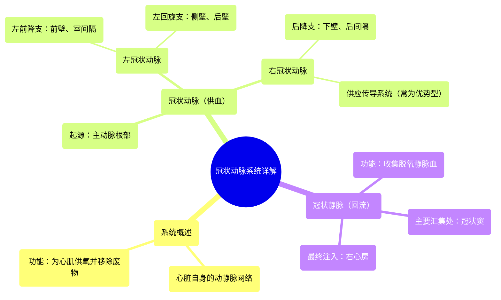

# 14 360 video - Coronary Vessels - Explained in Mixed Reality

  <video controls preload="metadata" playsinline>
    <source src="https://helly.s3.bitiful.net/心血管学科/%E4%B8%93%E8%BE%91%2001%EF%BC%9A%E5%BF%83%E8%84%8F%E8%A7%A3%E5%89%96%E5%AD%A6%E5%AE%9E%E6%99%AF%E8%AF%BE%20%28Heart%20Anatomy%20-%20Course%29/14%20360%20video%20-%20Coronary%20Vessels%20-%20Explained%20in%20Mixed%20Reality.mp4" type="video/mp4">
    
您的浏览器不支持播放，请升级。

  </video>

::: tip ⚡️ 核心考点 (30s速读)
*   **核心考点**：冠状动脉系统是心脏自身的供血系统，由冠状动脉（供血）和冠状静脉（回流）组成，对维持心肌功能至关重要。
*   **临床意义**：冠状动脉粥样硬化导致管腔狭窄或闭塞，是冠心病（如心绞痛、心肌梗死）的根本原因。理解其解剖是进行冠脉介入治疗（如支架植入）和冠脉搭桥手术的基础。
:::

## 🧠 深度精讲

*   **冠状动脉系统概述**：冠状动脉系统是心脏的“生命线”，是一个独立的动静脉网络，专门负责心脏自身的血液循环。它确保心肌（心脏的肌肉层）获得充足的氧气和营养物质，并高效运走代谢废物。
*   **冠状动脉**：
    *   **起源与功能**：直接起源于主动脉根部的主动脉窦（左、右冠状动脉窦）。它们是体循环中最早分出的动脉分支，负责将富含氧气的动脉血输送到整个心肌。
    *   **主要分支**：
        1.  **左冠状动脉**：从左冠状动脉窦发出后，很快分为两大主干：
            *   **左前降支**：沿前室间沟下行，供应左心室前壁、室间隔前2/3及心尖部。是冠心病最常累及的血管。
            *   **左回旋支**：沿冠状沟向左后走行，供应左心室侧壁和后壁。
        2.  **右冠状动脉**：从右冠状动脉窦发出，沿冠状沟向右后走行，主要供应右心房、右心室、室间隔后1/3及窦房结、房室结（多数人的“优势型”供血）。其重要分支为**后降支**。
*   **冠状静脉**：
    *   **功能**：收集心肌代谢后的脱氧血液（静脉血）和废物。
    *   **回流途径**：大部分冠状静脉（如心大静脉、心中静脉、心小静脉）最终汇入一个共同的静脉腔道——**冠状窦**。
    *   **冠状窦**：位于心脏膈面的冠状沟内，是一个重要的静脉结构，作为冠状静脉血的主要汇集处，最终将血液注入**右心房**，完成心脏自身的循环。

## 📚 双语术语表 (Terminology)
| 英文术语 | 中文翻译 | 定义/解释 |
| :--- | :--- | :--- |
| Coronary Vessels / Cardiac Vessels | 冠状动脉血管 / 心脏血管 | 为心脏心肌供血和回流血液的血管系统总称。 |
| Coronary Arteries | 冠状动脉 | 起源于主动脉，向心肌输送富氧血液的动脉。 |
| Left Coronary Artery | 左冠状动脉 | 起源于左主动脉窦，主要供应左心室的冠状动脉主干。 |
| Right Coronary Artery | 右冠状动脉 | 起源于右主动脉窦，主要供应右心室的冠状动脉主干。 |
| Coronary Veins | 冠状静脉 | 收集心肌脱氧血液并回流入心脏的静脉。 |
| Coronary Sinus | 冠状窦 | 心脏后部冠状沟内的主要静脉窦，汇集大部分冠状静脉血并注入右心房。 |
| Right Atrium | 右心房 | 心脏的四个腔室之一，接收来自体循环（经上下腔静脉）和心循环（经冠状窦）的静脉血。 |
| Myocardium | 心肌 | 构成心脏壁的肌肉层，负责心脏的收缩泵血功能。 |
| Deoxygenated Blood / Venous Blood | 脱氧血液 / 静脉血 | 氧气含量低、二氧化碳等代谢废物含量高的血液。 |
| Oxygenated Blood / Arterial Blood | 富氧血液 / 动脉血 | 氧气含量高、准备输送到组织去的血液。 |

## 🗺️ 知识图谱

