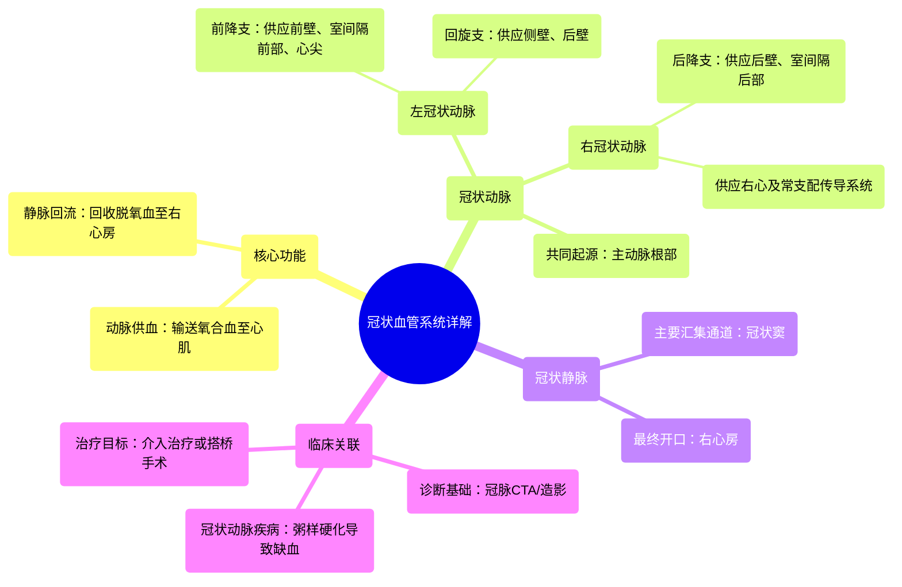

# 14 360 video - Coronary Vessels - Explained in Mixed Reality

  <video controls preload="metadata" playsinline>
    <source src="https://helly.s3.bitiful.net/心血管学科/%E4%B8%93%E8%BE%91%2001%EF%BC%9A%E5%BF%83%E8%84%8F%E8%A7%A3%E5%89%96%E5%AD%A6%E5%AE%9E%E6%99%AF%E8%AF%BE%20%28Heart%20Anatomy%20-%20Course%29/14%20360%20video%20-%20Coronary%20Vessels%20-%20Explained%20in%20Mixed%20Reality.mp4" type="video/mp4">
    
您的浏览器不支持播放，请升级。

  </video>

::: tip ⚡️ 核心考点 (30s速读)
*   **核心考点**：冠状动脉系统是心脏自身的供血系统，由动脉和静脉组成。动脉（左、右冠状动脉）负责向心肌输送富氧血液；静脉（汇入冠状窦）负责回收脱氧血液回右心房。
*   **临床意义**：冠状动脉粥样硬化导致管腔狭窄或闭塞，是冠心病（如心绞痛、心肌梗死）的根本原因。理解其解剖是诊断和治疗（如冠脉介入、搭桥手术）的基础。
:::

## 🧠 深度精讲

*   **冠状动脉系统概述**：冠状动脉系统是心脏的“生命线”，是一个独立的动静脉网络，专门为心肌本身服务。它确保心脏这个泵在持续工作的同时，自身也能获得充足的氧气和营养，并清除代谢废物。
*   **冠状动脉**：
    *   **起源**：直接起源于主动脉根部的主动脉窦（左、右冠状动脉窦）。
    *   **主要分支**：
        1.  **左冠状动脉**：从左冠状动脉窦发出后，很快分为两大主要分支：
            *   **前降支**：沿前室间沟下行，供应左心室前壁、室间隔前2/3及心尖部。是冠心病最常累及的血管。
            *   **回旋支**：沿左房室沟走行，供应左心室侧壁和后壁。
        2.  **右冠状动脉**：从右冠状动脉窦发出，沿右房室沟走行，主要供应右心房、右心室、室间隔后1/3及窦房结、房室结（约55%人群）。其重要分支为**后降支**。
    *   **功能**：在心脏舒张期，主动脉瓣关闭，血液通过冠状动脉开口灌注心肌，为心肌收缩提供能量。
*   **冠状静脉**：
    *   **路径**：心肌毛细血管中的脱氧血液汇入小静脉，最终大多汇集到心脏膈面的一条主要静脉通道——**冠状窦**。
    *   **冠状窦**：位于左心房和左心室之间的冠状沟后部，开口于右心房。它是心脏静脉血回流的主要汇集站。
    *   **功能**：有效引流心肌代谢产生的废物（如二氧化碳、乳酸），将静脉血送回右心房，参与体循环。

## 📚 双语术语表 (Terminology)
| 英文术语 | 中文翻译 | 定义/解释 |
| :--- | :--- | :--- |
| Coronary Vessels | 冠状血管 / 心脏血管 | 为心脏肌肉供血和引流的动静脉网络总称。 |
| Coronary Arteries | 冠状动脉 | 起源于主动脉，向心肌输送富氧血液的动脉。 |
| Left Coronary Artery | 左冠状动脉 | 起源于左主动脉窦，主要供应左心室的冠状动脉主干。 |
| Right Coronary Artery | 右冠状动脉 | 起源于右主动脉窦，主要供应右心室及心脏传导系统的冠状动脉主干。 |
| Coronary Veins | 冠状静脉 | 收集心肌脱氧血液并回流入心脏的静脉。 |
| Coronary Sinus | 冠状窦 | 心脏后部的主要静脉通道，汇集大部分冠状静脉血并注入右心房。 |
| Venous Blood | 静脉血 | 脱氧的、富含代谢废物的血液。 |
| Right Atrium | 右心房 | 心脏的四个腔室之一，接收来自体静脉和冠状窦的静脉血。 |
| Aorta | 主动脉 | 体循环的动脉主干，冠状动脉由其根部发出。 |

## 🗺️ 知识图谱

