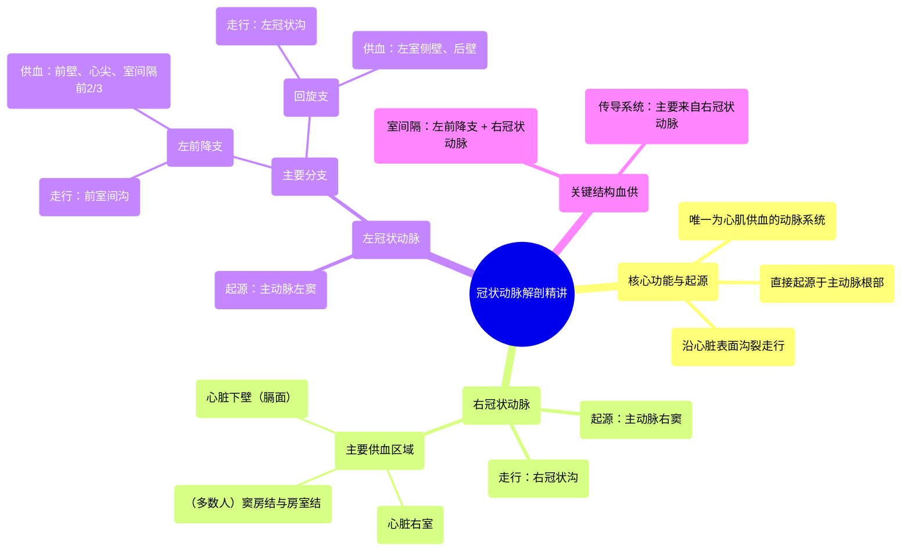

# 15 360 video - Coronary Arteries - Explained in Mixed Reality

  <video controls preload="metadata" playsinline>
    <source src="https://helly.bitiful.net/心血管学科/%E4%B8%93%E8%BE%91%2001%EF%BC%9A%E5%BF%83%E8%84%8F%E8%A7%A3%E5%89%96%E5%AD%A6%E5%AE%9E%E6%99%AF%E8%AF%BE%20%28Heart%20Anatomy%20-%20Course%29/15%20360%20video%20-%20Coronary%20Arteries%20-%20Explained%20in%20Mixed%20Reality.mp4" type="video/mp4">
    
您的浏览器不支持播放，请升级。

  </video>

::: tip ⚡️ 核心考点 (30s速读)
*   **核心考点**：冠状动脉是直接发自主动脉、为心肌供血的唯一动脉系统，其解剖走行与分支支配区域是理解心肌缺血、心肌梗死等疾病的基础。
*   **临床意义**：不同冠状动脉分支的阻塞会导致特定区域的心肌缺血或坏死，如左前降支阻塞常引起前壁心肌梗死，右冠状动脉阻塞常引起下壁心肌梗死及可能的心律失常。
:::

## 🧠 深度精讲
*   **概念1：冠状动脉的总体解剖与功能**
    冠状动脉是心脏的“生命线”，它们直接起源于主动脉根部的主动脉窦，沿着心脏表面的沟（冠状沟、室间沟）走行，并发出分支深入心肌，确保心脏这个高耗能器官能持续获得富含氧气的血液。其走行路径与心脏的解剖结构（心房、心室、沟、裂）紧密相关。

*   **概念2：右冠状动脉 (Right Coronary Artery, RCA)**
    右冠状动脉起源于主动脉的右冠状动脉窦，沿右侧冠状沟下行，主要环绕并供应心脏的右侧。它最重要的分支通常供应心脏下壁（膈面）的血液。此外，在大多数人群中（约55-60%），右冠状动脉还发出分支供应心脏的“司令部”——窦房结和房室结，因此右冠状动脉病变可能导致严重的心律失常。

*   **概念3：左冠状动脉 (Left Coronary Artery, LCA) 及其主要分支**
    左冠状动脉起源于主动脉的左冠状动脉窦，起始部被左心耳部分覆盖。它很快分为两大主干：
    1.  **左前降支 (Left Anterior Descending artery, LAD)**：沿前室间沟下行至心尖，是供应心脏前壁、室间隔前2/3及心尖部血液的最重要血管，常被称为“寡妇制造者”，因其阻塞后果严重。
    2.  **回旋支 (Circumflex artery, LCX)**：沿左侧冠状沟走行，主要供应心脏的左室侧壁和后壁。

*   **概念4：重要结构的血供**
    *   **室间隔**：血供来自左前降支的室间隔支和右冠状动脉的后降支（取决于优势型），是心肌梗死常见的受累区域。
    *   **心脏传导系统**：窦房结和房室结的血供主要来自右冠状动脉的分支（多数人），少数来自左回旋支。这解释了为什么下壁心肌梗死（常为RCA阻塞）常合并心动过缓等传导障碍。

## 📚 双语术语表 (Terminology)
| 英文术语 | 中文翻译 | 定义/解释 |
| :--- | :--- | :--- |
| Coronary Arteries | 冠状动脉 | 直接发自主动脉根部，负责向心肌供应含氧血液的动脉系统。 |
| Aorta | 主动脉 | 体循环的动脉主干，冠状动脉由其根部发出。 |
| Myocardium | 心肌 | 构成心脏壁的肌肉组织，其收缩推动血液循环。 |
| Coronary Sulcus (Atrioventricular Groove) | 冠状沟（房室沟） | 心脏表面分隔心房和心室的环形沟，冠状动脉主干走行于此。 |
| Interventricular Groove | 室间沟 | 心脏表面分隔左右心室的沟，前室间沟内有左前降支走行。 |
| Right Coronary Artery (RCA) | 右冠状动脉 | 起源于右冠状动脉窦，沿右冠状沟走行，主要供应右心及心脏下壁。 |
| Left Coronary Artery (LCA) | 左冠状动脉 | 起源于左冠状动脉窦，分为左前降支和回旋支，主要供应左心。 |
| Left Anterior Descending artery (LAD) | 左前降支动脉 | 左冠状动脉的主要分支，沿前室间沟下行，供应前壁心肌和大部分室间隔。 |
| Circumflex artery (LCX) | 回旋支动脉 | 左冠状动脉的主要分支，沿左冠状沟走行，供应左室侧壁和后壁。 |
| Sinoatrial node (SA node) | 窦房结 | 心脏的正常起搏点，位于右心房，多数由右冠状动脉供血。 |
| Atrioventricular node (AV node) | 房室结 | 位于房间隔，负责传导心房至心室的电冲动，多数由右冠状动脉供血。 |
| Septum | 室间隔 | 分隔心脏左右心室的结构，其血供来自左右冠状动脉的分支。 |

## 🗺️ 知识图谱

