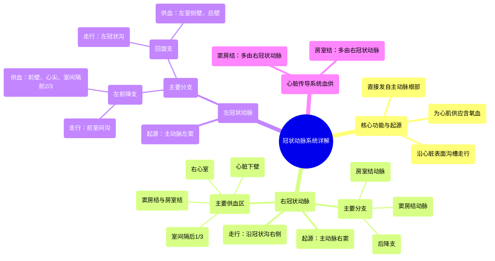

# 15 360 video - Coronary Arteries - Explained in Mixed Reality

  <video controls preload="metadata" playsinline>
    <source src="https://helly.s3.bitiful.net/心血管学科/%E4%B8%93%E8%BE%91%2001%EF%BC%9A%E5%BF%83%E8%84%8F%E8%A7%A3%E5%89%96%E5%AD%A6%E5%AE%9E%E6%99%AF%E8%AF%BE%20%28Heart%20Anatomy%20-%20Course%29/15%20360%20video%20-%20Coronary%20Arteries%20-%20Explained%20in%20Mixed%20Reality.mp4" type="video/mp4">
    
您的浏览器不支持播放，请升级。

  </video>

::: tip ⚡️ 核心考点 (30s速读)
*   **核心考点**：冠状动脉是直接发自主动脉、为心肌供血的血管系统，分为左、右冠状动脉两大主干，其分支走行于心脏表面的特定沟槽，为不同区域的心肌及心脏传导系统供血。
*   **临床意义**：冠状动脉的解剖是理解冠心病（如心肌梗死）的基础。不同动脉的阻塞会导致其供血区域的心肌缺血坏死，产生不同的临床症状和心电图表现。例如，右冠状动脉阻塞常影响下壁心肌和心脏传导系统。
:::

## 🧠 深度精讲
*   **概念1：冠状动脉的总体功能与起源**
    冠状动脉是心脏的“生命线”，它们直接起源于主动脉根部的主动脉窦，负责将富含氧气的血液输送到心肌的每一个细胞。心肌本身虽然浸泡在血液中，但无法直接从心腔内获取养分，必须依赖这套独立的血管系统。它们像一顶皇冠（“冠状”一词的由来）一样环绕在心脏表面，并发出分支深入心肌内部。

*   **概念2：右冠状动脉的走行与供血区域**
    右冠状动脉起源于主动脉的右冠状动脉窦。它沿着心房与心室之间的**冠状沟**向右下方走行，主要环绕心脏的右侧。其主要供血区域包括：**心脏的下壁（膈面）**、**右心室**的大部分以及**室间隔**的后三分之一。更重要的是，它通常为心脏的“司令部”——**窦房结**和**房室结**——提供血液，因此右冠状动脉病变可能引发严重的心律失常。

*   **概念3：左冠状动脉的分支与供血区域**
    左冠状动脉起源于主动脉的左冠状动脉窦，起始部被左心耳部分覆盖。它非常短，很快分为两大主干：
    1.  **左前降支**：沿着心脏前表面的**前室间沟**向心尖方向走行，形似“前哨”。它负责供应**心脏前壁**、**心尖部**以及**室间隔**的前三分之二，是冠心病最常累及的血管，被称为“寡妇制造者”。
    2.  **回旋支**：沿着左侧的**冠状沟**向左后方走行，环绕心脏的左缘。它主要供应**心脏的左室侧壁**和**后壁**。

*   **概念4：心脏传导系统的血供**
    心脏有节律地跳动依赖于特殊的电传导系统。该系统关键节点的血供至关重要：
    *   **窦房结**：心脏的正常起搏点，约55%的人由**右冠状动脉**的分支供血，45%由**左回旋支**供血。
    *   **房室结**：心房和心室之间的电信号“中转站”，约90%的人由**右冠状动脉**的分支供血。
    了解这一点有助于解释下壁心肌梗死时为何常伴有心动过缓等传导阻滞。

## 📚 双语术语表 (Terminology)
| 英文术语 | 中文翻译 | 定义/解释 |
| :--- | :--- | :--- |
| Coronary Arteries | 冠状动脉 | 直接发自主动脉，为心肌供应含氧血液的血管系统。 |
| Aorta | 主动脉 | 体循环的动脉主干，冠状动脉从其根部发出。 |
| Myocardium | 心肌 | 构成心脏壁的肌肉组织，依赖冠状动脉供血。 |
| Coronary Sulcus | 冠状沟（房室沟） | 心脏表面分隔心房和心室的环形沟，冠状动脉主干走行于此。 |
| Interventricular Groove | 室间沟 | 心脏表面分隔左、右心室的沟，前室间沟内有左前降支走行。 |
| Right Coronary Artery | 右冠状动脉 | 起源于右冠状动脉窦，主要供应心脏右室、下壁及传导系统。 |
| Left Coronary Artery | 左冠状动脉 | 起源于左冠状动脉窦，很快分为左前降支和回旋支。 |
| Left Anterior Descending Artery | 左前降支动脉 | 左冠状动脉的主要分支，沿前室间沟下行，供应前壁、心尖及室间隔前部。 |
| Circumflex Artery | 回旋支动脉 | 左冠状动脉的主要分支，沿左侧冠状沟走行，供应左室侧壁和后壁。 |
| Sinoatrial Node | 窦房结 | 位于右心房，是心脏的正常起搏点。 |
| Atrioventricular Node | 房室结 | 位于房间隔下部，负责传导心房至心室的电冲动。 |
| Septum | 室间隔 | 分隔心脏左、右心室的结构，其血供来自左、右冠状动脉的分支。 |

## 🗺️ 知识图谱

