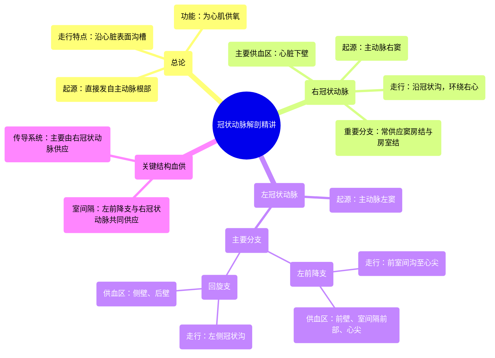

# 15 360 video - Coronary Arteries - Explained in Mixed Reality

  <video controls preload="metadata" playsinline>
    <source src="https://helly.s3.bitiful.net/心血管学科/%E4%B8%93%E8%BE%91%2001%EF%BC%9A%E5%BF%83%E8%84%8F%E8%A7%A3%E5%89%96%E5%AD%A6%E5%AE%9E%E6%99%AF%E8%AF%BE%20%28Heart%20Anatomy%20-%20Course%29/15%20360%20video%20-%20Coronary%20Arteries%20-%20Explained%20in%20Mixed%20Reality.mp4" type="video/mp4">
    
您的浏览器不支持播放，请升级。

  </video>

::: tip ⚡️ 核心考点 (30s速读)
*   **核心考点**：冠状动脉是发自主动脉、为心肌供血的唯一动脉系统。左、右冠状动脉分别起源于主动脉的左、右冠状动脉窦，沿心脏表面的特定沟槽走行并发出分支，为心脏不同区域供血。
*   **临床意义**：冠状动脉的解剖结构是理解冠心病（如心肌梗死）的基础。特定动脉的阻塞会导致其供血区域的心肌缺血或坏死，例如左前降支阻塞常引起前壁心肌梗死，右冠状动脉阻塞则影响下壁和心脏传导系统（如窦房结、房室结）。
:::

## 🧠 深度精讲
*   **概念1：冠状动脉的总体功能与走行**
    冠状动脉是心脏的“生命线”，它们直接起源于主动脉根部，负责将富含氧气的血液输送到心肌的每一个细胞。它们并非随机分布，而是沿着心脏表面的解剖学沟槽（如冠状沟、室间沟）走行，形成一个高效的“冠脉网络”，确保整个心脏都能获得充足的血液供应。

*   **概念2：右冠状动脉 (RCA)**
    右冠状动脉起源于主动脉的右冠状动脉窦，沿着心房与心室之间的冠状沟向右下方走行，主要环绕并供应心脏的右侧。它的主要供血区域是心脏的下壁（膈面）。此外，在大多数人群中，右冠状动脉还发出分支为心脏重要的“起搏点”——窦房结和房室结供血，因此其病变可能不仅引起心肌缺血，还会导致心律失常。

*   **概念3：左冠状动脉 (LCA) 及其主要分支**
    左冠状动脉起源于主动脉的左冠状动脉窦，起始部被左心耳部分覆盖。它很快分为两大主干：
    1.  **左前降支 (LAD)**：沿着心脏前部的室间沟下行，直抵心尖。它主要负责供应心脏前壁、室间隔前2/3以及心尖部，是临床上最常发生病变的血管之一，故有“寡妇制造者”之称。
    2.  **回旋支 (LCX)**：沿着左侧的冠状沟走行，主要供应心脏的侧壁和后壁。

*   **概念4：重要结构的血供**
    *   **室间隔**：其血供由左前降支和右冠状动脉的分支共同承担。
    *   **传导系统**：如前所述，窦房结和房室结的血供主要来自右冠状动脉（约占55-65%的人群），其余人群可能由左回旋支供血。了解这一点对解释某些心肌梗死伴发的心律失常有重要意义。

## 📚 双语术语表 (Terminology)
| 英文术语 | 中文翻译 | 定义/解释 |
| :--- | :--- | :--- |
| Coronary Arteries | 冠状动脉 | 起源于主动脉根部，专门为心肌供应含氧血液的动脉系统。 |
| Aorta | 主动脉 | 体循环的起始大动脉，冠状动脉直接发自其根部。 |
| Right Coronary Artery (RCA) | 右冠状动脉 | 起源于右冠状动脉窦，沿冠状沟走行，主要供应右心及心脏下壁。 |
| Left Coronary Artery (LCA) | 左冠状动脉 | 起源于左冠状动脉窦，主要分为左前降支和回旋支，供应左心大部分区域。 |
| Left Anterior Descending (LAD) | 左前降支 | 左冠状动脉的主要分支，沿前室间沟下行，供应前壁、室间隔前部和心尖。 |
| Circumflex Artery (LCX) | 回旋支 | 左冠状动脉的主要分支，沿左侧冠状沟走行，供应左室侧壁和后壁。 |
| Coronary Sulcus | 冠状沟 | 心脏表面分隔心房和心室的环形沟，冠状动脉主干走行于此。 |
| Interventricular Groove | 室间沟 | 心脏表面分隔左右心室的沟，前室间沟内有左前降支走行。 |
| Sinoatrial (SA) Node | 窦房结 | 心脏的正常起搏点，位于右心房，其血供多来自右冠状动脉。 |
| Atrioventricular (AV) Node | 房室结 | 位于房间隔下部的传导组织，其血供也多来自右冠状动脉。 |
| Myocardium | 心肌 | 构成心脏壁的肌肉组织，依赖冠状动脉供血以维持收缩功能。 |

## 🗺️ 知识图谱

