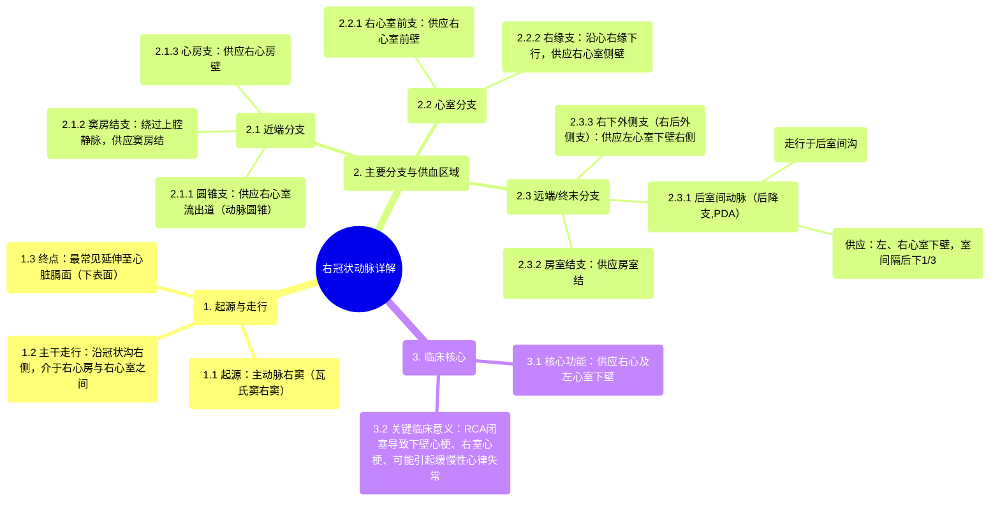

# 16 360 video - Right Coronary Artery - Explained in Mixed Reality

  <video controls preload="metadata" playsinline>
    <source src="https://helly.s3.bitiful.net/心血管学科/%E4%B8%93%E8%BE%91%2001%EF%BC%9A%E5%BF%83%E8%84%8F%E8%A7%A3%E5%89%96%E5%AD%A6%E5%AE%9E%E6%99%AF%E8%AF%BE%20%28Heart%20Anatomy%20-%20Course%29/16%20360%20video%20-%20Right%20Coronary%20Artery%20-%20Explained%20in%20Mixed%20Reality.mp4" type="video/mp4">
    
您的浏览器不支持播放，请升级。

  </video>

::: tip ⚡️ 核心考点 (30s速读)
*   **核心考点**：右冠状动脉是供应心脏右半部分及部分左心室下壁的主要动脉，其走行、主要分支及供血区域是解剖学与临床实践（如冠心病定位）的核心。
*   **临床意义**：右冠状动脉闭塞可导致下壁心肌梗死、右心室梗死、房室传导阻滞（影响房室结血供）及窦性心动过缓（影响窦房结血供），是心血管急症诊治的关键。
:::

## 🧠 深度精讲

*   **概念1：右冠状动脉的起源与走行**
    右冠状动脉是心脏冠状动脉系统的重要组成部分。它起源于主动脉根部的**右冠状动脉窦**（又称瓦氏窦右窦）。发出后，它沿着心脏表面的**冠状沟**（房室沟）右侧部分走行，此沟正好分隔了上方的**右心房**与下方的**右心室**。其主干通常延伸至心脏的**膈面**（下表面），并在大多数个体中为心脏的此区域供血。

*   **概念2：右冠状动脉的主要分支及其功能**
    右冠状动脉在其走行过程中发出多个关键分支，供应心脏的不同结构：
    1.  **圆锥支**：最早的分支之一，供应**右心室流出道**（动脉圆锥）。
    2.  **窦房结支**：走行于右心耳后方，绕过上腔静脉，为心脏的起搏点——**窦房结**供血。
    3.  **心房支**：供应**右心房**壁。
    4.  **右心室前支**：供应**右心室前壁**。
    5.  **右缘支**：沿心脏右缘下行，是供应右心室侧壁的重要分支。
    6.  **后室间动脉**：右冠状动脉最重要的延续分支之一，沿心脏**后室间沟**走行，供应**左、右心室的下壁**和**室间隔的后下1/3**，故又称**后降支**。
    7.  **房室结支**：在后室间沟与冠状沟交汇处发出，向上供应心脏的另一个关键起搏传导结构——**房室结**。
    8.  **右下外侧支**：供应**左心室下壁的右侧部分**，又称右后外侧支。

## 📚 双语术语表 (Terminology)
| 英文术语 | 中文翻译 | 定义/解释 |
| :--- | :--- | :--- |
| Right Coronary Artery (RCA) | 右冠状动脉 | 起源于主动脉右窦，沿冠状沟右侧走行，供应右心房、右心室大部及左心室下壁的动脉。 |
| Coronary Sulcus | 冠状沟 | 心脏表面分隔心房与心室的沟，右冠状动脉主干走行于其右侧部分。 |
| Right Sinus of Valsalva | 瓦氏窦右窦 / 右冠状动脉窦 | 主动脉根部的三个膨大之一，右冠状动脉开口于此。 |
| Conus Arteriosus | 动脉圆锥 | 右心室流出道的上部，形似圆锥，由圆锥支供血。 |
| Sinuatrial Nodal Branch | 窦房结支 | 右冠状动脉的分支，为心脏正常起搏点窦房结供血。 |
| Atrioventricular Nodal Branch | 房室结支 | 右冠状动脉的分支，为房室传导的关键结构房室结供血。 |
| Inferior Interventricular Artery | 后室间动脉 | 右冠状动脉的延续主干，沿后室间沟走行，供应心室下壁，又称后降支。 |
| Posterior Descending Artery (PDA) | 后降支 | 后室间动脉的常用临床别名。 |
| Right Marginal Branch | 右缘支 | 沿心脏右缘下行的分支，供应右心室侧壁。 |

## 🗺️ 知识图谱

