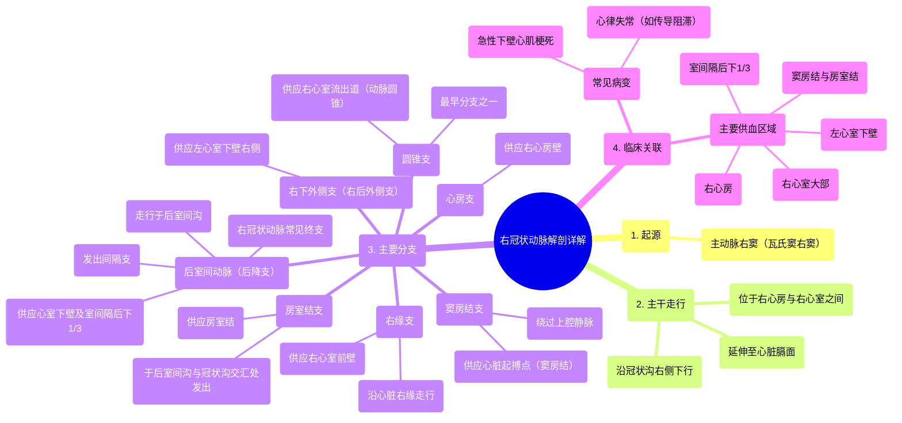

# 16 360 video - Right Coronary Artery - Explained in Mixed Reality

  <video controls preload="metadata" playsinline>
    <source src="https://helly.bitiful.net/心血管学科/%E4%B8%93%E8%BE%91%2001%EF%BC%9A%E5%BF%83%E8%84%8F%E8%A7%A3%E5%89%96%E5%AD%A6%E5%AE%9E%E6%99%AF%E8%AF%BE%20%28Heart%20Anatomy%20-%20Course%29/16%20360%20video%20-%20Right%20Coronary%20Artery%20-%20Explained%20in%20Mixed%20Reality.mp4" type="video/mp4">
    
您的浏览器不支持播放，请升级。

  </video>

::: tip ⚡️ 核心考点 (30s速读)
*   **核心考点**：右冠状动脉是供应心脏右半部分及部分左心室下壁的主要动脉。掌握其**起源、主干走行、主要分支及其供血区域**是理解其临床意义的基础。
*   **临床意义**：右冠状动脉是**急性下壁心肌梗死**最常见的责任血管。其分支（如窦房结支、房室结支）的阻塞可导致**心律失常**（如窦性心动过缓、房室传导阻滞）。理解其解剖变异对介入治疗至关重要。
:::

## 🧠 深度精讲

*   **概念1：右冠状动脉的起源与主干走行**
    右冠状动脉起源于**主动脉右窦**（又称瓦氏窦右窦）。发出后，它沿着心脏表面的**冠状沟（房室沟）右侧部分**下行，走行于**右心房与右心室之间**。其主干通常延伸至心脏的**膈面（下表面）**，并在大多数个体中为心脏的膈面供血。

*   **概念2：右冠状动脉的主要分支及其功能**
    右冠状动脉沿途发出多个重要分支，按顺序主要包括：
    1.  **圆锥支**：最早的分支之一，供应**右心室流出道（动脉圆锥）**。
    2.  **窦房结支**：走行于右心耳后方，绕过上腔静脉，为心脏的**起搏点——窦房结**供血。
    3.  **心房支**：供应**右心房**壁。
    4.  **右缘支**：沿心脏**右缘**下行，供应**右心室前壁**。
    5.  **后室间动脉（后降支）**：右冠状动脉在膈面的主要延续，走行于**后室间沟**，供应**左、右心室的下壁**和**室间隔的后下1/3**。
    6.  **房室结支**：在后室间沟与冠状沟交汇处发出，向上供应**房室结**。
    7.  **右下外侧支（右后外侧支）**：供应**左心室下壁的右侧部分**。

## 📚 双语术语表 (Terminology)
| 英文术语 | 中文翻译 | 定义/解释 |
| :--- | :--- | :--- |
| Right Coronary Artery (RCA) | 右冠状动脉 | 起源于主动脉右窦，沿冠状沟右侧走行，主要供应右心房、右心室大部及左心室下壁。 |
| Coronary Sulcus (Atrioventricular Groove) | 冠状沟（房室沟） | 心脏表面分隔心房与心室的环形沟，是冠状动脉主干走行的通道。 |
| Right Sinus of Valsalva | 瓦氏窦右窦（主动脉右窦） | 主动脉根部三个膨大（窦）之一，右冠状动脉的开口位于此。 |
| Conus Arteriosus | 动脉圆锥 | 右心室流出道的上部，形似圆锥，连接肺动脉干。 |
| Sinuatrial Nodal Branch (SA Nodal Branch) | 窦房结支 | 右冠状动脉的分支，为心脏正常起搏点（窦房结）供血。 |
| Right Marginal Branch | 右缘支 | 沿心脏右缘（锐缘）走行的动脉分支，供应右心室侧壁。 |
| Inferior Interventricular Artery (Posterior Descending Artery, PDA) | 后室间动脉（后降支） | 通常为右冠状动脉的终末分支，走行于后室间沟，供应心室下壁和室间隔后部。 |
| Atrioventricular Nodal Branch (AV Nodal Branch) | 房室结支 | 右冠状动脉的分支，为房室结供血，房室结是心房与心室间电信号传导的关键结构。 |
| Right Inferolateral/Posterolateral Branch | 右下外侧支/右后外侧支 | 右冠状动脉供应左心室下壁右侧部分的分支。 |

## 🗺️ 知识图谱

