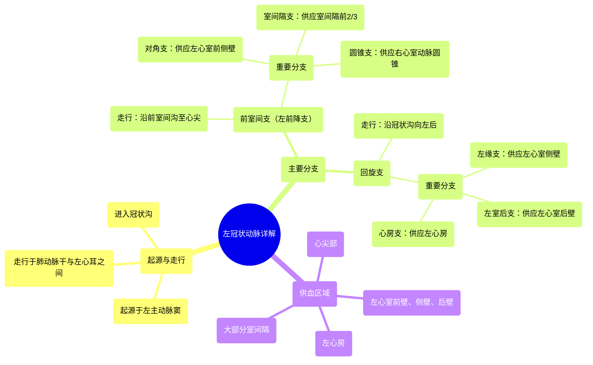

# 17 360 video - Left Coronary Artery - Explained in Mixed Reality

  <video controls preload="metadata" playsinline>
    <source src="https://helly.s3.bitiful.net/心血管学科/%E4%B8%93%E8%BE%91%2001%EF%BC%9A%E5%BF%83%E8%84%8F%E8%A7%A3%E5%89%96%E5%AD%A6%E5%AE%9E%E6%99%AF%E8%AF%BE%20%28Heart%20Anatomy%20-%20Course%29/17%20360%20video%20-%20Left%20Coronary%20Artery%20-%20Explained%20in%20Mixed%20Reality.mp4" type="video/mp4">
    
您的浏览器不支持播放，请升级。

  </video>

::: tip ⚡️ 核心考点 (30s速读)
*   **核心考点**：左冠状动脉是心脏左侧的主要供血动脉，起源于左主动脉窦，主干短，很快分为前室间支（左前降支）和回旋支两大分支。
*   **临床意义**：左冠状动脉及其分支是冠心病（尤其是心肌梗死）最常累及的部位。前室间支闭塞常导致前壁心肌梗死，回旋支闭塞则影响左心室侧壁和后壁。
:::

## 🧠 深度精讲

*   **左冠状动脉的起源与走行**：左冠状动脉起自升主动脉根部的左主动脉窦，主干非常短，在肺动脉干与左心耳之间穿行后，迅速进入冠状沟。
*   **左冠状动脉的主要分支**：主干在冠状沟内很快分为两大终支：
    1.  **前室间支**：也称为左前降支，沿前室间沟下行，指向心尖。它是左冠状动脉最重要的分支，负责供应左心室前壁、大部分室间隔（前2/3）及心尖部。
    2.  **回旋支**：沿冠状沟向左后方走行，绕过心脏左缘，主要供应左心房、左心室的侧壁和后壁。
*   **前室间支的重要分支**：
    *   **对角支**：向左心室前壁和侧壁发出的分支，通常有1-3支。
    *   **室间隔支**：垂直穿入室间隔，供应室间隔的前上2/3部分，是重要的穿支动脉。
    *   **圆锥支**：第一分支，供应右心室漏斗部（动脉圆锥）。
*   **回旋支的重要分支**：
    *   **左缘支**：沿心脏左缘下行，供应左心室侧壁。
    *   **左室后支**：供应左心室后壁（若回旋支为优势型）。
    *   **心房支**：供应左心房。

## 📚 双语术语表 (Terminology)
| 英文术语 | 中文翻译 | 定义/解释 |
| :--- | :--- | :--- |
| Left Coronary Artery | 左冠状动脉 | 起源于左主动脉窦，为心脏左侧供血的主要动脉。 |
| Left Aortic Sinus | 左主动脉窦 | 升主动脉根部的三个膨大之一，左冠状动脉开口于此。 |
| Anterior Interventricular Artery / Left Anterior Descending Artery | 前室间支 / 左前降支 | 左冠状动脉的主要分支之一，沿前室间沟下行，供应左心室前壁和室间隔。 |
| Circumflex Artery | 回旋支 | 左冠状动脉的主要分支之一，沿冠状沟向左后走行，供应左心房和左心室侧后壁。 |
| Coronary Sulcus | 冠状沟 | 心脏表面分隔心房和心室的环形沟。 |
| Diagonal Branches | 对角支 | 从前室间支向左心室前侧壁发出的斜行分支。 |
| Septal Branches | 室间隔支 | 从前室间支垂直穿入室间隔的分支，供应室间隔心肌。 |
| Conal Branch | 圆锥支 | 前室间支的第一分支，供应右心室漏斗部（动脉圆锥）。 |
| Left Marginal Branch | 左缘支 | 回旋支沿心脏左缘发出的重要分支，供应左心室侧壁。 |
| Atrial Branches | 心房支 | 回旋支向心房发出的分支。 |
| Interventricular Septum | 室间隔 | 分隔左心室和右心室的心脏结构。 |

## 🗺️ 知识图谱

