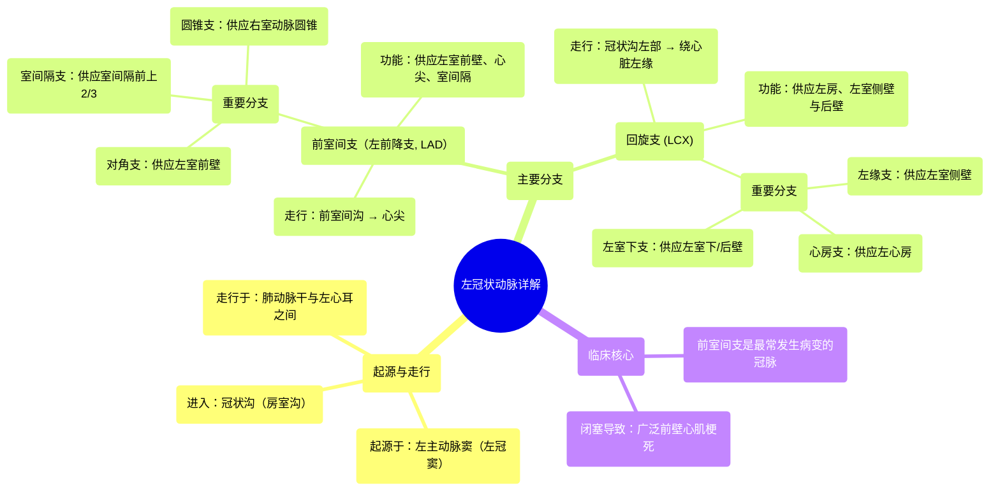

# 17 360 video - Left Coronary Artery - Explained in Mixed Reality

  <video controls preload="metadata" playsinline>
    <source src="https://helly.s3.bitiful.net/心血管学科/%E4%B8%93%E8%BE%91%2001%EF%BC%9A%E5%BF%83%E8%84%8F%E8%A7%A3%E5%89%96%E5%AD%A6%E5%AE%9E%E6%99%AF%E8%AF%BE%20%28Heart%20Anatomy%20-%20Course%29/17%20360%20video%20-%20Left%20Coronary%20Artery%20-%20Explained%20in%20Mixed%20Reality.mp4" type="video/mp4">
    
您的浏览器不支持播放，请升级。

  </video>

::: tip ⚡️ 核心考点 (30s速读)
*   **核心考点**：左冠状动脉起源于左主动脉窦，主干短，主要分为前室间支（左前降支）和回旋支两大分支，负责左心大部分血液供应。
*   **临床意义**：前室间支是冠心病最常累及的血管，其闭塞可导致广泛前壁心肌梗死，是临床最危重的心梗类型之一。理解其分支（如对角支、室间隔支）对判断梗死范围及并发症至关重要。
:::

## 🧠 深度精讲

*   **起源与走行**：左冠状动脉（Left Coronary Artery, LCA）起源于升主动脉根部的左主动脉窦（左冠窦），主干（左主干）非常短，走行于肺动脉干后方与左心耳之间，随即进入冠状沟（房室沟）。
*   **主要分支**：左主干在冠状沟内迅速分为两大终末支：
    1.  **前室间支 (Anterior Interventricular Branch)**：也称为**左前降支 (Left Anterior Descending Artery, LAD)**。它沿前室间沟斜行向下，绕过心尖，是供应左心室前壁、心尖部及大部分室间隔血液的最重要血管。
    2.  **回旋支 (Circumflex Artery, LCX)**：沿冠状沟向左后方走行，绕过心脏左缘，主要供应左心房、左心室的侧壁和后壁。
*   **前室间支 (LAD) 的重要分支**：
    *   **对角支 (Diagonal Branches)**：从前室间支左侧发出，斜行分布于左心室前壁，常有1-3支。
    *   **室间隔支 (Septal Branches)**：从前室间支深面发出，垂直进入室间隔，供应室间隔前上2/3的血液，是重要的穿支血管。
    *   **圆锥支 (Conal Branch)**：第一分支，供应右心室漏斗部（动脉圆锥）。有时可与右冠状动脉的圆锥支吻合。
*   **回旋支 (LCX) 的重要分支**：
    *   **左缘支 (Left Marginal Branch)**：沿心脏左缘下行，是供应左心室侧壁的主要血管。
    *   **左室下支 (Inferior Left Ventricular Branch)**：供应左心室下壁（后壁）。
    *   **心房支 (Atrial Branches)**：供应左心房。

## 📚 双语术语表 (Terminology)
| 英文术语 | 中文翻译 | 定义/解释 |
| :--- | :--- | :--- |
| Left Coronary Artery (LCA) | 左冠状动脉 | 起源于左主动脉窦，供应左心大部分血液的主干动脉。 |
| Left Aortic Sinus | 左主动脉窦（左冠窦） | 主动脉根部三个窦之一，左冠状动脉开口于此。 |
| Coronary Sulcus (Atrioventricular Groove) | 冠状沟（房室沟） | 分隔心房与心室的环形沟，冠状动脉主干走行于此。 |
| Anterior Interventricular Artery / Left Anterior Descending Artery (LAD) | 前室间支 / 左前降支 | 左冠状动脉的主要分支，走行于前室间沟，供应左室前壁、心尖及室间隔。 |
| Circumflex Artery (LCX) | 回旋支 | 左冠状动脉的主要分支，沿冠状沟向左后走行，供应左房和左室侧后壁。 |
| Diagonal Branches | 对角支 | 起源于前室间支，斜行分布于左心室前壁的分支。 |
| Septal Branches | 室间隔支 | 起源于前室间支，垂直穿入室间隔，供应其大部分血液的分支。 |
| Conal Branch | 圆锥支 | 前室间支的第一分支，供应右心室动脉圆锥（漏斗部）。 |
| Left Marginal Branch | 左缘支 | 回旋支沿心脏左缘走行的主要分支，供应左室侧壁。 |
| Interventricular Septum | 室间隔 | 分隔左、右心室的心脏结构。 |

## 🗺️ 知识图谱

