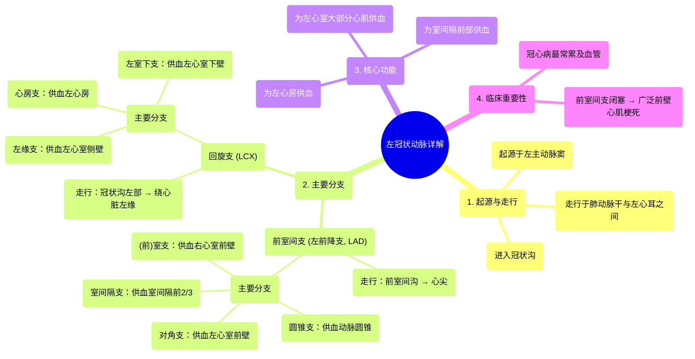

# 17 360 video - Left Coronary Artery - Explained in Mixed Reality

  <video controls preload="metadata" playsinline>
    <source src="https://helly.bitiful.net/心血管学科/%E4%B8%93%E8%BE%91%2001%EF%BC%9A%E5%BF%83%E8%84%8F%E8%A7%A3%E5%89%96%E5%AD%A6%E5%AE%9E%E6%99%AF%E8%AF%BE%20%28Heart%20Anatomy%20-%20Course%29/17%20360%20video%20-%20Left%20Coronary%20Artery%20-%20Explained%20in%20Mixed%20Reality.mp4" type="video/mp4">
    
您的浏览器不支持播放，请升级。

  </video>

::: tip ⚡️ 核心考点 (30s速读)
*   **核心考点**：左冠状动脉（LCA）起源于左主动脉窦，主干（LMCA）短暂走行后，**最常分为两大终支**：**前室间支（LAD，左前降支）** 和 **回旋支（LCX）**，共同负责左心大部分心肌的血液供应。
*   **临床意义**：前室间支（LAD）是冠心病最常累及的血管，其闭塞可导致广泛前壁心肌梗死，危及生命。理解其分支（如对角支、室间隔支）的供血范围对心肌梗死定位诊断至关重要。
:::

## 🧠 深度精讲

*   **概念1：左冠状动脉的起源与主干**
    左冠状动脉（Left Coronary Artery, LCA）是供应心脏左半部分（左心房、左心室大部分及室间隔前2/3）的主要动脉。它**起源于升主动脉根部的左主动脉窦**（Left Aortic Sinus），在肺动脉干（Pulmonary Trunk）和左心耳（Left Auricle）之间穿出后，迅速进入冠状沟（Coronary Sulcus，即房室沟）。其起始段被称为左冠状动脉主干（Left Main Coronary Artery, LMCA），长度通常很短（数毫米至1-2厘米），随即分叉。

*   **概念2：两大主要分支及其走行**
    左冠状动脉主干在冠状沟内分为两大终支：
    1.  **前室间支（Anterior Interventricular Artery）**：也称为**左前降支（Left Anterior Descending artery, LAD）**。它沿前室间沟（心脏胸肋面左右心室之间的纵沟）斜行向下，走向心尖。此动脉是心脏最重要的供血血管之一。
    2.  **回旋支（Circumflex Artery, LCX）**：沿冠状沟向左、向后走行，绕过心脏左缘（钝缘），主要供应左心房的侧、后壁以及左心室的侧壁和后壁。在大多数人中，它终止于心脏左缘附近，不延伸至后室间沟。

*   **概念3：前室间支（LAD）的主要分支与供血区域**
    前室间支在走行过程中发出多个重要分支，为不同区域供血：
    *   **圆锥支（Conal Branch）**：通常是LAD的第一个分支，细小，供应右心室流出道（动脉圆锥）。
    *   **对角支（Diagonal Branches）**：从LAD左侧发出，斜行分布于左心室前壁（胸肋面），常有1-3支。
    *   **室间隔支（Septal Branches）**：从LAD深面发出，垂直穿入室间隔肌部，供应室间隔的前上2/3部分。这是LAD的**特征性分支**。
    *   **（前）室支（Anterior Ventricular Branches）**：泛指LAD向右心室前壁发出的分支，通常较细小。

*   **概念4：回旋支（LCX）的主要分支与供血区域**
    回旋支在冠状沟内走行时，发出分支供应左心房和左心室：
    *   **心房支（Atrial Branches）**：供应左心房。
    *   **左缘支（Left Marginal Branch）**：是LCX的一个较大分支，沿心脏左缘（钝缘）下行，供应左心室的侧壁。
    *   **左室下支（Inferior Left Ventricular Branch）**：供应左心室的下壁（膈面）后部。在某些个体（左优势型冠状动脉），LCX可延伸至后室间沟，发出**后室间支（Posterior Interventricular Artery）**。

## 📚 双语术语表 (Terminology)
| 英文术语 | 中文翻译 | 定义/解释 |
| :--- | :--- | :--- |
| Left Coronary Artery (LCA) | 左冠状动脉 | 起源于左主动脉窦，供应左心大部分血液的主干动脉。 |
| Left Main Coronary Artery (LMCA) | 左冠状动脉主干 | 左冠状动脉起始后、分叉前的短段。 |
| Anterior Interventricular Artery / Left Anterior Descending (LAD) | 前室间支 / 左前降支 | 左冠状动脉的主要分支之一，走行于前室间沟，供应左心室前壁、心尖及室间隔前部。 |
| Circumflex Artery (LCX) | 回旋支 | 左冠状动脉的主要分支之一，沿冠状沟向左后走行，供应左心房和左心室侧、后壁。 |
| Coronary Sulcus | 冠状沟（房室沟） | 心脏表面分隔心房和心室的环形沟，冠状动脉主干走行于此。 |
| Conus Arteriosus | 动脉圆锥 | 右心室流出道的漏斗形部分，由圆锥支供血。 |
| Diagonal Branches | 对角支 | 从前室间支（LAD）左侧发出的分支，供应左心室前壁。 |
| Septal Branches | 室间隔支 | 从前室间支（LAD）深面垂直发出的分支，供应室间隔肌部。 |
| Left Marginal Branch | 左缘支 | 回旋支（LCX）沿心脏左缘（钝缘）走行的较大分支，供应左心室侧壁。 |
| Interventricular Septum | 室间隔 | 分隔左心室和右心室的心脏结构。 |

## 🗺️ 知识图谱

